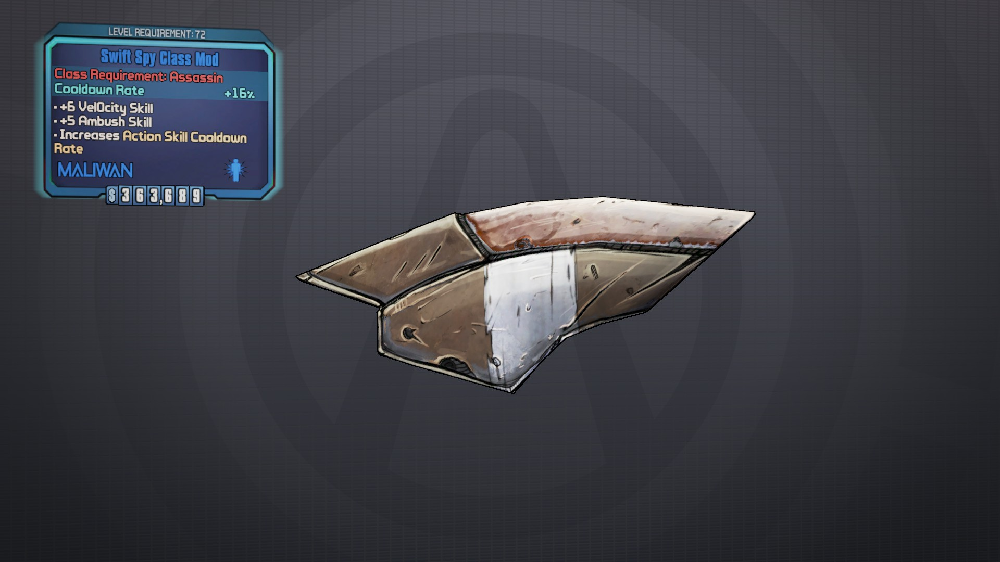
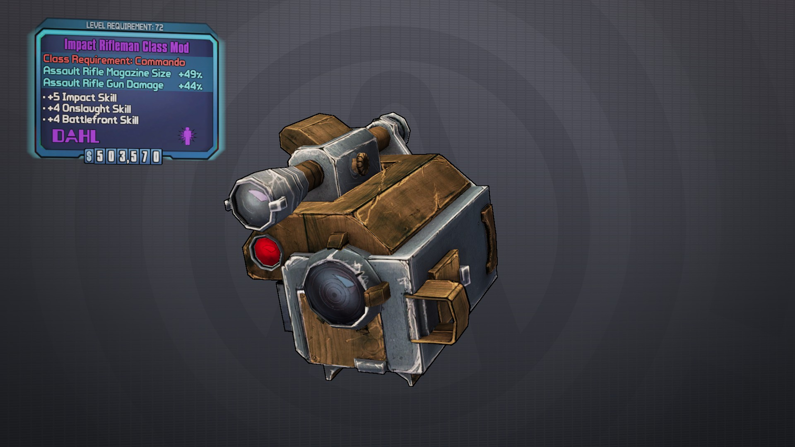
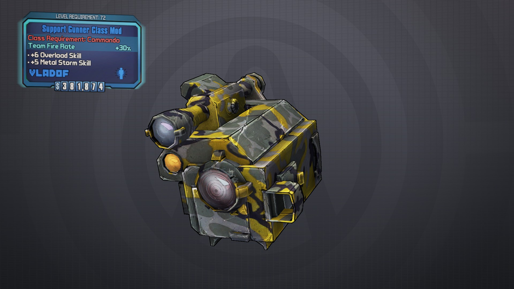
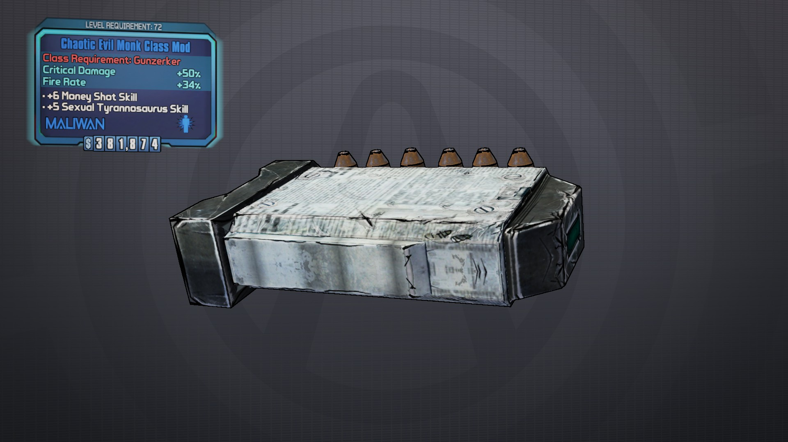
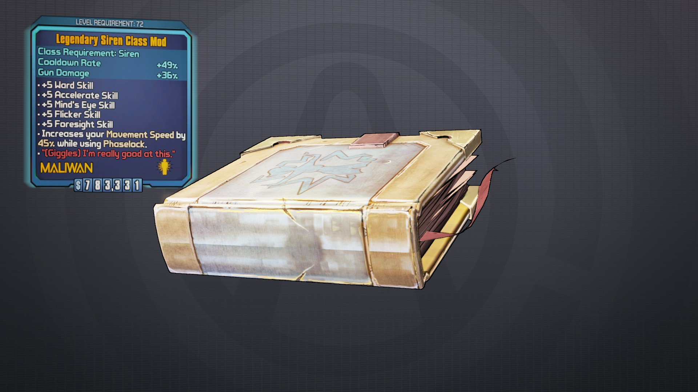
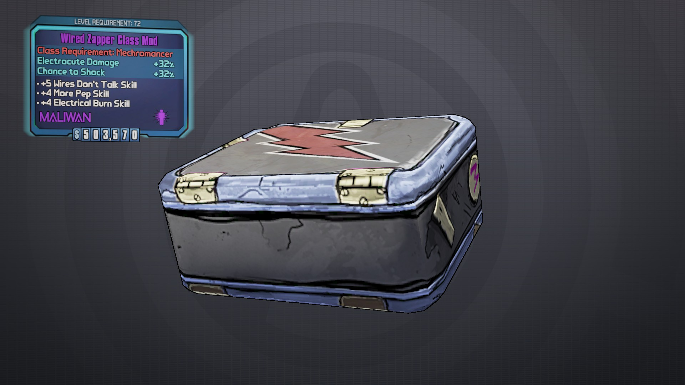
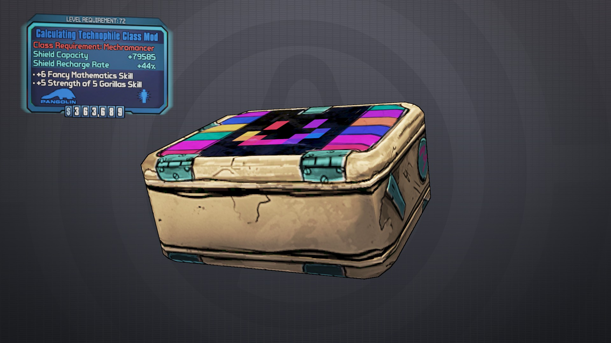
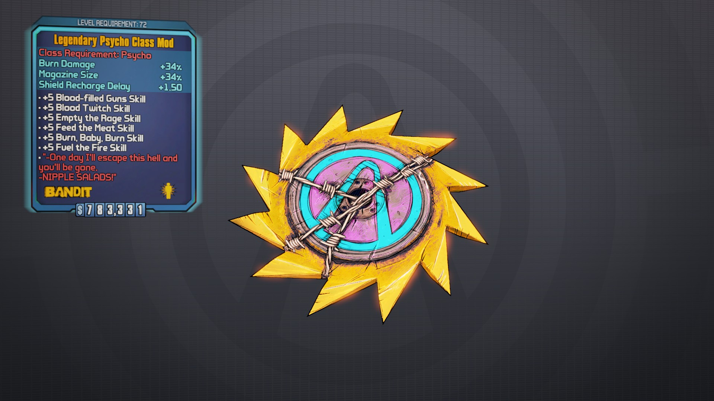
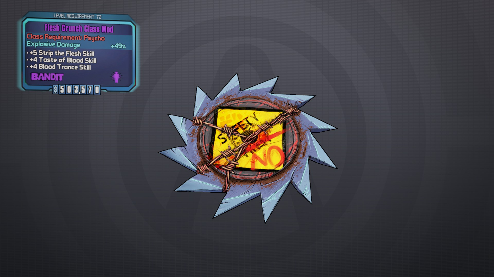

# Legendary Assassin

    Legendary Hunter 
    (Headsh0t/Fast Hands/C0unter Strike/Killing Bl0w/Ir0n Hand +5 All) 
    (Cooldown Rate +35% / Critical Damage +29% / Reload Speed +16%) 
    BL2(BwAAAADTlAArDZShYxAyGQXBAUEAwf///////////38DASYBAME=) 

    Legendary Sniper
    BL2(BwAAAACxTgoMAAsAsBBIJAXBAUEAwf///////////78EwQIgAME=)

    Legendary Ninja
    BL2(BwAAAADNBgoLAAsAEBFIJAXBAUEAwf///////////78EQQIgAME=)

    Legendary Killer
    BL2(BwAAAACBvgoKAAsA8BFIJAXBAUEAwf///////////78EgQIgAME=)

    Slayer Of Terramorphous 
    (Headsh0t/0ptics/Fast Hands/C0unter Strike/Ir0n Hand +4 All) 
    (Burn Damage +26% / Burn Chance +26% / Max Health +8294) 
    BL2(BwAAAADVKQAjDZKhYxAyGQXBAUEAwf///////////38DwQkBAME=)

# Purple Assassin

    Bloodied Survivor 
    (Resurgence +5 / Ambush +4 / Rising Sh0t +4) 
    (Max Health +9015 / Health Regeneration + 236.6) 
    BL2(BwAAAAADAQAUDZahIxAymQXBAUEAwf///////////38DQSYBAME=) 

    Disturbed Survivor 
    (Rising Sh0t +5 / Resurgence +4 / Ambush +4) 
    (Max Health +9015 / Health Regeneration + 236.6) 
    BL2(BwAAAADZOgAUDZahIxAyGQfBAUEAwf///////////38DgSYBAME=) 

    Contemptible Survivor 
    (Ambush +5 / Rising Sh0t +4 / Resurgence +4) 
    (Max Health +9015 / Health Regeneration + 236.6) 
    BL2(BwAAAACcDQAUDZahIxAymQjBAUEAwf///////////38DwSYBAME=) 

    Contemptible Killer 
    (Ambush +5 / Killer +4 / Fearless +4) 
    (Team Critical Damage +40%) 
    BL2(BwAAAACDigAfDZahwxAymQXBAQEBwf///////////38DQS0BAME=) 

    Unpredictable Killer 
    (Fearless +5 / Ambush +4 / Killer +4) 
    (Team Critical Damage +40%) 
    BL2(BwAAAAAchgAfDZahwxAymQjBAQEBwf///////////38DwS0BAME=)

    The Killer 
    (Killer +5 / Ambush +4 / Fearless +4) 
    (Team Critical Damage +40%) 
    BL2(BwAAAAC+gAAfDZahwxAyGQfBAUEAwf///////////38DgS0BAME=)

    Tricky Spy 
    (Unf0rseen +5 / Ambush +4 / Vel0city +4) 
    (Cooldown Rate +13%) 
    BL2(BwAAAAD7OQAsDZahAxEymQXBAUEAwf///////////38DQSgBAME=) 

    Swift Spy 
    (Vel0city +5 / Unf0rseen +4 / Ambush +4) 
    (Cooldown Rate +13%) 
    BL2(BwAAAABkNQAsDZahAxEymQjBAUEAwf///////////38DwSgBAME=) 

    Contemptible Spy 
    (Ambush +5 / Vel0city +4 / Unf0rseen +4) 
    (Cooldown Rate +13%) 
    BL2(BwAAAAAhAgAsDZahAxEyGQfBAUEAwf///////////38DgSgBAME=) 

    Razored Stalker 
    (C0unter Strike +5 / Rising Sh0t +4 / F0ll0wthr0ugh +4) 
    (Pistol Fire Rate +26% / Pistol Magazine Size +36% / Shield Recharge Rate +35%) 
    BL2(BwAAAAC79gAVDZahoxAymQXBAUEAwf///////////38DQScBAME=) 

    Shadow Stalker 
    (F0llowthr0ugh +5 / C0unter Strike +4 / Rising Sh0t +4) 
    (Pistol Fire Rate +26% / Pistol Magazine Size +36% / Shield Recharge Rate +35%) 
    BL2(BwAAAABhzQAVDZahoxAyGQfBAUEAwf///////////38DgScBAME=)

    Disturbed Stalker 
    (Rising Sh0t +5 / F0ll0wthr0ugh +4 / C0unter Strike +4) 
    (Pistol Fire Rate +26% / Pistol Magazine Size +36% / Shield Recharge Rate +35%) 
    BL2(BwAAAAAk+gAVDZahoxAymQjBAUEAwf///////////38DwScBAME=)

    Tranquil Sniper 
    (Precisi0n +5 / 0ne Sh0t 0ne Kill +4 / Headsh0t +4) 
    (Sniper Rifle Damage +36% / Sniper Rifle Critical Damage +36% / Shield Capacity -8294) 
    BL2(BwAAAADAYQAWDZahYxAymQjBAUEAwf///////////38DwSkBAME=) 

    One Shot Sniper 
    (0ne Sh0t 0ne Kill +5 / Headsh0t +4 / Precisi0n +4) 
    (Sniper Rifle Damage +36% / Sniper Rifle Critical Damage +36% / Shield Capacity -8294) 
    BL2(BwAAAACFVgAWDZahYxAyGQfBAUEAwf///////////38DgSkBAME=) 

    Deadly Sniper 
    (Headsh0t +5 / 0ne Sh0t 0ne Kill +4 / Precisi0n +4) 
    (Sniper Rifle Damage +36% / Sniper Rifle Critical Damage +36% / Shield Capacity -8294) 
    BL2(BwAAAABfbQAWDZahYxAymQXBAUEAwf///////////38DQSkBAME=) 

    Sure Shot 
    (Precisi0n +5 / Kill C0nfirmed +4 / 0ptics +4) 
    (Team Accuracy +28%) 
    BL2(BwAAAABnTQAeDZahwxAyGQfBAUEAwf///////////38DgSoBAME=) 

    True Shot 
    (Kill C0nfirmed +5 / Precisi0n +4 / 0ptics +4) 
    (Team Accuracy +28%) 
    BL2(BwAAAAC9dgAeDZahwxAymQXBAUEAwf///////////38DQSoBAME=) 

    Long Shot 
    (0ptics +5 / Precisi0n +4 / Kill C0nfirmed +4) 
    (Team Accuracy +28%) 
    BL2(BwAAAAAiegAeDZahwxAymQjBAUEAwf///////////38DwSoBAME=) 

    Succinct Professional 
    (Ambush +5 / Killer +4 / Tw0 Fang +4) 
    (Reload Speed +29% / Shield Capacity +793) 
    BL2(BwAAAADSwQAXDZahQxAymQXBAUEAwf///////////38DQSsBAME=) 

    The Professional 
    (Killer +5 / Ambush +4 / Tw0 Fang +4) 
    (Reload Speed +29% / Shield Capacity +793) 
    BL2(BwAAAAAI+gAXDZahQxAyGQfBAUEAwf///////////38DgSsBAME=)

    Unequaled Professional 
    (Tw0 Fang +5 / Killer +4 / Ambush +4) 
    (Reload Speed +29% / Shield Capacity +793) 
    BL2(BwAAAABNzQAXDZahQxAymQjBAUEAwf///////////38DwSsBAME=) 

    Lethal Ninja 
    (Killing Bl0w +5 / Resurgence +4 / Backstab +4) 
    (Melee Damage +46%) 
    BL2(BwAAAADdzgAYDZahAxEymQXBAUEAwf///////////38DQSwBAME=) 

    Bloodied Ninja 
    (Resurgence +5 / Killing Bl0w +4 / Backstab +4) 
    (Melee Damage +46%) 
    BL2(BwAAAAAH9QAYDZahAxEyGQfBAUEAwf///////////38DgSwBAME=) 

    Shadow Ninja 
    (Backstab +5 / Killing Bl0w +4 / Resurgence +4) 
    (Melee Damage +46%) 
    BL2(BwAAAABCwgAYDZahAxEymQjBAUEAwf///////////38DwSwBAME=) 

    Rugged Infiltrator 
    (Ir0n Hand +5 / Unf0rseen +4 / Be Like Water +4) 
    (Fire Rate +26% / Melee Damage +36%) 
    BL2(BwAAAAAtbwAgDZahQxAymQXBAUEAwf///////////38DQS4BAME=) 

    Tricky Infiltrator 
    (Unf0rseen +5 / Ir0n Hand +4 / Be Like Water +4) 
    (Fire Rate +26% / Melee Damage +36%) 
    BL2(BwAAAAD3VAAgDZahQxAyGQfBAUEAwf///////////38DgS4BAME=) 

    Graceful Infiltrator 
    (Be Like Water +5 / Unf0rseen +4 / Ir0n Hand +4) 
    (Fire Rate +26% / Melee Damage +36%) 
    BL2(BwAAAACyYwAgDZahQxAymQjBAUEAwf///////////38DwS4BAME=)

    Chaotic Evil Rogue Class Mod	
    [Critical Damage +45%] [Fire Rate +31%]	
    [+5 Vel0city Skill] [+4 Tw0 Fang Skill] [+4 Like The Wind Skill]	
    BL2(BwAAAAAO6QkcFAWwEBG9ngjBAUEAwf///////////38DAQchAME=)

    Chaotic Evil Rogue Class Mod	
    [Critical Damage +45%] [Fire Rate +31%]	
    [+5 Tw0 Fang Skill] [+4 Vel0city Skill] [+4 Like The Wind Skill]	
    BL2(BwAAAAB6rAkcFAWwEBG9HgfBAUEAwf///////////38DAQchAME=)

    Chaotic Evil Rogue Class Mod	
    [Critical Damage +45%] [Fire Rate +31%]	
    [+5 Like The Wind Skill] [+4 Vel0city Skill] [+4 Tw0 Fang Skill]	
    BL2(BwAAAADzAQkcFAWwEBG9ngXBAUEAwf///////////38DAQchAME=)

    Chaotic Good Rogue Class Mod	
    [Reload Speed +45%] [Fire Rate +31%]	
    [+5 Vel0city Skill] [+4 Tw0 Fang Skill] [+4 Like The Wind Skill]	
    BL2(BwAAAADvhgkbFAWwEBG9ngjBAUEAwf///////////38DwQYhAME=)

    Chaotic Good Rogue Class Mod	
    [Reload Speed +45%] [Fire Rate +31%]	
    [+5 Tw0 Fang Skill] [+4 Vel0city Skill] [+4 Like The Wind Skill]	
    BL2(BwAAAACbwwkbFAWwEBG9HgfBAUEAwf///////////38DwQYhAME=)

    Chaotic Good Rogue Class Mod	
    [Reload Speed +45%] [Fire Rate +31%]	
    [+5 Like The Wind Skill] [+4 Vel0city Skill] [+4 Tw0 Fang Skill]	
    BL2(BwAAAAASbgkbFAWwEBG9ngXBAUEAwf///////////38DwQYhAME=)

    Chaotic Neutral Rogue Class Mod	
    [Magazine Size +45%] [Fire Rate +31%]	
    [+5 Vel0city Skill] [+4 Tw0 Fang Skill] [+4 Like The Wind Skill]	
    BL2(BwAAAAB9sAkYFAWwEBG9ngjBAUEAwf///////////38DAQYhAME=)

    Chaotic Neutral Rogue Class Mod	
    [Magazine Size +45%] [Fire Rate +31%]	
    [+5 Tw0 Fang Skill] [+4 Vel0city Skill] [+4 Like The Wind Skill]	
    BL2(BwAAAAAJ9QkYFAWwEBG9HgfBAUEAwf///////////38DAQYhAME=)

    Chaotic Neutral Rogue Class Mod	
    [Magazine Size +45%] [Fire Rate +31%]	
    [+5 Like The Wind Skill] [+4 Vel0city Skill] [+4 Tw0 Fang Skill]	
    BL2(BwAAAACAWAkYFAWwEBG9ngXBAUEAwf///////////38DAQYhAME=)

    Lawful Evil Rogue Class Mod	
    [Critical Damage +45%] [Weapon Accuracy +31%]	
    [+5 Vel0city Skill] [+4 Tw0 Fang Skill] [+4 Like The Wind Skill]	
    BL2(BwAAAABZ3QkeFAWwEBG9ngjBAUEAwf///////////38DgQchAME=)

    Lawful Evil Rogue Class Mod	
    [Critical Damage +45%] [Weapon Accuracy +31%]	
    [+5 Tw0 Fang Skill] [+4 Vel0city Skill] [+4 Like The Wind Skill]	
    BL2(BwAAAAAtmAkeFAWwEBG9HgfBAUEAwf///////////38DgQchAME=)

    Lawful Evil Rogue Class Mod	
    [Critical Damage +45%] [Weapon Accuracy +31%]	
    [+5 Like The Wind Skill] [+4 Vel0city Skill] [+4 Tw0 Fang Skill]	
    BL2(BwAAAACkNQkeFAWwEBG9ngXBAUEAwf///////////38DgQchAME=)

    Lawful Good Rogue Class Mod	
    [Reload Speed +45%] [Weapon Accuracy +31%]	
    [+5 Vel0city Skill] [+4 Tw0 Fang Skill] [+4 Like The Wind Skill]	
    BL2(BwAAAAC4sgkZFAWwEBG9ngjBAUEAwf///////////38DQQYhAME=)

    Lawful Good Rogue Class Mod	
    [Reload Speed +45%] [Weapon Accuracy +31%]	
    [+5 Tw0 Fang Skill] [+4 Vel0city Skill] [+4 Like The Wind Skill]	
    BL2(BwAAAADM9wkZFAWwEBG9HgfBAUEAwf///////////38DQQYhAME=)

    Lawful Good Rogue Class Mod	
    [Reload Speed +45%] [Weapon Accuracy +31%]	
    [+5 Like The Wind Skill] [+4 Vel0city Skill] [+4 Tw0 Fang Skill]	
    BL2(BwAAAABFWgkZFAWwEBG9ngXBAUEAwf///////////38DQQYhAME=)

    Lawful Neutral Rogue Class Mod	
    [Magazine Size +45%] [Weapon Accuracy +31%]	
    [+5 Vel0city Skill] [+4 Tw0 Fang Skill] [+4 Like The Wind Skill]	
    BL2(BwAAAACnXAkXFAWwEBG9ngjBAUEAwf///////////38DwQUhAME=)

    Lawful Neutral Rogue Class Mod	
    [Magazine Size +45%] [Weapon Accuracy +31%]	
    [+5 Tw0 Fang Skill] [+4 Vel0city Skill] [+4 Like The Wind Skill]	
    BL2(BwAAAADTGQkXFAWwEBG9HgfBAUEAwf///////////38DwQUhAME=)

    Lawful Neutral Rogue Class Mod	
    [Magazine Size +45%] [Weapon Accuracy +31%]	
    [+5 Like The Wind Skill] [+4 Vel0city Skill] [+4 Tw0 Fang Skill]	
    BL2(BwAAAABatAkXFAWwEBG9ngXBAUEAwf///////////38DwQUhAME=)

    Neutral Evil Rogue Class Mod	
    [Critical Damage +45%] [Magazine Size +45%]	
    [+5 Vel0city Skill] [+4 Tw0 Fang Skill] [+4 Like The Wind Skill]	
    BL2(BwAAAADL6wkdFAWwEBG9ngjBAUEAwf///////////38DQQchAME=)

    Neutral Evil Rogue Class Mod	
    [Critical Damage +45%] [Magazine Size +45%]	
    [+5 Tw0 Fang Skill] [+4 Vel0city Skill] [+4 Like The Wind Skill]	
    BL2(BwAAAAC/rgkdFAWwEBG9HgfBAUEAwf///////////38DQQchAME=)

    Neutral Evil Rogue Class Mod	
    [Critical Damage +45%] [Magazine Size +45%]	
    [+5 Like The Wind Skill] [+4 Vel0city Skill] [+4 Tw0 Fang Skill]	
    BL2(BwAAAAA2AwkdFAWwEBG9ngXBAUEAwf///////////38DQQchAME=)

    Neutral Good Rogue Class Mod	
    [Reload Speed +45% ] [Magazine Size +45%]	
    [+5 Vel0city Skill] [+4 Tw0 Fang Skill] [+4 Like The Wind Skill]	
    BL2(BwAAAAAqhAkaFAWwEBG9ngjBAUEAwf///////////38DgQYhAME=)

    Neutral Good Rogue Class Mod	
    [Reload Speed +45% ] [Magazine Size +45%]	
    [+5 Tw0 Fang Skill] [+4 Vel0city Skill] [+4 Like The Wind Skill]	
    BL2(BwAAAABewQkaFAWwEBG9HgfBAUEAwf///////////38DgQYhAME=)

    Neutral Good Rogue Class Mod	
    [Reload Speed +45% ] [Magazine Size +45%]	
    [+5 Like The Wind Skill] [+4 Vel0city Skill] [+4 Tw0 Fang Skill]	
    BL2(BwAAAADXbAkaFAWwEBG9ngXBAUEAwf///////////38DgQYhAME=)

    True Neutral Rogue Class Mod	
    [Magazine Size +73%]	
    [+5 Vel0city Skill] [+4 Tw0 Fang Skill] [+4 Like The Wind Skill]	
    BL2(BwAAAABiXgkWFAWwEBG9ngjBAUEAwf///////////38DgQUhAME=)

    True Neutral Rogue Class Mod	
    [Magazine Size +73%]	
    [+5 Tw0 Fang Skill] [+4 Vel0city Skill] [+4 Like The Wind Skill]	
    BL2(BwAAAAAWGwkWFAWwEBG9HgfBAUEAwf///////////38DgQUhAME=)

    True Neutral Rogue Class Mod	
    [Magazine Size +73%]	
    [+5 Like The Wind Skill] [+4 Vel0city Skill] [+4 Tw0 Fang Skill]	
    BL2(BwAAAACftgkWFAWwEBG9ngXBAUEAwf///////////38DgQUhAME=)

# Blue Assassin

    Contemptible Survivor 
    (Ambush +6 / Rising Sh0t +5) 
    (Max Health +9015 / Health Regeneration +236.6) 
    BL2(BwAAAABjdwAUDZihIxAyGQnBAUEAwf///////////38DQSYBAME=) 

    Contemptible Survivor 
    (Ambush +6 / Resurgence +5) 
    (Max Health +9015 / Health Regeneration +236.6) 
    BL2(BwAAAACnoQAUDZihIxAyWQjBAUEAwf///////////38DQSYBAME=) 

    Disturbed Survivor 
    (Rising Shot +6 / Ambush +5) 
    (Max Health +9015 / Health Regeneration +236.6) 
    BL2(BwAAAACgpgAUDZihIxAymQfBAUEAwf///////////38DgSYBAME=) 

    Disturbed Survivor 
    (Rising Shot +6 / Resurgence +5) 
    (Max Health +9015 / Health Regeneration +236.6) 
    BL2(BwAAAABkcAAUDZihIxAy2QbBAUEAwf///////////38DgSYBAME=) 

    Bloodied Survivor 
    (Resurgence +6 / Ambush +5) 
    (Max Health +9015 / Health Regeneration +236.6) 
    BL2(BwAAAADpTwAUDZihIxAyGQbBAUEAwf///////////38DwSYBAME=) 

    Bloodied Survivor 
    (Resurgence +6 / Rising Shot +5) 
    (Max Health +9015 / Health Regeneration +236.6) 
    BL2(BwAAAAA4rQAUDZihIxAyWQXBAUEAwf///////////38DwSYBAME=) 

    The Killer 
    (Killer +6 / Fearless +5) 
    (Team Critical Damage +40%) 
    BL2(BwAAAADHHAAfDZihwxAymQfBAUEAwf///////////38DgS0BAME=) 

    The Killer 
    (Killer +6 / Ambush +5) 
    (Team Critical Damage +40%) 
    BL2(BwAAAAADygAfDZihwxAy2QbBAUEAwf///////////38DgS0BAME=) 

    Unpredictable Killer 
    (Fearless +6 / Killer +5) 
    (Team Critical Damage +40%) 
    BL2(BwAAAACBGAAfDZihwxAyGQnBAQEBwf///////////38DwS0BAME=) 

    Unpredictable Killer 
    (Fearless +6 / Ambush +5) 
    (Team Critical Damage +40%) 
    BL2(BwAAAABFzgAfDZihwxAyWQjBAQEBwf///////////38DwS0BAME=) 

    Contemptible Killer 
    (Ambush +6 / Fearless +5) 
    (Team Critical Damage +40%) 
    BL2(BwAAAAALIAAfDZihwxAyGQbBAQEBwf///////////38DQS0BAME=) 

    Contemptible Killer 
    (Ambush +6 / Killer +5) 
    (Team Critical Damage +40%) 
    BL2(BwAAAADawgAfDZihwxAyWQXBAQEBwf///////////38DQS0BAME=) 

    Contemptible Spy 
    (Ambush +6 / Vel0city +5) 
    (Cooldown Rate +13%) 
    BL2(BwAAAABYngAsDZihAxEymQfBAUEAwf///////////38DgSgBAME=) 

    Contemptible Spy 
    (Ambush +6 / Unf0reseen +5) 
    (Cooldown Rate +13%) 
    BL2(BwAAAACcSAAsDZihAxEy2QbBAUEAwf///////////38DgSgBAME=) 

    Swift Spy 
    (Vel0city +6 / Ambush +5) 
    (Cooldown Rate +13%) 
    BL2(BwAAAAD5qwAsDZihAxEyGQnBAUEAwf///////////38DwSgBAME=) 

    Swift Spy 
    (Vel0city +6 / Unf0reseen +5) 
    (Cooldown Rate +13%) 
    BL2(BwAAAAA9fQAsDZihAxEyWQjBAUEAwf///////////38DwSgBAME=) 

    Tricky Spy 
    (Unf0reseen +6 / Vel0city +5) 
    (Cooldown Rate +13%) 
    BL2(BwAAAABzkwAsDZihAxEyGQbBAUEAwf///////////38DQSgBAME=) 

    Tricky Spy 
    (Unf0reseen +6 / Ambush +5) 
    (Cooldown Rate +13%) 
    BL2(BwAAAACicQAsDZihAxEyWQXBAUEAwf///////////38DQSgBAME=) 

    Disturbed Stalker 
    (Rising Sh0t +6 / F0ll0w Thr0ugh +5) 
    (Pistol Fire Rate +26% / Pistol Magazine Size +36% / Shield Recharge Rate +35%) 
    BL2(BwAAAAC5ZAAVDZihoxAyGQnBAUEAwf///////////38DwScBAME=) 

    Disturbed Stalker 
    (Rising Sh0t +6 / C0unter Strike +5) 
    (Pistol Fire Rate +26% / Pistol Magazine Size +36% / Shield Recharge Rate +35%) 
    BL2(BwAAAAB9sgAVDZihoxAyWQjBAUEAwf///////////38DwScBAME=) 

    Shadow Stalker 
    (F0ll0w Thr0ugh +6 / Rising Sh0t +5) 
    (Pistol Fire Rate +26% / Pistol Magazine Size +36% / Shield Recharge Rate +35%) 
    BL2(BwAAAAAYUQAVDZihoxAymQfBAUEAwf///////////38DgScBAME=) 

    Shadow Stalker 
    (F0ll0w Thr0ugh +6 / C0unter Strike +5) 
    (Pistol Fire Rate +26% / Pistol Magazine Size +36% / Shield Recharge Rate +35%) 
    BL2(BwAAAADchwAVDZihoxAy2QbBAUEAwf///////////38DgScBAME=) 

    Razored Stalker 
    (C0unter Strike +6 / Rising Sh0t +5) 
    (Pistol Fire Rate +26% / Pistol Magazine Size +36% / Shield Recharge Rate +35%) 
    BL2(BwAAAAAzXAAVDZihoxAyGQbBAUEAwf///////////38DQScBAME=) 

    Razored Stalker 
    (C0unter Strike +6 / F0ll0w Thr0ugh +5) 
    (Pistol Fire Rate +26% / Pistol Magazine Size +36% / Shield Recharge Rate +35%) 
    BL2(BwAAAADivgAVDZihoxAyWQXBAUEAwf///////////38DQScBAME=) 

    Tranquil Sniper 
    (Precision +6 / 0ne Sh0t 0ne Kill +5) 
    (Sniper Rifle Damage +36% / Sniper Rifle Critical Damage +36% / Shield Capacity -8294) 
    BL2(BwAAAABd/wAWDZihYxAyGQnBAUEAwf///////////38DwSkBAME=) 

    Tranquil Sniper 
    (Precision +6 / Headsh0t +5) 
    (Sniper Rifle Damage +36% / Sniper Rifle Critical Damage +36% / Shield Capacity -8294) 
    BL2(BwAAAACZKQAWDZihYxAyWQjBAUEAwf///////////38DwSkBAME=) 

    One Shot Sniper 
    (0ne Sh0t 0ne Kill +6 / Precision +5) 
    (Sniper Rifle Damage +36% / Sniper Rifle Critical Damage +36% / Shield Capacity -8294) 
    BL2(BwAAAAD8ygAWDZihYxAymQfBAUEAwf///////////38DgSkBAME=) 

    One Shot Sniper 
    (0ne Sh0t 0ne Kill +6 / Headsh0t +5) 
    (Sniper Rifle Damage +36% / Sniper Rifle Critical Damage +36% / Shield Capacity -8294) 
    BL2(BwAAAAA4HAAWDZihYxAy2QbBAUEAwf///////////38DgSkBAME=) 

    Deadly Sniper 
    (Headsh0t +6 / Precision +5) 
    (Sniper Rifle Damage +36% / Sniper Rifle Critical Damage +36% / Shield Capacity -8294) 
    BL2(BwAAAADXxwAWDZihYxAyGQbBAUEAwf///////////38DQSkBAME=) 

    Deadly Sniper 
    (Headsh0t +6 / 0ne Sh0t 0ne Kill +5) 
    (Sniper Rifle Damage +36% / Sniper Rifle Critical Damage +36% / Shield Capacity -8294) 
    BL2(BwAAAAAGJQAWDZihYxAyWQXBAUEAwf///////////38DQSkBAME=) 

    Long Shot 
    (0ptics +6 / Precision +5) 
    (Team Accuracy +28%) 
    BL2(BwAAAAC/5AAeDZihwxAyGQnBAUEAwf///////////38DwSoBAME=) 

    Long Shot 
    (0ptics +6 / Kill C0nfirmed +5) 
    (Team Accuracy +28%) 
    BL2(BwAAAAB7MgAeDZihwxAyWQjBAUEAwf///////////38DwSoBAME=) 

    True Shot 
    (Kill C0nfirmed +6 / 0ptics +5) 
    (Team Accuracy +28%) 
    BL2(BwAAAAA13AAeDZihwxAyGQbBAUEAwf///////////38DQSoBAME=) 

    True Shot 
    (Kill C0nfirmed +6 / Precision +5) 
    (Team Accuracy +28%) 
    BL2(BwAAAADkPgAeDZihwxAyWQXBAUEAwf///////////38DQSoBAME=) 

    Sure Shot 
    (Precision +6 / 0ptics +5) 
    (Team Accuracy +28%) 
    BL2(BwAAAAAe0QAeDZihwxAymQfBAUEAwf///////////38DgSoBAME=) 

    Sure Shot 
    (Preision +6 / Kill C0nfirmed +5) 
    (Team Accuracy +28%) 
    BL2(BwAAAADaBwAeDZihwxAy2QbBAUEAwf///////////38DgSoBAME=) 

    Unequaled Professional 
    (Tw0 Fang +6 / Killer +5) 
    (Reload Speed +29% / Shield Capacity +7933) 
    BL2(BwAAAADQUwAXDZihQxAyGQnBAUEAwf///////////38DwSsBAME=) 

    Unequaled Professional 
    (Tw0 Fang +6 / Ambush +5) 
    (Reload Speed +29% / Shield Capacity +7933) 
    BL2(BwAAAAAUhQAXDZihQxAyWQjBAUEAwf///////////38DwSsBAME=) 

    The Professional 
    (Killer +6 / Tw0 Fang +5) 
    (Reload Speed +29% / Shield Capacity +7933) 
    BL2(BwAAAABxZgAXDZihQxAymQfBAUEAwf///////////38DgSsBAME=) 

    The Professional 
    (Killer +6 / Ambush +5) 
    (Reload Speed +29% / Shield Capacity +7933) 
    BL2(BwAAAAC1sAAXDZihQxAy2QbBAUEAwf///////////38DgSsBAME=) 

    Succint Professional 
    (Ambush +6 / Tw0 Fang +5) 
    (Reload Speed +29% / Shield Capacity +7933) 
    BL2(BwAAAABaawAXDZihQxAyGQbBAUEAwf///////////38DQSsBAME=) 

    Succinct Professional 
    (Ambush +6 / Killer +5) 
    (Reload Speed +29% / Shield Capacity +7933) 
    BL2(BwAAAACLiQAXDZihQxAyWQXBAUEAwf///////////38DQSsBAME=) 

    Shadow Ninja 
    (Backstab +6 / Resurgence +5) 
    (Melee Damage +46%) 
    BL2(BwAAAADfXAAYDZihAxEyGQnBAUEAwf///////////38DwSwBAME=) 

    Shadow Ninja 
    (Backstab +6 / Killing Bl0w +5) 
    (Melee Damage +46%) 
    BL2(BwAAAAAbigAYDZihAxEyWQjBAUEAwf///////////38DwSwBAME=) 

    Bloodied Ninja 
    (Resurgence +6 / Backstab +5) 
    (Melee Damage +46%) 
    BL2(BwAAAAB+aQAYDZihAxEymQfBAUEAwf///////////38DgSwBAME=) 

    Bloodied Ninja 
    (Resurgence +6 / Killing Bl0w +5) 
    (Melee Damage +46%) 
    BL2(BwAAAAC6vwAYDZihAxEy2QbBAUEAwf///////////38DgSwBAME=) 

    Lethal Ninja 
    (Killing Bl0w +6 / Backstab +5) 
    (Melee Damage +46%) 
    BL2(BwAAAABVZAAYDZihAxEyGQbBAUEAwf///////////38DQSwBAME=) 

    Lethal Ninja 
    (Killing Bl0w +6 / Resurgence +5) 
    (Melee Damage +46%) 
    BL2(BwAAAACEhgAYDZihAxEyWQXBAUEAwf///////////38DQSwBAME=) 

    Graceful Infiltrator 
    (Be Like Water +6 / Unf0reseen +5) 
    (Fire Rate +26% / Melee Damage +36%) 
    BL2(BwAAAAAv/QAgDZihQxAyGQnBAUEAwf///////////38DwS4BAME=) 

    Graceful Infiltrator 
    (Be Like Water +6 / Ir0n Hand +5) 
    (Fire Rate +26% / Melee Damage +36%) 
    BL2(BwAAAADrKwAgDZihQxAyWQjBAUEAwf///////////38DwS4BAME=) 

    Tricky Infiltrator 
    (Unf0reseen +6 / Be Like Water +5) 
    (Fire Rate +26% / Melee Damage +36%) 
    BL2(BwAAAACOyAAgDZihQxAymQfBAUEAwf///////////38DgS4BAME=) 

    Tricky Infiltrator 
    (Unf0reseen +6 / Ir0n Hand +5) 
    (Fire Rate +26% / Melee Damage +36%) 
    BL2(BwAAAABKHgAgDZihQxAy2QbBAUEAwf///////////38DgS4BAME=) 

    Rugged Infiltrator 
    (Ir0n Hand +6 / Be Like Water +5) 
    (Fire Rate +26% / Melee Damage +36%) 
    BL2(BwAAAAClxQAgDZihQxAyGQbBAUEAwf///////////38DQS4BAME=) 

    Rugged Infiltrator 
    (Ir0n Hand +6 / Unf0reseen +5) 
    (Fire Rate +26% / Melee Damage +36%) 
    BL2(BwAAAAB0JwAgDZihQxAyWQXBAUEAwf///////////38DQS4BAME=)

    Chaotic Evil Rogue Class Mod
    [Critical Damage +45%] [Fire Rate +31%]	
    [+6 Vel0city Skill] [+5 Tw0 Fang Skill]	
    BL2(BwAAAAB2cgkcFAWwEBG9HgnBAUEAwf///////////38DAQchAME=)

    Chaotic Evil Rogue Class Mod	
    [Critical Damage +45%] [Fire Rate +31%]	
    [+6 Vel0city Skill] [+5 Like The Wind Skill]	
    BL2(BwAAAACypAkcFAWwEBG9XgjBAUEAwf///////////38DAQchAME=)

    Chaotic Evil Rogue Class Mod	
    [Critical Damage +45%] [Fire Rate +31%]	
    [+6 Tw0 Fang Skill] [+5 Vel0city Skill]	
    BL2(BwAAAADmNQkcFAWwEBG9ngfBAUEAwf///////////38DAQchAME=)

    Chaotic Evil Rogue Class Mod	
    [Critical Damage +45%] [Fire Rate +31%]	
    [+6 Tw0 Fang Skill] [+5 Like The Wind Skill]	
    BL2(BwAAAAAi4wkcFAWwEBG93gbBAUEAwf///////////38DAQchAME=)

    Chaotic Evil Rogue Class Mod	
    [Critical Damage +45%] [Fire Rate +31%]	
    [+6 Like The Wind Skill] [+5 Vel0city Skill]	
    BL2(BwAAAACergkcFAWwEBG9HgbBAUEAwf///////////38DAQchAME=)

    Chaotic Evil Rogue Class Mod	
    [Critical Damage +45%] [Fire Rate +31%]	
    [+6 Like The Wind Skill] [+5 Tw0 Fang Skill]	
    BL2(BwAAAABPTAkcFAWwEBG9XgXBAUEAwf///////////38DAQchAME=)

    Chaotic Good Rogue Class Mod	
    [Reload Speed +45%] [Fire Rate +31%]	
    [+6 Vel0city Skill] [+5 Tw0 Fang Skill]	
    BL2(BwAAAACXHQkbFAWwEBG9HgnBAUEAwf///////////38DwQYhAME=)

    Chaotic Good Rogue Class Mod	
    [Reload Speed +45%] [Fire Rate +31%]	
    [+6 Vel0city Skill] [+5 Like The Wind Skill]	
    BL2(BwAAAABTywkbFAWwEBG9XgjBAUEAwf///////////38DwQYhAME=)

    Chaotic Good Rogue Class Mod	
    [Reload Speed +45%] [Fire Rate +31%]	
    [+6 Tw0 Fang Skill] [+5 Vel0city Skill]	
    BL2(BwAAAAAHWgkbFAWwEBG9ngfBAUEAwf///////////38DwQYhAME=)

    Chaotic Good Rogue Class Mod	
    [Reload Speed +45%] [Fire Rate +31%]	
    [+6 Tw0 Fang Skill] [+5 Like The Wind Skill]	
    BL2(BwAAAADDjAkbFAWwEBG93gbBAUEAwf///////////38DwQYhAME=)

    Chaotic Good Rogue Class Mod	
    [Reload Speed +45%] [Fire Rate +31%]	
    [+6 Like The Wind Skill] [+5 Vel0city Skill]	
    BL2(BwAAAAB/wQkbFAWwEBG9HgbBAUEAwf///////////38DwQYhAME=)

    Chaotic Good Rogue Class Mod	
    [Reload Speed +45%] [Fire Rate +31%]	
    [+6 Like The Wind Skill] [+5 Tw0 Fang Skill]	
    BL2(BwAAAACuIwkbFAWwEBG9XgXBAUEAwf///////////38DwQYhAME=)

    Chaotic Neutral Rogue Class Mod	
    [Magazine Size +45%] [Fire Rate +31%]	
    [+6 Vel0city Skill] [+5 Tw0 Fang Skill]	
    BL2(BwAAAAAFKwkYFAWwEBG9HgnBAUEAwf///////////38DAQYhAME=)

    Chaotic Neutral Rogue Class Mod	
    [Magazine Size +45%] [Fire Rate +31%]	
    [+6 Vel0city Skill] [+5 Like The Wind Skill]	
    BL2(BwAAAADB/QkYFAWwEBG9XgjBAUEAwf///////////38DAQYhAME=)

    Chaotic Neutral Rogue Class Mod	
    [Magazine Size +45%] [Fire Rate +31%]	
    [+6 Tw0 Fang Skill] [+5 Vel0city Skill]	
    BL2(BwAAAACVbAkYFAWwEBG9ngfBAUEAwf///////////38DAQYhAME=)

    Chaotic Neutral Rogue Class Mod	
    [Magazine Size +45%] [Fire Rate +31%]	
    [+6 Tw0 Fang Skill] [+5 Like The Wind Skill]	
    BL2(BwAAAABRugkYFAWwEBG93gbBAUEAwf///////////38DAQYhAME=)

    Chaotic Neutral Rogue Class Mod	
    [Magazine Size +45%] [Fire Rate +31%]	
    [+6 Like The Wind Skill] [+5 Vel0city Skill]	
    BL2(BwAAAADt9wkYFAWwEBG9HgbBAUEAwf///////////38DAQYhAME=)

    Chaotic Neutral Rogue Class Mod	
    [Magazine Size +45%] [Fire Rate +31%]	
    [+6 Like The Wind Skill] [+5 Tw0 Fang Skill]	
    BL2(BwAAAAA8FQkYFAWwEBG9XgXBAUEAwf///////////38DAQYhAME=)

    Lawful Evil Rogue Class Mod	
    [Critical Damage +45%] [Weapon Accuracy +31%]	
    [+6 Vel0city Skill] [+5 Tw0 Fang Skill]	
    BL2(BwAAAAAhRgkeFAWwEBG9HgnBAUEAwf///////////38DgQchAME=)

    Lawful Evil Rogue Class Mod	
    [Critical Damage +45%] [Weapon Accuracy +31%]	
    [+6 Vel0city Skill] [+5 Like The Wind Skill]	
    BL2(BwAAAADlkAkeFAWwEBG9XgjBAUEAwf///////////38DgQchAME=)

    Lawful Evil Rogue Class Mod	
    [Critical Damage +45%] [Weapon Accuracy +31%]	
    [+6 Tw0 Fang Skill] [+5 Vel0city Skill]	
    BL2(BwAAAACxAQkeFAWwEBG9ngfBAUEAwf///////////38DgQchAME=)

    Lawful Evil Rogue Class Mod	
    [Critical Damage +45%] [Weapon Accuracy +31%]	
    [+6 Tw0 Fang Skill] [+5 Like The Wind Skill]	
    BL2(BwAAAAB11wkeFAWwEBG93gbBAUEAwf///////////38DgQchAME=)

    Lawful Evil Rogue Class Mod	
    [Critical Damage +45%] [Weapon Accuracy +31%]	
    [+6 Like The Wind Skill] [+5 Vel0city Skill]	
    BL2(BwAAAADJmgkeFAWwEBG9HgbBAUEAwf///////////38DgQchAME=)

    Lawful Evil Rogue Class Mod	
    [Critical Damage +45%] [Weapon Accuracy +31%]	
    [+6 Like The Wind Skill] [+5 Tw0 Fang Skill]	
    BL2(BwAAAAAYeAkeFAWwEBG9XgXBAUEAwf///////////38DgQchAME=)

    Lawful Good Rogue Class Mod	
    [Reload Speed +45%] [Weapon Accuracy +31%]	
    [+6 Vel0city Skill] [+5 Tw0 Fang Skill]	
    BL2(BwAAAADAKQkZFAWwEBG9HgnBAUEAwf///////////38DQQYhAME=)

    Lawful Good Rogue Class Mod	
    [Reload Speed +45%] [Weapon Accuracy +31%]	
    [+6 Vel0city Skill] [+5 Like The Wind Skill]	
    BL2(BwAAAAAE/wkZFAWwEBG9XgjBAUEAwf///////////38DQQYhAME=)

    Lawful Good Rogue Class Mod	
    [Reload Speed +45%] [Weapon Accuracy +31%]	
    [+6 Tw0 Fang Skill] [+5 Vel0city Skill]
    BL2(BwAAAABQbgkZFAWwEBG9ngfBAUEAwf///////////38DQQYhAME=)

    Lawful Good Rogue Class Mod	
    [Reload Speed +45%] [Weapon Accuracy +31%]	
    [+6 Tw0 Fang Skill] [+5 Like The Wind Skill]	
    BL2(BwAAAACUuAkZFAWwEBG93gbBAUEAwf///////////38DQQYhAME=)

    Lawful Good Rogue Class Mod	
    [Reload Speed +45%] [Weapon Accuracy +31%]	
    [+6 Like The Wind Skill] [+5 Vel0city Skill]	
    BL2(BwAAAAAo9QkZFAWwEBG9HgbBAUEAwf///////////38DQQYhAME=)

    Lawful Good Rogue Class Mod	
    [Reload Speed +45%] [Weapon Accuracy +31%]	
    [+6 Like The Wind Skill] [+5 Tw0 Fang Skill]	
    BL2(BwAAAAD5FwkZFAWwEBG9XgXBAUEAwf///////////38DQQYhAME=)

    Lawful Neutral Rogue Class Mod	
    [Magazine Size +45%] [Weapon Accuracy +31%]	
    [+6 Vel0city Skill] [+5 Tw0 Fang Skill]	
    BL2(BwAAAADfxwkXFAWwEBG9HgnBAUEAwf///////////38DwQUhAME=)

    Lawful Neutral Rogue Class Mod	
    [Magazine Size +45%] [Weapon Accuracy +31%]	
    [+6 Vel0city Skill] [+5 Like The Wind Skill]	
    BL2(BwAAAAAbEQkXFAWwEBG9XgjBAUEAwf///////////38DwQUhAME=)

    Lawful Neutral Rogue Class Mod	
    [Magazine Size +45%] [Weapon Accuracy +31%]	
    [+6 Tw0 Fang Skill] [+5 Vel0city Skill]	
    BL2(BwAAAABPgAkXFAWwEBG9ngfBAUEAwf///////////38DwQUhAME=)

    Lawful Neutral Rogue Class Mod	
    [Magazine Size +45%] [Weapon Accuracy +31%]	
    [+6 Tw0 Fang Skill] [+5 Like The Wind Skill]	
    BL2(BwAAAACLVgkXFAWwEBG93gbBAUEAwf///////////38DwQUhAME=)

    Lawful Neutral Rogue Class Mod	
    [Magazine Size +45%] [Weapon Accuracy +31%]	
    [+6 Like The Wind Skill] [+5 Vel0city Skill]	
    BL2(BwAAAAA3GwkXFAWwEBG9HgbBAUEAwf///////////38DwQUhAME=)

    Lawful Neutral Rogue Class Mod	
    [Magazine Size +45%] [Weapon Accuracy +31%]	
    [+6 Like The Wind Skill] [+5 Tw0 Fang Skill]	
    BL2(BwAAAADm+QkXFAWwEBG9XgXBAUEAwf///////////38DwQUhAME=)

    Neutral Evil Rogue Class Mod	
    [Critical Damage +45%] [Magazine Size +45%]	
    [+6 Vel0city Skill] [+5 Tw0 Fang Skill]	
    BL2(BwAAAACzcAkdFAWwEBG9HgnBAUEAwf///////////38DQQchAME=)

    Neutral Evil Rogue Class Mod	
    [Critical Damage +45%] [Magazine Size +45%]	
    [+6 Vel0city Skill] [+5 Like The Wind Skill]	
    BL2(BwAAAAB3pgkdFAWwEBG9XgjBAUEAwf///////////38DQQchAME=)

    Neutral Evil Rogue Class Mod	
    [Critical Damage +45%] [Magazine Size +45%]	
    [+6 Tw0 Fang Skill] [+5 Vel0city Skill]	
    BL2(BwAAAAAjNwkdFAWwEBG9ngfBAUEAwf///////////38DQQchAME=)

    Neutral Evil Rogue Class Mod	
    [Critical Damage +45%] [Magazine Size +45%]	
    [+6 Tw0 Fang Skill] [+5 Like The Wind Skill]	
    BL2(BwAAAADn4QkdFAWwEBG93gbBAUEAwf///////////38DQQchAME=)

    Neutral Evil Rogue Class Mod	
    [Critical Damage +45%] [Magazine Size +45%]	
    [+6 Like The Wind Skill] [+5 Vel0city Skill]	
    BL2(BwAAAABbrAkdFAWwEBG9HgbBAUEAwf///////////38DQQchAME=)

    Neutral Evil Rogue Class Mod	
    [Critical Damage +45%] [Magazine Size +45%]	
    [+6 Like The Wind Skill] [+5 Tw0 Fang Skill]	
    BL2(BwAAAACKTgkdFAWwEBG9XgXBAUEAwf///////////38DQQchAME=)

    Neutral Good Rogue Class Mod	
    [Reload Speed +45% ] [Magazine Size +45%]	
    [+6 Vel0city Skill] [+5 Tw0 Fang Skill]	
    BL2(BwAAAABSHwkaFAWwEBG9HgnBAUEAwf///////////38DgQYhAME=)

    Neutral Good Rogue Class Mod	
    [Reload Speed +45% ] [Magazine Size +45%]	
    [+6 Vel0city Skill] [+5 Like The Wind Skill]	
    BL2(BwAAAACWyQkaFAWwEBG9XgjBAUEAwf///////////38DgQYhAME=)

    Neutral Good Rogue Class Mod	
    [Reload Speed +45% ] [Magazine Size +45%]	
    [+6 Tw0 Fang Skill] [+5 Vel0city Skill]	
    BL2(BwAAAADCWAkaFAWwEBG9ngfBAUEAwf///////////38DgQYhAME=)

    Neutral Good Rogue Class Mod	
    [Reload Speed +45% ] [Magazine Size +45%]	
    [+6 Tw0 Fang Skill] [+5 Like The Wind Skill]	
    BL2(BwAAAAAGjgkaFAWwEBG93gbBAUEAwf///////////38DgQYhAME=)

    Neutral Good Rogue Class Mod	
    [Reload Speed +45% ] [Magazine Size +45%]	
    [+6 Like The Wind Skill] [+5 Vel0city Skill]	
    BL2(BwAAAAC6wwkaFAWwEBG9HgbBAUEAwf///////////38DgQYhAME=)

    Neutral Good Rogue Class Mod	
    [Reload Speed +45% ] [Magazine Size +45%]	
    [+6 Like The Wind Skill] [+5 Tw0 Fang Skill]	
    BL2(BwAAAABrIQkaFAWwEBG9XgXBAUEAwf///////////38DgQYhAME=)

    True Neutral Rogue Class Mod	
    [Magazine Size +73%]	
    [+6 Vel0city Skill] [+5 Tw0 Fang Skill]	
    BL2(BwAAAAAaxQkWFAWwEBG9HgnBAUEAwf///////////38DgQUhAME=)

    True Neutral Rogue Class Mod	
    [Magazine Size +73%]	
    [+6 Vel0city Skill] [+5 Like The Wind Skill]	
    BL2(BwAAAADeEwkWFAWwEBG9XgjBAUEAwf///////////38DgQUhAME=)

    True Neutral Rogue Class Mod	
    [Magazine Size +73%]	
    [+6 Tw0 Fang Skill] [+5 Vel0city Skill]
    BL2(BwAAAACKggkWFAWwEBG9ngfBAUEAwf///////////38DgQUhAME=)

    True Neutral Rogue Class Mod	
    [Magazine Size +73%]	
    [+6 Tw0 Fang Skill] [+5 Like The Wind Skill]	
    BL2(BwAAAABOVAkWFAWwEBG93gbBAUEAwf///////////38DgQUhAME=)

    True Neutral Rogue Class Mod	
    [Magazine Size +73%]	
    [+6 Like The Wind Skill] [+5 Vel0city Skill]	
    BL2(BwAAAADyGQkWFAWwEBG9HgbBAUEAwf///////////38DgQUhAME=)

    True Neutral Rogue Class Mod	
    [Magazine Size +73%]	
    [+6 Like The Wind Skill] [+5 Tw0 Fang Skill]	
    BL2(BwAAAAAj+wkWFAWwEBG9XgXBAUEAwf///////////38DgQUhAME=)

# Legendary Commando

    Legendary Soldier 
    (Sentry / Ready / Impact / Expertise / Healthy / Preparation +5 All) 
    (Cooldown Rate +35% / Gun Damage +29% / Fire Rate +16%) 
    BL2(BwAAAADL9AAlDWqhQxAyGQXBAUEAwf///////////38DQRABAME=)  

    Legendary Engineer
    BL2(BwAAAADqWgoDAAcAUBBIJAXBAUEAwf///////////78EQQEgAME=)

    Legendary Pointman
    BL2(BwAAAACwjQoEAAcAEBJIJAXBAUEAwf///////////78EAQEgAME=)

    Legendary Ranger
    BL2(BwAAAACRxQoFAAcAEBFIJAXBAUEAwf///////////78EwQAgAME=)

    Legendary Soldier Slayer Of Terramorphous 
    (Sentry / Ready / Impact / Expertise / Healthy +4 All) 
    (Burn Damage +26% / Burn Chance + 26% / Max Health +8294) 
    BL2(BwAAAAAY+wAADWihQxAyGQXBAUEAwf///////////38DwQkBAME=)

# Purple Commando

    Military Specialist 
    (Duty Calls +5 / Ready +4 / Forbearance +4) 
    (SMG Accuracy +28%) 
    BL2(BwAAAACk+QACDWyhwxAymQjBAUEAwf///////////38DwQwBAME=) 

    Warfare Specialist 
    (Ready +5 / Forbearance +4 / Duty Calls +4) 
    (SMG Accuracy +28%) 
    BL2(BwAAAADhzgACDWyhwxAyGQfBAUEAwf///////////38DgQwBAME=) 

    Hazard Specialist 
    (Forbearance +5 / Ready +4 / Duty Calls +4) 
    (SMG Accuracy +28%) 
    BL2(BwAAAAA79QACDWyhwxAymQXBAUEAwf///////////38DQQwBAME=) 

    Support Gunner 
    (Overload +5 / Steady +4 / Metal Storm +4) 
    (Team Fire Rate +26%) 
    BL2(BwAAAABCsgAaDWyhoxAymQjBAUEAwf///////////38DAREBAME=) 

    Auto Gunner 
    (Steady +5 / Overload +4 / Metal Storm +4) 
    (Team Fire Rate +26%) 
    BL2(BwAAAAB9mAAaDWyhoxAyGQfBAUEAwf///////////38DwRABAME=) 

    Heavy Gunner 
    (Metal Storm +5 / Overload +4 / Steady +4) 
    (Team Fire Rate +26%) 
    BL2(BwAAAADFRwAaDWyhoxAymQXBAUEAwf///////////38DgRABAME=) 

    Heavy Shock Trooper 
    (Metal Storm +5 / Quick Charge +4 / Onslaught +4) 
    (Shock Damage Resist +26% / Electrocute Damage +40%) 
    BL2(BwAAAADc8AADDWyhAxEymQXBAUEAwf///////////38DQQ0BAME=) 

    Security Shock Trooper 
    (Quick Charge +5 / Metal Storm +4 / Onslaught +4) 
    (Shock Damage Resist +26% / Electrocute Damage +40%) 
    BL2(BwAAAABD/AADDWyhAxEymQjBAUEAwf///////////38DwQ0BAME=) 

    Assault Shock Trooper 
    (Onslaught +5 / Quick Charge +4 / Metal Storm +4) 
    (Shock Damage Resist +26% / Electrocute Damage +40%) 
    BL2(BwAAAAAGywADDWyhAxEyGQfBAUEAwf///////////38DgQ0BAME=) 

    Expert Grenadier 
    (Steady +5 / Impact +4 / Grenadier +4) 
    (Grenade Damage +35% / Explosive Damage Resist +26%) 
    BL2(BwAAAADsxwAGDWyhgxAymQjBAUEAwf///////////38DARIBAME=) 

    Impact Grenadier 
    (Impact +5 / Steady +4 / Grenadier +4) 
    (Grenade Damage +35% / Explosive Damage Resist +26%) 
    BL2(BwAAAAA/LgAGDWyhgxAyGQfBAUEAwf///////////38DwREBAME=) 

    Master Grenadier 
    (Grenadier +5 / Steady +4 / Impact +4) 
    (Grenade Damage +35% / Explosive Damage Resist +26%) 
    BL2(BwAAAACH8QAGDWyhgxAymQXBAUEAwf///////////38DgREBAME=) 

    Unstoppable Pointman 
    (Grit +5 / Pressure +4 / Last Ditch Effort +4) 
    (Health Regeneration +281.7 / Max Health +9015) 
    BL2(BwAAAAAqLwAFDWyhAxIyGQfBAUEAwf///////////38DgQ8BAME=) 

    Juiced Pointman 
    (Pressure +5 / Grit +4 / Last Ditch Effort +4) 
    (Health Regeneration +281.7 / Max Health +9015) 
    BL2(BwAAAABvGAAFDWyhAxIymQjBAUEAwf///////////38DwQ8BAME=) 

    Grisly Pointman 
    (Last Ditch Effort +5 / Grit +4 / Pressure +4) 
    (Health Regeneration +281.7 / Max Health +9015) 
    BL2(BwAAAADwFAAFDWyhAxIymQXBAUEAwf///////////38DQQ8BAME=) 

    Assault Rifleman 
    (Onslaught +5 / Battlefront +4 / Impact +4) 
    (Assault Rifle Mazine Size +40% / Assault Rifle Damage +35%) 
    BL2(BwAAAAAHAwAEDWyhQxAyGQfBAUEAwf///////////38DgQ4BAME=) 

    Front Line Rifleman 
    (Battlefront +5 / Onslaught +4 / Impact +4) 
    (Assault Rifle Mazine Size +40% / Assault Rifle Damage +35%) 
    BL2(BwAAAADdOAAEDWyhQxAymQXBAUEAwf///////////38DQQ4BAME=) 

    Impact Rifleman 
    (Impact +5 / Onslaught +4 / Battlefront +4) 
    (Assault Rifle Mazine Size +40% / Assault Rifle Damage +35%) 
    BL2(BwAAAABCNAAEDWyhQxAymQjBAUEAwf///////////38DwQ4BAME=) 

    Efficient Tactician 
    (Resourceful +5 / Battlefront +4 / Preparation +4) 
    (Team Shield Recharge Rate +40% / Team Shield Recharge Delay -28%) 
    BL2(BwAAAABJ8QAZDWyh4xEyGQfBAUEAwf///////////38DgQsBAME=) 

    Front Line Tactician 
    (Battlefront +5 / Resourceful +4 / Preparation +4) 
    (Team Shield Recharge Rate +40% / Team Shield Recharge Delay -28%) 
    BL2(BwAAAAAMxgAZDWyh4xEymQjBAUEAwf///////////38DwQsBAME=) 

    Determined Tactician 
    (Preparation +5 / Resourceful +4 / Battlefront +4) 
    (Team Shield Recharge Rate +40% / Team Shield Recharge Delay -28%) 
    BL2(BwAAAACTygAZDWyh4xEymQXBAUEAwf///////////38DQQsBAME=) 

    Expert Veteran 
    (Steady +5 / Pressure +4 / Last Ditch Effort +4) 
    (Reload Speed +31% / Magazine Size +35%) 
    BL2(BwAAAAAEYwABDWyhQxAymQjBAUEAwf///////////38DwQoBAME=) 

    Resolute Veteran 
    (Pressure +5 / Steady +4 / Last Ditch Effort +4) 
    (Reload Speed +31% / Magazine Size +35%) 
    BL2(BwAAAABBVAABDWyhQxAyGQfBAUEAwf///////////38DgQoBAME=) 

    Diehard Veteran 
    (Last Ditch Effort +5 / Pressure +4 / Steady +4) 
    (Reload Speed +31% / Magazine Size +35%) 
    BL2(BwAAAACbbwABDWyhQxAymQXBAUEAwf///////////38DQQoBAME=) 

    Sentry Engineer 
    (Sentry +5 / Battlefront +4 / Resourceful +4) 
    (Cooldown Rate +35%) 
    BL2(BwAAAADq6gAmDWyhQxAymQXBAUEAwf///////////38DgRIBAME=) 

    Front Line Engineer 
    (Battlefront +5 / Sentry +4 / Resourceful +4) 
    (Cooldown Rate +35%) 
    BL2(BwAAAABtHwAmDWyhQxAymQjBAUEAwf///////////38DARMBAME=) 

    Efficiency Engineer 
    (Resourceful +5 / Sentry +4 / Battlefront +4) 
    (Cooldown Rate +35%) 
    BL2(BwAAAABSNQAmDWyhQxAyGQfBAUEAwf///////////38DwRIBAME=)

    Chaotic Evil Ranger Class Mod	
    [Critical Damage +45%] [Fire Rate +31%]	
    [+5 Impact Skill] [+4 Ranger Skill] [+4 Grit Skill]	
    BL2(BwAAAAA8sAkJFAGwEBG9ngjBAUEAwf///////////38DgQIhAME=)

    Chaotic Evil Ranger Class Mod	
    [Critical Damage +45%] [Fire Rate +31%]	
    [+5 Ranger Skill] [+4 Impact Skill] [+4 Grit Skill]	
    BL2(BwAAAABI9QkJFAGwEBG9HgfBAUEAwf///////////38DgQIhAME=)

    Chaotic Evil Ranger Class Mod	
    [Critical Damage +45%] [Fire Rate +31%]	
    [+5 Grit Skill] [+4 Impact Skill] [+4 Ranger Skill]	
    BL2(BwAAAADBWAkJFAGwEBG9ngXBAUEAwf///////////38DgQIhAME=)

    Chaotic Good Ranger Class Mod	
    [Reload Speed +45%] [Fire Rate +31%]	
    [+5 Impact Skill] [+4 Ranger Skill] [+4 Grit Skill]	
    BL2(BwAAAACEuAkGFAGwEBG9ngjBAUEAwf///////////38DwQEhAME=)

    Chaotic Good Ranger Class Mod	
    [Reload Speed +45%] [Fire Rate +31%]	
    [+5 Ranger Skill] [+4 Impact Skill] [+4 Grit Skill]	
    BL2(BwAAAADw/QkGFAGwEBG9HgfBAUEAwf///////////38DwQEhAME=)

    Chaotic Good Ranger Class Mod	
    [Reload Speed +45%] [Fire Rate +31%]	
    [+5 Grit Skill] [+4 Impact Skill] [+4 Ranger Skill]	
    BL2(BwAAAAB5UAkGFAGwEBG9ngXBAUEAwf///////////38DwQEhAME=)

    Chaotic Neutral Ranger Class Mod	
    [Magazine Size +45%] [Fire Rate +31%]	
    [+5 Impact Skill] [+4 Ranger Skill] [+4 Grit Skill]	
    BL2(BwAAAADTjAkEFAGwEBG9ngjBAUEAwf///////////38DQQEhAME=)

    Chaotic Neutral Ranger Class Mod	
    [Magazine Size +45%] [Fire Rate +31%]	
    [+5 Ranger Skill] [+4 Impact Skill] [+4 Grit Skill]	
    BL2(BwAAAACnyQkEFAGwEBG9HgfBAUEAwf///////////38DQQEhAME=)

    Chaotic Neutral Ranger Class Mod	
    [Magazine Size +45%] [Fire Rate +31%]	
    [+5 Grit Skill] [+4 Impact Skill] [+4 Ranger Skill]	
    BL2(BwAAAAAuZAkEFAGwEBG9ngXBAUEAwf///////////38DQQEhAME=)

    Lawful Evil Ranger Class Mod	
    [Critical Damage +45%] [Weapon Accuracy +31%]	
    [+5 Impact Skill] [+4 Ranger Skill] [+4 Grit Skill]	
    BL2(BwAAAACbVgkIFAGwEBG9ngjBAUEAwf///////////38DQQIhAME=)

    Lawful Evil Ranger Class Mod	
    [Critical Damage +45%] [Weapon Accuracy +31%]	
    [+5 Ranger Skill] [+4 Impact Skill] [+4 Grit Skill]	
    BL2(BwAAAADvEwkIFAGwEBG9HgfBAUEAwf///////////38DQQIhAME=)

    Lawful Evil Ranger Class Mod	
    [Critical Damage +45%] [Weapon Accuracy +31%]	
    [+5 Grit Skill] [+4 Impact Skill] [+4 Ranger Skill]	
    BL2(BwAAAABmvgkIFAGwEBG9ngXBAUEAwf///////////38DQQIhAME=)

    Lawful Good Ranger Class Mod	
    [Reload Speed +45%] [Weapon Accuracy +31%]	
    [+5 Impact Skill] [+4 Ranger Skill] [+4 Grit Skill]	
    BL2(BwAAAAB0agkFFAGwEBG9ngjBAUEAwf///////////38DgQEhAME=)

    Lawful Good Ranger Class Mod	
    [Reload Speed +45%] [Weapon Accuracy +31%]	
    [+5 Ranger Skill] [+4 Impact Skill] [+4 Grit Skill]	
    BL2(BwAAAAAALwkFFAGwEBG9HgfBAUEAwf///////////38DgQEhAME=)

    Lawful Good Ranger Class Mod	
    [Reload Speed +45%] [Weapon Accuracy +31%]	
    [+5 Grit Skill] [+4 Impact Skill] [+4 Ranger Skill]	
    BL2(BwAAAACJggkFFAGwEBG9ngXBAUEAwf///////////38DgQEhAME=)

    Lawful Neutral Ranger Class Mod	
    [Magazine Size +45%] [Weapon Accuracy +31%]	
    [+5 Impact Skill] [+4 Ranger Skill] [+4 Grit Skill]	
    BL2(BwAAAAD34QkCFAGwEBG9ngjBAUEAwf///////////38DwQAhAME=)

    Lawful Neutral Ranger Class Mod	
    [Magazine Size +45%] [Weapon Accuracy +31%]	
    [+5 Ranger Skill] [+4 Impact Skill] [+4 Grit Skill]	
    BL2(BwAAAACDpAkCFAGwEBG9HgfBAUEAwf///////////38DwQAhAME=)

    Lawful Neutral Ranger Class Mod	
    [Magazine Size +45%] [Weapon Accuracy +31%]	
    [+5 Grit Skill] [+4 Impact Skill] [+4 Ranger Skill]	
    BL2(BwAAAAAKCQkCFAGwEBG9ngXBAUEAwf///////////38DwQAhAME=)

    Neutral Evil Ranger Class Mod	
    [Critical Damage +45%] [Magazine Size +45%]	
    [+5 Impact Skill] [+4 Ranger Skill] [+4 Grit Skill]	
    BL2(BwAAAADMYgkKFAGwEBG9ngjBAUEAwf///////////38DwQIhAME=)

    Neutral Evil Ranger Class Mod	
    [Critical Damage +45%] [Magazine Size +45%]	
    [+5 Ranger Skill] [+4 Impact Skill] [+4 Grit Skill]	
    BL2(BwAAAAC4JwkKFAGwEBG9HgfBAUEAwf///////////38DwQIhAME=)

    Neutral Evil Ranger Class Mod	
    [Critical Damage +45%] [Magazine Size +45%]	
    [+5 Grit Skill] [+4 Impact Skill] [+4 Ranger Skill]	
    BL2(BwAAAAAxigkKFAGwEBG9ngXBAUEAwf///////////38DwQIhAME=)

    Neutral Good Ranger Class Mod	
    [Reload Speed +45% ] [Magazine Size +45%]	
    [+5 Impact Skill] [+4 Ranger Skill] [+4 Grit Skill]	
    BL2(BwAAAADXZAkHFAGwEBG9ngjBAUEAwf///////////38DAQIhAME=)

    Neutral Good Ranger Class Mod	
    [Reload Speed +45% ] [Magazine Size +45%]	
    [+5 Ranger Skill] [+4 Impact Skill] [+4 Grit Skill]	
    BL2(BwAAAACjIQkHFAGwEBG9HgfBAUEAwf///////////38DAQIhAME=)

    Neutral Good Ranger Class Mod	
    [Reload Speed +45% ] [Magazine Size +45%]	
    [+5 Grit Skill] [+4 Impact Skill] [+4 Ranger Skill]	
    BL2(BwAAAAAqjAkHFAGwEBG9ngXBAUEAwf///////////38DAQIhAME=)

    True Neutral Ranger Class Mod	
    [Magazine Size +73%]	
    [+5 Impact Skill] [+4 Ranger Skill] [+4 Grit Skill]	
    BL2(BwAAAABI/gkDFAGwEBG9ngjBAUEAwf///////////38DAQEhAME=)

    True Neutral Ranger Class Mod	
    [Magazine Size +73%]	
    [+5 Ranger Skill] [+4 Impact Skill] [+4 Grit Skill]	
    BL2(BwAAAAA8uwkDFAGwEBG9HgfBAUEAwf///////////38DAQEhAME=)

    True Neutral Ranger Class Mod	
    [Magazine Size +73%]	
    [+5 Grit Skill] [+4 Impact Skill] [+4 Ranger Skill]	
    BL2(BwAAAAC1FgkDFAGwEBG9ngXBAUEAwf///////////38DAQEhAME=)

# Blue Commando

    Military Specialist 
    (Duty Calls +6 / Ready +5) 
    (SMG Accuracy +28%) 
    BL2(BwAAAABiswACDW6hwxAyGQnBAUEAwf///////////38DwQwBAME=) 

    Military Specialist 
    (Duty Calls +6 / Forebearance +5) 
    (SMG Accuracy +28%) 
    BL2(BwAAAACmZQACDW6hwxAyWQjBAUEAwf///////////38DwQwBAME=) 

    Warfare Specialist 
    (Ready +6 / Duty Calls +5) 
    (SMG Accuracy +28%) 
    BL2(BwAAAADDhgACDW6hwxAymQfBAUEAwf///////////38DgQwBAME=) 

    Warfare Specialist 
    (Ready +6 / Forebearance +5) 
    (SMG Accuracy +28%) 
    BL2(BwAAAAAHUAACDW6hwxAy2QbBAUEAwf///////////38DgQwBAME=) 

    Hazard Specialist 
    (Forebearance +6 / Duty Calls +5) 
    (SMG Accuracy +28%) 
    BL2(BwAAAADoiwACDW6hwxAyGQbBAUEAwf///////////38DQQwBAME=) 

    Hazard Specialist 
    (Forebearance +6 / Ready +5) 
    (SMG Accuracy +28%) 
    BL2(BwAAAAA5aQACDW6hwxAyWQXBAUEAwf///////////38DQQwBAME=) 

    Support Gunner 
    (Overload +6 / Steady +5) 
    (Team Fire Rate +26%) 
    BL2(BwAAAACE+AAaDW6hoxAyGQnBAUEAwf///////////38DAREBAME=) 

    Support Gunner 
    (Overload +6 / Metal Storm +5) 
    (Team Fire Rate +26%) 
    BL2(BwAAAABALgAaDW6hoxAyWQjBAUEAwf///////////38DAREBAME=) 

    Auto Gunner 
    (Steady +6 / Overload +5) 
    (Team Fire Rate +26%) 
    BL2(BwAAAABf0AAaDW6hoxAymQfBAUEAwf///////////38DwRABAME=) 

    Auto Gunner 
    (Steady +6 / Metal Storm +5) 
    (Team Fire Rate +26%) 
    BL2(BwAAAACbBgAaDW6hoxAy2QbBAUEAwf///////////38DwRABAME=) 

    Heavy Gunner 
    (Metal Storm +6 / Overload +5) 
    (Team Fire Rate +26%) 
    BL2(BwAAAAAWOQAaDW6hoxAyGQbBAUEAwf///////////38DgRABAME=) 

    Heavy Gunner 
    (Metal Storm +6 / Steady +5) 
    (Team Fire Rate +26%) 
    BL2(BwAAAADH2wAaDW6hoxAyWQXBAUEAwf///////////38DgRABAME=) 

    Heavy Shock Trooper 
    (Metal Storm +6 / Quick Charge +5) 
    (Shock Damage Resist +26% / Electrocute Damage +40%) 
    BL2(BwAAAAAPjgADDW6hAxEyGQbBAUEAwf///////////38DQQ0BAME=) 

    Heavy Shock Trooper 
    (Metal Storm +6 / Onslaught +5) 
    (Shock Damage Resist +26% / Electrocute Damage +40%) 
    BL2(BwAAAADebAADDW6hAxEyWQXBAUEAwf///////////38DQQ0BAME=) 

    Security Shock Trooper 
    (Quick Charge +6 / Onslaught +5) 
    (Shock Damage Resist +26% / Electrocute Damage +40%) 
    BL2(BwAAAACFtgADDW6hAxEyGQnBAUEAwf///////////38DwQ0BAME=) 

    Security Shock Trooper 
    (Quick Charge +6 / Metal Storm +5) 
    (Shock Damage Resist +26% / Electrocute Damage +40%) 
    BL2(BwAAAABBYAADDW6hAxEyWQjBAUEAwf///////////38DwQ0BAME=) 

    Assault Shock Trooper 
    (Onslaught +6 / Quick Charge +5) 
    (Shock Damage Resist +26% / Electrocute Damage +40%) 
    BL2(BwAAAAAkgwADDW6hAxEymQfBAUEAwf///////////38DgQ0BAME=) 

    Assault Shock Trooper 
    (Onslaught +6 / Metal Storm +5) 
    (Shock Damage Resist +26% / Electrocute Damage +40%) 
    BL2(BwAAAADgVQADDW6hAxEy2QbBAUEAwf///////////38DgQ0BAME=) 

    Expert Grenadier 
    (Steady +6 / Impact +5) 
    (Grenade Damage +35% / Explosive Damage Resist +26%) 
    BL2(BwAAAAAqjQAGDW6hgxAyGQnBAUEAwf///////////38DARIBAME=) 

    Expert Grenadier 
    (Steady +6 / Grenadier +5) 
    (Grenade Damage +35% / Explosive Damage Resist +26%) 
    BL2(BwAAAADuWwAGDW6hgxAyWQjBAUEAwf///////////38DARIBAME=) 

    Impact Grenadier 
    (Impact +6 / Steady +5) 
    (Grenade Damage +35% / Explosive Damage Resist +26%) 
    BL2(BwAAAAAdZgAGDW6hgxAymQfBAUEAwf///////////38DwREBAME=) 

    Impact Grenadier 
    (Impact +6 / Grenadier +5) 
    (Grenade Damage +35% / Explosive Damage Resist +26%) 
    BL2(BwAAAADZsAAGDW6hgxAy2QbBAUEAwf///////////38DwREBAME=) 

    Master Grenadier 
    (Grenadier +6 / Steady +5) 
    (Grenade Damage +35% / Explosive Damage Resist +26%) 
    BL2(BwAAAABUjwAGDW6hgxAyGQbBAUEAwf///////////38DgREBAME=) 

    Master Grenadier 
    (Grenadier +6 / Impact +5) 
    (Grenade Damage +35% / Explosive Damage Resist +26%) 
    BL2(BwAAAACFbQAGDW6hgxAyWQXBAUEAwf///////////38DgREBAME=) 

    Unstoppable Pointman 
    (Grit +6 / Pressure +5) 
    (Health Regeneration +281.7 / Max Health +9015) 
    BL2(BwAAAAAIZwAFDW6hAxIymQfBAUEAwf///////////38DgQ8BAME=) 

    Unstoppable Pointman 
    (Grit +6 / Last Ditch Effort +5) 
    (Health Regeneration +281.7 / Max Health +9015) 
    BL2(BwAAAADMsQAFDW6hAxIy2QbBAUEAwf///////////38DgQ8BAME=) 

    Juiced Pointman 
    (Pressure +6 / Grit +5) 
    (Health Regeneration +281.7 / Max Health +9015) 
    BL2(BwAAAACpUgAFDW6hAxIyGQnBAUEAwf///////////38DwQ8BAME=) 

    Juiced Pointman 
    (Pressure +6 / Last Ditch Effort +5) 
    (Health Regeneration +281.7 / Max Health +9015) 
    BL2(BwAAAABthAAFDW6hAxIyWQjBAUEAwf///////////38DwQ8BAME=) 

    Grisly Pointman 
    (Last Ditch Effort +6 / Pressure +5) 
    (Health Regeneration +281.7 / Max Health +9015) 
    BL2(BwAAAAAjagAFDW6hAxIyGQbBAUEAwf///////////38DQQ8BAME=) 

    Grisly Pointman 
    (Last Ditch Effirt +6 / Grit +5) 
    (Health Regeneration +281.7 / Max Health +9015) 
    BL2(BwAAAADyiAAFDW6hAxIyWQXBAUEAwf///////////38DQQ8BAME=) 

    Assualt Rifleman 
    (Onslaught +6 / Impact +5) 
    (Assault Rifle Mazine Size +40% / Assault Rifle Damage +35%) 
    BL2(BwAAAAAlSwAEDW6hQxAymQfBAUEAwf///////////38DgQ4BAME=) 

    Assault Rifleman 
    (Onslaught +6 / Battlefront +5) 
    (Assault Rifle Mazine Size +40% / Assault Rifle Damage +35%) 
    BL2(BwAAAADhnQAEDW6hQxAy2QbBAUEAwf///////////38DgQ4BAME=) 

    Front Line Rifleman 
    (Battlefront +6 / Impact +5) 
    (Assault Rifle Mazine Size +40% / Assault Rifle Damage +35%) 
    BL2(BwAAAAAORgAEDW6hQxAyGQbBAUEAwf///////////38DQQ4BAME=) 

    Front Line Rifleman 
    (Battlefront +6 / Onslaught +5) 
    (Assault Rifle Mazine Size +40% / Assault Rifle Damage +35%) 
    BL2(BwAAAADfpAAEDW6hQxAyWQXBAUEAwf///////////38DQQ4BAME=) 

    Impact Rifleman 
    (Impact +6 / Onslaught +5) 
    (Assault Rifle Mazine Size +40% / Assault Rifle Damage +35%) 
    BL2(BwAAAACEfgAEDW6hQxAyGQnBAUEAwf///////////38DwQ4BAME=) 

    Impact Rifleman 
    (Impact +6 / Battlefront +5) 
    (Assault Rifle Mazine Size +40% / Assault Rifle Damage +35%) 
    BL2(BwAAAABAqAAEDW6hQxAyWQjBAUEAwf///////////38DwQ4BAME=)
    
    Efficient Tactician 
    (Resourceful +6 / Battlefront +5) 
    (Team Shield Recharge Rate +40% / Team Shield Recharge Delay -28%) 
    BL2(BwAAAABruQAZDW6h4xEymQfBAUEAwf///////////38DgQsBAME=)
    
    Efficient Tactician (Resourceful +6 / Preparation +5) 
    (Team Shield Recharge Rate +40% / Team Shield Recharge Delay -28%) 
    BL2(BwAAAACvbwAZDW6h4xEy2QbBAUEAwf///////////38DgQsBAME=) 

    Front Line Tactician 
    (Battlefront +6 / Resourceful +5) 
    (Team Shield Recharge Rate +40% / Team Shield Recharge Delay -28%) 
    BL2(BwAAAADKjAAZDW6h4xEyGQnBAUEAwf///////////38DwQsBAME=) 

    Front Line Tactician 
    (Battlefront +6 / Preparation +5) 
    (Team Shield Recharge Rate +40% / Team Shield Recharge Delay -28%) 
    BL2(BwAAAAAOWgAZDW6h4xEyWQjBAUEAwf///////////38DwQsBAME=) 

    Determined Tactician 
    (Preparation +6 / Battlefront +5) 
    (Team Shield Recharge Rate +40% / Team Shield Recharge Delay -28%) 
    BL2(BwAAAABAtAAZDW6h4xEyGQbBAUEAwf///////////38DQQsBAME=) 

    Determined Tactician 
    (Preparation +6 / Resourceful +5) 
    (Team Shield Recharge Rate +40% / Team Shield Recharge Delay -28%) 
    BL2(BwAAAACRVgAZDW6h4xEyWQXBAUEAwf///////////38DQQsBAME=) 

    Expert Veteran 
    (Steady +6 / Pressure +5) 
    (Reload Speed +31% / Magazine Size +35%) 
    BL2(BwAAAADCKQABDW6hQxAyGQnBAUEAwf///////////38DwQoBAME=) 

    Expert Veteran 
    (Steady +6 / Last Ditch Effort +5) 
    (Reload Speed +31% / Magazine Size +35%) 
    BL2(BwAAAAAG/wABDW6hQxAyWQjBAUEAwf///////////38DwQoBAME=) 

    Resolute Veteran 
    (Pressure +6 / Steady +5) 
    (Reload Speed +31% / Magazine Size +35%) 
    BL2(BwAAAABjHAABDW6hQxAymQfBAUEAwf///////////38DgQoBAME=) 

    Resolute Veteran 
    (Pressure +6 / Last Ditch Effort +5) 
    (Reload Speed +31% / Magazine Size +35%) 
    BL2(BwAAAACnygABDW6hQxAy2QbBAUEAwf///////////38DgQoBAME=) 

    Diehard Veteran 
    (Last Ditch Effort +6 / Steady +5) 
    (Reload Speed +31% / Magazine Size +35%) 
    BL2(BwAAAABIEQABDW6hQxAyGQbBAUEAwf///////////38DQQoBAME=) 

    Diehard Veteran 
    (Last Ditch Effort +6 / Pressure +5) 
    (Reload Speed +31% / Magazine Size +35%) 
    BL2(BwAAAACZ8wABDW6hQxAyWQXBAUEAwf///////////38DQQoBAME=) 

    Sentry Engineer 
    (Sentry +6 / Battlefront +5) 
    (Cooldown Rate +35%) 
    BL2(BwAAAAA5lAAmDW6hQxAyGQbBAUEAwf///////////38DgRIBAME=) 

    Sentry Engineer 
    (Sentry +6 / Resourceful +5) 
    (Cooldown Rate +35%) 
    BL2(BwAAAADodgAmDW6hQxAyWQXBAUEAwf///////////38DgRIBAME=) 

    Front Line Engineer 
    (Battlefront +6 / Resourceful +5) 
    (Cooldown Rate +35%) 
    BL2(BwAAAACrVQAmDW6hQxAyGQnBAUEAwf///////////38DARMBAME=) 

    Front Line Engineer 
    (Battlefront +6 / Sentry +5) 
    (Cooldown Rate +35%) 
    BL2(BwAAAABvgwAmDW6hQxAyWQjBAUEAwf///////////38DARMBAME=) 

    Efficiency Engineer 
    (Resourceful +6 / Battlefront +5) 
    (Cooldown Rate +35%) 
    BL2(BwAAAABwfQAmDW6hQxAymQfBAUEAwf///////////38DwRIBAME=) 

    Efficiency Engineer 
    (Resourceful +6 / Sentry +5) 
    (Cooldown Rate +35%) 
    BL2(BwAAAAC0qwAmDW6hQxAy2QbBAUEAwf///////////38DwRIBAME=)

    Chaotic Evil Ranger Class Mod	
    [Critical Damage +45%] [Fire Rate +31%]	
    [+6 Impact Skill] [+5 Ranger Skill]	
    BL2(BwAAAABEKwkJFAGwEBG9HgnBAUEAwf///////////38DgQIhAME=)

    Chaotic Evil Ranger Class Mod	
    [Critical Damage +45%] [Fire Rate +31%]	
    [+6 Impact Skill] [+5 Grit Skill]	
    BL2(BwAAAACA/QkJFAGwEBG9XgjBAUEAwf///////////38DgQIhAME=)

    Chaotic Evil Ranger Class Mod	
    [Critical Damage +45%] [Fire Rate +31%]	
    [+6 Ranger Skill] [+5 Impact Skill]	
    BL2(BwAAAADUbAkJFAGwEBG9ngfBAUEAwf///////////38DgQIhAME=)

    Chaotic Evil Ranger Class Mod	
    [Critical Damage +45%] [Fire Rate +31%]	
    [+6 Ranger Skill] [+5 Grit Skill]	
    BL2(BwAAAAAQugkJFAGwEBG93gbBAUEAwf///////////38DgQIhAME=)

    Chaotic Evil Ranger Class Mod	
    [Critical Damage +45%] [Fire Rate +31%]	
    [+6 Grit Skill] [+5 Impact Skill]	
    BL2(BwAAAACs9wkJFAGwEBG9HgbBAUEAwf///////////38DgQIhAME=)

    Chaotic Evil Ranger Class Mod	
    [Critical Damage +45%] [Fire Rate +31%]	
    [+6 Grit Skill] [+5 Ranger Skill]	
    BL2(BwAAAAB9FQkJFAGwEBG9XgXBAUEAwf///////////38DgQIhAME=)

    Chaotic Good Ranger Class Mod	
    [Reload Speed +45%] [Fire Rate +31%]	
    [+6 Impact Skill] [+5 Ranger Skill]	
    BL2(BwAAAAD8IwkGFAGwEBG9HgnBAUEAwf///////////38DwQEhAME=)

    Chaotic Good Ranger Class Mod	
    [Reload Speed +45%] [Fire Rate +31%]	
    [+6 Impact Skill] [+5 Grit Skill]	
    BL2(BwAAAAA49QkGFAGwEBG9XgjBAUEAwf///////////38DwQEhAME=)

    Chaotic Good Ranger Class Mod	
    [Reload Speed +45%] [Fire Rate +31%]	
    [+6 Ranger Skill] [+5 Impact Skill]	
    BL2(BwAAAABsZAkGFAGwEBG9ngfBAUEAwf///////////38DwQEhAME=)

    Chaotic Good Ranger Class Mod	
    [Reload Speed +45%] [Fire Rate +31%]	
    [+6 Ranger Skill] [+5 Grit Skill]	
    BL2(BwAAAACosgkGFAGwEBG93gbBAUEAwf///////////38DwQEhAME=)

    Chaotic Good Ranger Class Mod	
    [Reload Speed +45%] [Fire Rate +31%]	
    [+6 Grit Skill] [+5 Impact Skill]	
    BL2(BwAAAAAU/wkGFAGwEBG9HgbBAUEAwf///////////38DwQEhAME=)

    Chaotic Good Ranger Class Mod	
    [Reload Speed +45%] [Fire Rate +31%]	
    [+6 Grit Skill] [+5 Ranger Skill]	
    BL2(BwAAAADFHQkGFAGwEBG9XgXBAUEAwf///////////38DwQEhAME=)

    Chaotic Neutral Ranger Class Mod	
    [Magazine Size +45%] [Fire Rate +31%]	
    [+6 Impact Skill] [+5 Ranger Skill]	
    BL2(BwAAAACrFwkEFAGwEBG9HgnBAUEAwf///////////38DQQEhAME=)

    Chaotic Neutral Ranger Class Mod	
    [Magazine Size +45%] [Fire Rate +31%]	
    [+6 Impact Skill] [+5 Grit Skill]	
    BL2(BwAAAABvwQkEFAGwEBG9XgjBAUEAwf///////////38DQQEhAME=)

    Chaotic Neutral Ranger Class Mod	
    [Magazine Size +45%] [Fire Rate +31%]	
    [+6 Ranger Skill] [+5 Impact Skill]	
    BL2(BwAAAAA7UAkEFAGwEBG9ngfBAUEAwf///////////38DQQEhAME=)

    Chaotic Neutral Ranger Class Mod	
    [Magazine Size +45%] [Fire Rate +31%]	
    [+6 Ranger Skill] [+5 Grit Skill]	
    BL2(BwAAAAD/hgkEFAGwEBG93gbBAUEAwf///////////38DQQEhAME=)

    Chaotic Neutral Ranger Class Mod	
    [Magazine Size +45%] [Fire Rate +31%]	
    [+6 Grit Skill] [+5 Impact Skill]	
    BL2(BwAAAABDywkEFAGwEBG9HgbBAUEAwf///////////38DQQEhAME=)

    Chaotic Neutral Ranger Class Mod	
    [Magazine Size +45%] [Fire Rate +31%]	
    [+6 Grit Skill] [+5 Ranger Skill]	
    BL2(BwAAAACSKQkEFAGwEBG9XgXBAUEAwf///////////38DQQEhAME=)

    Lawful Evil Ranger Class Mod	
    [Critical Damage +45%] [Weapon Accuracy +31%]	
    [+6 Impact Skill] [+5 Ranger Skill]	
    BL2(BwAAAADjzQkIFAGwEBG9HgnBAUEAwf///////////38DQQIhAME=)

    Lawful Evil Ranger Class Mod	
    [Critical Damage +45%] [Weapon Accuracy +31%]	
    [+6 Impact Skill] [+5 Grit Skill]	
    BL2(BwAAAAAnGwkIFAGwEBG9XgjBAUEAwf///////////38DQQIhAME=)

    Lawful Evil Ranger Class Mod	
    [Critical Damage +45%] [Weapon Accuracy +31%]	
    [+6 Ranger Skill] [+5 Impact Skill]	
    BL2(BwAAAABzigkIFAGwEBG9ngfBAUEAwf///////////38DQQIhAME=)

    Lawful Evil Ranger Class Mod	
    [Critical Damage +45%] [Weapon Accuracy +31%]	
    [+6 Ranger Skill] [+5 Grit Skill]	
    BL2(BwAAAAC3XAkIFAGwEBG93gbBAUEAwf///////////38DQQIhAME=)

    Lawful Evil Ranger Class Mod	
    [Critical Damage +45%] [Weapon Accuracy +31%]	
    [+6 Grit Skill] [+5 Impact Skill]	
    BL2(BwAAAAALEQkIFAGwEBG9HgbBAUEAwf///////////38DQQIhAME=)

    Lawful Evil Ranger Class Mod	
    [Critical Damage +45%] [Weapon Accuracy +31%]	
    [+6 Grit Skill] [+5 Ranger Skill]	
    BL2(BwAAAADa8wkIFAGwEBG9XgXBAUEAwf///////////38DQQIhAME=)

    Lawful Good Ranger Class Mod	
    [Reload Speed +45%] [Weapon Accuracy +31%]	
    [+6 Impact Skill] [+5 Ranger Skill]	
    BL2(BwAAAAAM8QkFFAGwEBG9HgnBAUEAwf///////////38DgQEhAME=)

    Lawful Good Ranger Class Mod	
    [Reload Speed +45%] [Weapon Accuracy +31%]	
    [+6 Impact Skill] [+5 Grit Skill]	
    BL2(BwAAAADIJwkFFAGwEBG9XgjBAUEAwf///////////38DgQEhAME=)

    Lawful Good Ranger Class Mod	
    [Reload Speed +45%] [Weapon Accuracy +31%]	
    [+6 Ranger Skill] [+5 Impact Skill]	
    BL2(BwAAAACctgkFFAGwEBG9ngfBAUEAwf///////////38DgQEhAME=)

    Lawful Good Ranger Class Mod	
    [Reload Speed +45%] [Weapon Accuracy +31%]	
    [+6 Ranger Skill] [+5 Grit Skill]	
    BL2(BwAAAABYYAkFFAGwEBG93gbBAUEAwf///////////38DgQEhAME=)

    Lawful Good Ranger Class Mod	
    [Reload Speed +45%] [Weapon Accuracy +31%]	
    [+6 Grit Skill] [+5 Impact Skill]	
    BL2(BwAAAADkLQkFFAGwEBG9HgbBAUEAwf///////////38DgQEhAME=)

    Lawful Good Ranger Class Mod	
    [Reload Speed +45%] [Weapon Accuracy +31%]	
    [+6 Grit Skill] [+5 Ranger Skill]	
    BL2(BwAAAAA1zwkFFAGwEBG9XgXBAUEAwf///////////38DgQEhAME=)

    Lawful Neutral Ranger Class Mod	
    [Magazine Size +45%] [Weapon Accuracy +31%]	
    [+6 Impact Skill] [+5 Ranger Skill]	
    BL2(BwAAAACPegkCFAGwEBG9HgnBAUEAwf///////////38DwQAhAME=)

    Lawful Neutral Ranger Class Mod	
    [Magazine Size +45%] [Weapon Accuracy +31%]	
    [+6 Impact Skill] [+5 Grit Skill]	
    BL2(BwAAAABLrAkCFAGwEBG9XgjBAUEAwf///////////38DwQAhAME=)

    Lawful Neutral Ranger Class Mod	
    [Magazine Size +45%] [Weapon Accuracy +31%]	
    [+6 Ranger Skill] [+5 Impact Skill]	
    BL2(BwAAAAAfPQkCFAGwEBG9ngfBAUEAwf///////////38DwQAhAME=)

    Lawful Neutral Ranger Class Mod	
    [Magazine Size +45%] [Weapon Accuracy +31%]	
    [+6 Ranger Skill] [+5 Grit Skill]	
    BL2(BwAAAADb6wkCFAGwEBG93gbBAUEAwf///////////38DwQAhAME=)

    Lawful Neutral Ranger Class Mod	
    [Magazine Size +45%] [Weapon Accuracy +31%]	
    [+6 Grit Skill] [+5 Impact Skill]	
    BL2(BwAAAABnpgkCFAGwEBG9HgbBAUEAwf///////////38DwQAhAME=)

    Lawful Neutral Ranger Class Mod	
    [Magazine Size +45%] [Weapon Accuracy +31%]	
    [+6 Grit Skill] [+5 Ranger Skill]	
    BL2(BwAAAAC2RAkCFAGwEBG9XgXBAUEAwf///////////38DwQAhAME=)

    Neutral Evil Ranger Class Mod	
    [Critical Damage +45%] [Magazine Size +45%]	
    [+6 Impact Skill] [+5 Ranger Skill]	
    BL2(BwAAAAC0+QkKFAGwEBG9HgnBAUEAwf///////////38DwQIhAME=)

    Neutral Evil Ranger Class Mod	
    [Critical Damage +45%] [Magazine Size +45%]	
    [+6 Impact Skill] [+5 Grit Skill]	
    BL2(BwAAAABwLwkKFAGwEBG9XgjBAUEAwf///////////38DwQIhAME=)

    Neutral Evil Ranger Class Mod	
    [Critical Damage +45%] [Magazine Size +45%]	
    [+6 Ranger Skill] [+5 Impact Skill]	
    BL2(BwAAAAAkvgkKFAGwEBG9ngfBAUEAwf///////////38DwQIhAME=)

    Neutral Evil Ranger Class Mod	
    [Critical Damage +45%] [Magazine Size +45%]	
    [+6 Ranger Skill] [+5 Grit Skill]	
    BL2(BwAAAADgaAkKFAGwEBG93gbBAUEAwf///////////38DwQIhAME=)

    Neutral Evil Ranger Class Mod	
    [Critical Damage +45%] [Magazine Size +45%]	
    [+6 Grit Skill] [+5 Impact Skill]	
    BL2(BwAAAABcJQkKFAGwEBG9HgbBAUEAwf///////////38DwQIhAME=)

    Neutral Evil Ranger Class Mod	
    [Critical Damage +45%] [Magazine Size +45%]	
    [+6 Grit Skill] [+5 Ranger Skill]	
    BL2(BwAAAACNxwkKFAGwEBG9XgXBAUEAwf///////////38DwQIhAME=)

    Neutral Good Ranger Class Mod	
    [Reload Speed +45% ] [Magazine Size +45%]	
    [+6 Impact Skill] [+5 Ranger Skill]	
    BL2(BwAAAACv/wkHFAGwEBG9HgnBAUEAwf///////////38DAQIhAME=)

    Neutral Good Ranger Class Mod	
    [Reload Speed +45% ] [Magazine Size +45%]	
    [+6 Impact Skill] [+5 Grit Skill]	
    BL2(BwAAAABrKQkHFAGwEBG9XgjBAUEAwf///////////38DAQIhAME=)

    Neutral Good Ranger Class Mod	
    [Reload Speed +45% ] [Magazine Size +45%]	
    [+6 Ranger Skill] [+5 Impact Skill]	
    BL2(BwAAAAA/uAkHFAGwEBG9ngfBAUEAwf///////////38DAQIhAME=)

    Neutral Good Ranger Class Mod	
    [Reload Speed +45% ] [Magazine Size +45%]	
    [+6 Ranger Skill] [+5 Grit Skill]	
    BL2(BwAAAAD7bgkHFAGwEBG93gbBAUEAwf///////////38DAQIhAME=)

    Neutral Good Ranger Class Mod	
    [Reload Speed +45% ] [Magazine Size +45%]	
    [+6 Grit Skill] [+5 Impact Skill]	
    BL2(BwAAAABHIwkHFAGwEBG9HgbBAUEAwf///////////38DAQIhAME=)

    Neutral Good Ranger Class Mod	
    [Reload Speed +45% ] [Magazine Size +45%]	
    [+6 Grit Skill] [+5 Ranger Skill]	
    BL2(BwAAAACWwQkHFAGwEBG9XgXBAUEAwf///////////38DAQIhAME=)

    True Neutral Ranger Class Mod	
    [Magazine Size +73%]	
    [+6 Impact Skill] [+5 Ranger Skill]	
    BL2(BwAAAAAwZQkDFAGwEBG9HgnBAUEAwf///////////38DAQEhAME=)

    True Neutral Ranger Class Mod	
    [Magazine Size +73%]	
    [+6 Impact Skill] [+5 Grit Skill]	
    BL2(BwAAAAD0swkDFAGwEBG9XgjBAUEAwf///////////38DAQEhAME=)

    True Neutral Ranger Class Mod	
    [Magazine Size +73%]	
    [+6 Ranger Skill] [+5 Impact Skill]	
    BL2(BwAAAACgIgkDFAGwEBG9ngfBAUEAwf///////////38DAQEhAME=)

    True Neutral Ranger Class Mod	
    [Magazine Size +73%]	
    [+6 Ranger Skill] [+5 Grit Skill]	
    BL2(BwAAAABk9AkDFAGwEBG93gbBAUEAwf///////////38DAQEhAME=)

    True Neutral Ranger Class Mod	
    [Magazine Size +73%]	
    [+6 Grit Skill] [+5 Impact Skill]	
    BL2(BwAAAADYuQkDFAGwEBG9HgbBAUEAwf///////////38DAQEhAME=)

    True Neutral Ranger Class Mod	
    [Magazine Size +73%]	
    [+6 Grit Skill] [+5 Ranger Skill]	
    BL2(BwAAAAAJWwkDFAGwEBG9XgXBAUEAwf///////////38DAQEhAME=)

# Legendary Gunzerker

    Legendary Berserker 
    (Locked and Loaded / Quick Draw / Filled To The Brim / Hard To Kill / Incite +5 All) 
    (Cooldown Rate +40% / Fire Rate +22% / Melee Damage +36%) 
    BL2(BwAAAABAbwApDYahIxAyGQXBAUEAwf///////////38DwSEBAME=) 

    Legendary Gunzerker
    BL2(BwAAAAAGbgoHAAkAMBBIJAXBAUEAwf///////////78EAQMgAME=)

    Legendary Titan
    BL2(BwAAAAAK9QoJAAkA8BFIJAXBAUEAwf///////////78EgQEgAME=)

    Legendary Hoarder
    BL2(BwAAAACQBQoIAAkAsBBIJAXBAUEAwf///////////78EwQEgAME=)

    Slayer Of Terramorphous 
    (Locked and Loaded / Quick Draw / Filled To The Brim / Hard To Kill / Incite +4 All) 
    (Burn Damage +26% / Burn Chance +26% / Max Health +8264) 
    BL2(BwAAAACE+gAiDYShIxAyGQXBAUEAwf///////////38DwQkBAME=)

# Purple Gunzerker

    Loaded Hoarder 
    (Filled To The Brim +5 / 5 Shots or 6 +4 / Lay Waste +4) 
    (Team Bullet Regeneration +2.6) 
    BL2(BwAAAADBIQAcDYihoxAymQXBAUEAwf///////////38DASIBAME=) 

    Lucky Hoarder 
    (5 Shots or 6 +5 / Lay Waste +4 / Filled To The Brim +4) 
    (Team Bullet Regeneration +2.6) 
    BL2(BwAAAAB5/gAcDYihoxAyGQfBAUEAwf///////////38DQSIBAME=) 

    Unhinged Hoarder 
    (Lay Waste +5 / 5 Shots or 6 +4 / Filled To The Brim +4) 
    (Team Bullet Regeneration +2.6) 
    BL2(BwAAAABeLQAcDYihoxAymQjBAUEAwf///////////38DgSIBAME=) 

    Armored Titan 
    (I'm The Juggernaut +5 / Out of Bubblegum +4 / Hard To Kill +4) 
    (Health Regeneration +236.6 / Gun Damage +40% / Shield Capacity -5409) 
    BL2(BwAAAAA/AQAPDYih4xEymQXBAUEAwf///////////38DwR0BAME=) 

    Grand Titan 
    (Out of Bubblegum +5 / I'm The Juggernaut +4 / Hard To Kill +4) 
    (Health Regeneration +236.6 / Gun Damage +40% / Shield Capacity -5409) 
    BL2(BwAAAAARAAAPDYih4xEyGQfBAUEAwf///////////38DAR4BAME=) 

    Hulking Titan 
    (Hard To Kill +5 / I'm The Juggernaut +4 / Out of Bubblegum +4) 
    (Health Regeneration +236.6 / Gun Damage +40% / Shield Capacity -5409) 
    BL2(BwAAAABUNwAPDYih4xEymQjBAUEAwf///////////38DQR4BAME=) 

    Hulking Tank 
    (Hard To Kill +5 / Asbestos +4 / I'm The Juggernaut +4) 
    (Shield Capacity +11899 / Shield Recharge Rate +40%) 
    BL2(BwAAAAByAAAQDYihAxIyGQfBAUEAwf///////////38DAR8BAME=) 

    Armored Tank 
    (I'm The Juggernaut +5 / Hard To Kill +4 / Asbestos +4) 
    (Shield Capacity +11899 / Shield Recharge Rate +40%) 
    BL2(BwAAAAA3NwAQDYihAxIymQjBAUEAwf///////////38DQR8BAME=) 

    Impervious Tank 
    (Asbestos +5 / I'm The Juggernaut +4 / Hard To Kill +4) 
    (Shield Capacity +11899 / Shield Recharge Rate +40%) 
    BL2(BwAAAACwwgAQDYihAxIymQXBAUEAwf///////////38DwR4BAME=) 

    Cocky Renegade 
    (All I Need Is One +5 / Incite +4 / I'm Your Huckleberry +4) 
    (Pistol Gun Damage +40% / Pistol Accuracy -15%) 
    BL2(BwAAAAAI8QARDYihYxAymQXBAUEAwf///////////38DwR8BAME=) 

    Vengeful Renegade 
    (Incite +5 / All I Need Is One +4 / I'm Your Huckleberry +4) 
    (Pistol Gun Damage +40% / Pistol Accuracy -15%) 
    BL2(BwAAAACSngARDYihYxAyGQfBAUEAwf///////////38DASABAME=) 

    Suave Renegade 
    (I'm Your Huckleberry +5 / Incite +4 / All I Need Is One +4) 
    (Pistol Gun Damage +40% / Pistol Accuracy -15%) 
    BL2(BwAAAADXqQARDYihYxAymQjBAUEAwf///////////38DQSABAME=) 

    Vengeful Raider 
    (Incite +5 / Locked And Loaded +4 / Money Shot +4) 
    (Assault Rifle Accuracy +44% / Shield Capacity -2524) 
    BL2(BwAAAACjOgASDYihIxAymQXBAUEAwf///////////38DwSABAME=) 

    Auspicious Raider 
    (Money Shot +5 / Incite +4 / Locked And Loaded +4) 
    (Assault Rifle Accuracy +44% / Shield Capacity -2524) 
    BL2(BwAAAABh+AASDYihIxAyGQfBAUEAwf///////////38DASEBAME=) 

    Cocky Raider 
    (Locked And Loaded +5 / Incite +4 / Money Shot +4) 
    (Assault Rifle Accuracy +44% / Shield Capacity -2524) 
    BL2(BwAAAAAkzwASDYihIxAymQjBAUEAwf///////////38DQSEBAME=) 

    Pragmatic Devastator 
    (Divergent Likeness +5 / Just Got Real +4 / Filled To The Brim +4) 
    (Team Magazine Size +40%) 
    BL2(BwAAAAB51gAdDYihIxAymQXBAUEAwf///////////38DASMBAME=) 

    Savage Devastator 
    (Just Got Real +5 / Divergent Likeness +4 / Filled To The Brim +4) 
    (Team Magazine Size +40%) 
    BL2(BwAAAADBCQAdDYihIxAyGQfBAUEAwf///////////38DQSMBAME=) 

    Hoarding Devastator 
    (Filled To The Brim +5 / Divergent Likeness +4 / Just Got Real +4) 
    (Team Magazine Size +40%) 
    BL2(BwAAAADm2gAdDYihIxAymQjBAUEAwf///////////38DgSMBAME=) 

    Hoarding War Dog 
    (Filled To The Brim +5 / Out Of Bubblegum +4 / 5 Shots or 6 +4) 
    (Reload Speed +28% / Magazine Size +40%) 
    BL2(BwAAAABnJAAODYihQxAymQXBAUEAwf///////////38DwRwBAME=) 

    Determined War Dog 
    (Out of Bubblegum +5 / Filled To The Brim +4 / 5 Shots or 6 +4) 
    (Reload Speed +28% / Magazine Size +40%) 
    BL2(BwAAAACl5gAODYihQxAyGQfBAUEAwf///////////38DAR0BAME=) 

    Lucky War Dog 
    (5 Shots or 6 +5 / Out of Bubblegum +4 / Filled To The Brim +4) 
    (Reload Speed +28% / Magazine Size +40%) 
    BL2(BwAAAADg0QAODYihQxAymQjBAUEAwf///////////38DQR0BAME=) 

    Unstoppable Berserker 
    (Yippee Ki Yay +5 / Last Longer +4 / Lay Waste +4) 
    (Cooldown Rate +36%) 
    BL2(BwAAAACr2gAqDYihgxAymQXBAUEAwf///////////38DASQBAME=) 

    Two Gun Berserker 
    (Last Longer / Yippee Ki Yay +4 / Lay Waste +4) 
    (Cooldown Rate +36%) 
    BL2(BwAAAAATBQAqDYihgxAyGQfBAUEAwf///////////38DQSQBAME=) 

    Unhinged Berserker 
    (Lay Waste +5 / Last Longer +4 / Yippee Ki Yay +4) 
    (Cooldown Rate +36%) 
    BL2(BwAAAAA01gAqDYihgxAymQjBAUEAwf///////////38DgSQBAME=) 

    Savage Beast 
    (Just Got Real +5 / Incite +4 / Sexual Tyrannosaurus +4) 
    (Max Health +8294 / Reload Speed +28%) 
    BL2(BwAAAACbzwATDYihgxAymQjBAUEAwf///////////38DgSUBAME=) 

    Vengeful Beast 
    (Incite +5 / Just Got Real +4 / Sexual Tyrannosaurus +4) 
    (Max Health +8294 / Reload Speed +28%) 
    BL2(BwAAAAC8HAATDYihgxAyGQfBAUEAwf///////////38DQSUBAME=) 

    Altered Beast 
    (Sexual Tyrannosaurus +5 / Incite +4 / Just Got Real +4) 
    (Max Health +8294 / Reload Speed +28%) 
    BL2(BwAAAAAEwwATDYihgxAymQXBAUEAwf///////////38DASUBAME=)

    Chaotic Evil Monk Class Mod	
    [Critical Damage +45%] [Fire Rate +31%]	
    [+5 Money Shot Skill] [+4 Asbestos Skill] [+4 Sexual Tyrannosaurus Skill]	
    BL2(BwAAAABA+QknFAewEBG9ngjBAUEAwf///////////38DQQghAME=)

    Chaotic Evil Monk Class Mod	
    [Critical Damage +45%] [Fire Rate +31%]	
    [+5 Asbestos Skill] [+4 Money Shot Skill] [+4 Sexual Tyrannosaurus Skill]	
    BL2(BwAAAAA0vAknFAewEBG9HgfBAUEAwf///////////38DQQghAME=)

    Chaotic Evil Monk Class Mod	
    [Critical Damage +45%] [Fire Rate +31%]	
    [+5 Sexual Tyrannosaurus Skill] [+4 Money Shot Skill] [+4 Asbestos Skill]	
    BL2(BwAAAAC9EQknFAewEBG9ngXBAUEAwf///////////38DQQghAME=)

    Chaotic Good Monk Class Mod	
    [Reload Speed +45%] [Fire Rate +31%]	
    [+5 Money Shot Skill] [+4 Asbestos Skill] [+4 Sexual Tyrannosaurus Skill]	
    BL2(BwAAAACURgkiFAewEBG9ngjBAUEAwf///////////38DgQkhAME=)

    Chaotic Good Monk Class Mod	
    [Reload Speed +45%] [Fire Rate +31%]	
    [+5 Asbestos Skill] [+4 Money Shot Skill] [+4 Sexual Tyrannosaurus Skill]	
    BL2(BwAAAADgAwkiFAewEBG9HgfBAUEAwf///////////38DgQkhAME=)

    Chaotic Good Monk Class Mod	
    [Reload Speed +45%] [Fire Rate +31%]	
    [+5 Sexual Tyrannosaurus Skill] [+4 Money Shot Skill] [+4 Asbestos Skill]	
    BL2(BwAAAABprgkiFAewEBG9ngXBAUEAwf///////////38DgQkhAME=)

    Chaotic Neutral Monk Class Mod	
    [Magazine Size +45%] [Fire Rate +31%]	
    [+5 Money Shot Skill] [+4 Asbestos Skill] [+4 Sexual Tyrannosaurus Skill]	
    BL2(BwAAAABklAkhFAewEBG9ngjBAUEAwf///////////38DwQkhAME=)

    Chaotic Neutral Monk Class Mod	
    [Magazine Size +45%] [Fire Rate +31%]	
    [+5 Asbestos Skill] [+4 Money Shot Skill] [+4 Sexual Tyrannosaurus Skill]	
    BL2(BwAAAAAQ0QkhFAewEBG9HgfBAUEAwf///////////38DwQkhAME=)

    Chaotic Neutral Monk Class Mod	
    [Magazine Size +45%] [Fire Rate +31%]	
    [+5 Sexual Tyrannosaurus Skill] [+4 Money Shot Skill] [+4 Asbestos Skill]	
    BL2(BwAAAACZfAkhFAewEBG9ngXBAUEAwf///////////38DwQkhAME=)

    Lawful Evil Monk Class Mod	
    [Critical Damage +45%] [Weapon Accuracy +31%]	
    [+5 Money Shot Skill] [+4 Asbestos Skill] [+4 Sexual Tyrannosaurus Skill]	
    BL2(BwAAAAAmvwklFAewEBG9ngjBAUEAwf///////////38DgQghAME=)

    Lawful Evil Monk Class Mod	
    [Critical Damage +45%] [Weapon Accuracy +31%]	
    [+5 Asbestos Skill] [+4 Money Shot Skill] [+4 Sexual Tyrannosaurus Skill]	
    BL2(BwAAAABS+gklFAewEBG9HgfBAUEAwf///////////38DgQghAME=)

    Lawful Evil Monk Class Mod	
    [Critical Damage +45%] [Weapon Accuracy +31%]	
    [+5 Sexual Tyrannosaurus Skill] [+4 Money Shot Skill] [+4 Asbestos Skill]	
    BL2(BwAAAADbVwklFAewEBG9ngXBAUEAwf///////////38DgQghAME=)

    Lawful Good Monk Class Mod	
    [Reload Speed +45%] [Weapon Accuracy +31%]	
    [+5 Money Shot Skill] [+4 Asbestos Skill] [+4 Sexual Tyrannosaurus Skill]	
    BL2(BwAAAAAzoAkjFAewEBG9ngjBAUEAwf///////////38DQQkhAME=)

    Lawful Good Monk Class Mod	
    [Reload Speed +45%] [Weapon Accuracy +31%]	
    [+5 Asbestos Skill] [+4 Money Shot Skill] [+4 Sexual Tyrannosaurus Skill]	
    BL2(BwAAAABH5QkjFAewEBG9HgfBAUEAwf///////////38DQQkhAME=)

    Lawful Good Monk Class Mod	
    [Reload Speed +45%] [Weapon Accuracy +31%]	
    [+5 Sexual Tyrannosaurus Skill] [+4 Money Shot Skill] [+4 Asbestos Skill]	
    BL2(BwAAAADOSAkjFAewEBG9ngXBAUEAwf///////////38DQQkhAME=)

    Lawful Neutral Monk Class Mod	
    [Magazine Size +45%] [Weapon Accuracy +31%]	
    [+5 Money Shot Skill] [+4 Asbestos Skill] [+4 Sexual Tyrannosaurus Skill]	
    BL2(BwAAAAA3SAkgFAewEBG9ngjBAUEAwf///////////38DAQohAME=)

    Lawful Neutral Monk Class Mod	
    [Magazine Size +45%] [Weapon Accuracy +31%]	
    [+5 Asbestos Skill] [+4 Money Shot Skill] [+4 Sexual Tyrannosaurus Skill]	
    BL2(BwAAAABDDQkgFAewEBG9HgfBAUEAwf///////////38DAQohAME=)

    Lawful Neutral Monk Class Mod	
    [Magazine Size +45%] [Weapon Accuracy +31%]	
    [+5 Sexual Tyrannosaurus Skill] [+4 Money Shot Skill] [+4 Asbestos Skill]	
    BL2(BwAAAADKoAkgFAewEBG9ngXBAUEAwf///////////38DAQohAME=)

    Neutral Evil Monk Class Mod	
    [Critical Damage +45%] [Magazine Size +45%]	
    [+5 Money Shot Skill] [+4 Asbestos Skill] [+4 Sexual Tyrannosaurus Skill]	
    BL2(BwAAAADWbQkmFAewEBG9ngjBAUEAwf///////////38DwQghAME=)

    Neutral Evil Monk Class Mod	
    [Critical Damage +45%] [Magazine Size +45%]	
    [+5 Asbestos Skill] [+4 Money Shot Skill] [+4 Sexual Tyrannosaurus Skill]	
    BL2(BwAAAACiKAkmFAewEBG9HgfBAUEAwf///////////38DwQghAME=)

    Neutral Evil Monk Class Mod	
    [Critical Damage +45%] [Magazine Size +45%]	
    [+5 Sexual Tyrannosaurus Skill] [+4 Money Shot Skill] [+4 Asbestos Skill]	
    BL2(BwAAAAArhQkmFAewEBG9ngXBAUEAwf///////////38DwQghAME=)

    Neutral Good Monk Class Mod	
    [Reload Speed +45% ] [Magazine Size +45%]	
    [+5 Money Shot Skill] [+4 Asbestos Skill] [+4 Sexual Tyrannosaurus Skill]	
    BL2(BwAAAACo0gkkFAewEBG9ngjBAUEAwf///////////38DAQkhAME=)

    Neutral Good Monk Class Mod	
    [Reload Speed +45% ] [Magazine Size +45%]	
    [+5 Asbestos Skill] [+4 Money Shot Skill] [+4 Sexual Tyrannosaurus Skill]	
    BL2(BwAAAADclwkkFAewEBG9HgfBAUEAwf///////////38DAQkhAME=)

    Neutral Good Monk Class Mod	
    [Reload Speed +45% ] [Magazine Size +45%]	
    [+5 Sexual Tyrannosaurus Skill] [+4 Money Shot Skill] [+4 Asbestos Skill]	
    BL2(BwAAAABVOgkkFAewEBG9ngXBAUEAwf///////////38DAQkhAME=)

    True Neutral Monk Class Mod	
    [Magazine Size +73%]	
    [+5 Money Shot Skill] [+4 Asbestos Skill] [+4 Sexual Tyrannosaurus Skill]	
    BL2(BwAAAAAyGwkfFAewEBG9ngjBAUEAwf///////////38DAQghAME=)

    True Neutral Monk Class Mod	
    [Magazine Size +73%]	
    [+5 Asbestos Skill] [+4 Money Shot Skill] [+4 Sexual Tyrannosaurus Skill]	
    BL2(BwAAAABGXgkfFAewEBG9HgfBAUEAwf///////////38DAQghAME=)

    True Neutral Monk Class Mod	
    [Magazine Size +73%]	
    [+5 Sexual Tyrannosaurus Skill] [+4 Money Shot Skill] [+4 Asbestos Skill]	
    BL2(BwAAAADP8wkfFAewEBG9ngXBAUEAwf///////////38DAQghAME=)

# Blue Gunzerker

    Loaded Hoarder 
    (Filled To The Brim +6 / Lay Waste +5) 
    (Team Bullet Regeneration +2.6) 
    BL2(BwAAAAASXwAcDYqhoxAyGQbBAUEAwf///////////38DASIBAME=) 

    Loaded Hoarder 
    (Filled To The Brim +6 / 5 Shots or 6 +5) 
    (Team Bullet Regeneration +2.6) 
    BL2(BwAAAADDvQAcDYqhoxAyWQXBAUEAwf///////////38DASIBAME=) 

    Lucky Hoarder 
    (5 Shots or 6 +6 / Lay Waste +5) 
    (Team Bullet Regeneration +2.6) 
    BL2(BwAAAABbtgAcDYqhoxAymQfBAUEAwf///////////38DQSIBAME=) 

    Lucky Hoarder 
    (5 Shots or 6 +6 / Filled To The Brim +5) 
    (Team Bullet Regeneration +2.6) 
    BL2(BwAAAACfYAAcDYqhoxAy2QbBAUEAwf///////////38DQSIBAME=) 

    Unhinged Hoarder 
    (Lay Waste +6 / 5 Shots or 6 +5) 
    (Team Bullet Regeneration +2.6) 
    BL2(BwAAAACYZwAcDYqhoxAyGQnBAUEAwf///////////38DgSIBAME=) 

    Unhinged Hoarder 
    (Lay Waste +6 / Filled To The Brim +5) 
    (Team Bullet Regeneration +2.6) 
    BL2(BwAAAABcsQAcDYqhoxAyWQjBAUEAwf///////////38DgSIBAME=) 

    Armored Titan 
    (I'm The Juggernaut +6 / Hard To Kill +5) 
    (Health Regeneration +236.6 / Gun Damage +40% / Shield Capacity -5409) 
    BL2(BwAAAADsfwAPDYqh4xEyGQbBAUEAwf///////////38DwR0BAME=) 

    Armored Titan 
    (I'm The Juggernaut +6 / Out of Bubblegum +5) 
    (Health Regeneration +236.6 / Gun Damage +40% / Shield Capacity -5409) 
    BL2(BwAAAAA9nQAPDYqh4xEyWQXBAUEAwf///////////38DwR0BAME=) 

    Grand Titan 
    (Out of Bubblegum +6 / Hard To Kill +5) 
    (Health Regeneration +236.6 / Gun Damage +40% / Shield Capacity -5409) 
    BL2(BwAAAAAzSAAPDYqh4xEymQfBAUEAwf///////////38DAR4BAME=) 

    Grand Titan 
    (Out of Bubblegum +6 / I'm The Juggernaut +5) 
    (Health Regeneration +236.6 / Gun Damage +40% / Shield Capacity -5409) 
    BL2(BwAAAAD3ngAPDYqh4xEy2QbBAUEAwf///////////38DAR4BAME=) 

    Hulking Titan 
    (Hard To Kill +6 / Out of Bubblegum +5) 
    (Health Regeneration +236.6 / Gun Damage +40% / Shield Capacity -5409) 
    BL2(BwAAAACSfQAPDYqh4xEyGQnBAUEAwf///////////38DQR4BAME=) 

    Hulking Titan 
    (Hard To Kill +6 / I'm The Juggernaut +5) 
    (Health Regeneration +236.6 / Gun Damage +40% / Shield Capacity -5409) 
    BL2(BwAAAABWqwAPDYqh4xEyWQjBAUEAwf///////////38DQR4BAME=) 

    Hulking Tank 
    (Hard To Kill +6 / I'm The Juggernaut +5) 
    (Shield Capacity +11899 / Shield Recharge Rate +40%) 
    BL2(BwAAAABQSAAQDYqhAxIymQfBAUEAwf///////////38DAR8BAME=) 

    Hulking Tank 
    (Hard To Kill +6 / Asbestos +5) 
    (Shield Capacity +11899 / Shield Recharge Rate +40%) 
    BL2(BwAAAACUngAQDYqhAxIy2QbBAUEAwf///////////38DAR8BAME=) 

    Armored Tank 
    (I'm The Juggernaut +6 / Hard To Kill +5) 
    Shield Capacity +11899 / Shield Recharge Rate +40%) 
    BL2(BwAAAADxfQAQDYqhAxIyGQnBAUEAwf///////////38DQR8BAME=) 

    Armored Tank 
    (I'm The Juggernaut +6 / Asbestos +5) 
    (Shield Capacity +11899 / Shield Recharge Rate +40%) 
    BL2(BwAAAAA1qwAQDYqhAxIyWQjBAUEAwf///////////38DQR8BAME=) 

    Impervious Tank 
    (Asbestos +6 / I'm The Juggernaut +5) 
    (Shield Capacity +11899 / Shield Recharge Rate +40%) 
    BL2(BwAAAABjvAAQDYqhAxIyGQbBAUEAwf///////////38DwR4BAME=) 

    Impervious Tank 
    (Asbestos +6 / Hard To Kill +5) 
    (Shield Capacity +11899 / Shield Recharge Rate +40%) 
    BL2(BwAAAACyXgAQDYqhAxIyWQXBAUEAwf///////////38DwR4BAME=) 

    Cocky Renegade 
    (All I Need Is One +6 / I'm Your Huckleberry +5) 
    (Pistol Gun Damage +40% / Pistol Accuracy -15%) 
    BL2(BwAAAADbjwARDYqhYxAyGQbBAUEAwf///////////38DwR8BAME=) 

    Cocky Renegade 
    (All I Need Is One +6 / Incite +5) 
    (Pistol Gun Damage +40% / Pistol Accuracy -15%) 
    BL2(BwAAAAAKbQARDYqhYxAyWQXBAUEAwf///////////38DwR8BAME=) 

    Vengeful Renegade 
    (Incite +6 / I'm Your Huckleberry +5) 
    (Pistol Gun Damage +40% / Pistol Accuracy -15%) 
    BL2(BwAAAACw1gARDYqhYxAymQfBAUEAwf///////////38DASABAME=) 

    Vengeful Renegade 
    (Incite +6 / All I Need Is One +5) 
    (Pistol Gun Damage +40% / Pistol Accuracy -15%) 
    BL2(BwAAAAB0AAARDYqhYxAy2QbBAUEAwf///////////38DASABAME=) 

    Suave Renegade 
    (I'm Your Huckleberry +6 / Incite +5) 
    (Pistol Gun Damage +40% / Pistol Accuracy -15%) 
    BL2(BwAAAAAR4wARDYqhYxAyGQnBAUEAwf///////////38DQSABAME=) 

    Suave Renegade 
    (I'm Your Huckleberry +6 / All I Need Is One +5) 
    (Pistol Gun Damage +40% / Pistol Accuracy -15%) 
    BL2(BwAAAADVNQARDYqhYxAyWQjBAUEAwf///////////38DQSABAME=) 

    Vengeful Raider 
    (Incite +6 / Locked And Loaded +5) 
    (Assault Rifle Accuracy +44% / Shield Capacity -2524) 
    BL2(BwAAAABwRAASDYqhIxAyGQbBAUEAwf///////////38DwSABAME=) 

    Vengeful Raider 
    (Incite +6 / Money Shot +5) 
    (Assault Rifle Accuracy +44% / Shield Capacity -2524) 
    BL2(BwAAAAChpgASDYqhIxAyWQXBAUEAwf///////////38DwSABAME=) 

    Auspicious Raider 
    (Money Shot +6 / Locked And Loaded +5) 
    (Assault Rifle Accuracy +44% / Shield Capacity -2524) 
    BL2(BwAAAABDsAASDYqhIxAymQfBAUEAwf///////////38DASEBAME=) 

    Auspicious Raider 
    (Money Shot +6 / Incite +5) 
    (Assault Rifle Accuracy +44% / Shield Capacity -2524) 
    BL2(BwAAAACHZgASDYqhIxAy2QbBAUEAwf///////////38DASEBAME=) 

    Cocky Raider 
    (Locked And Loaded +6 / Money Shot +5) 
    (Assault Rifle Accuracy +44% / Shield Capacity -2524) 
    BL2(BwAAAADihQASDYqhIxAyGQnBAUEAwf///////////38DQSEBAME=) 

    Cocky Raider 
    (Locked And Loaded +6 / Incite +5) 
    (Assault Rifle Accuracy +44% / Shield Capacity -2524) 
    BL2(BwAAAAAmUwASDYqhIxAyWQjBAUEAwf///////////38DQSEBAME=) 

    Pragmatic Devastator 
    (Divergent +6 / Filled To The Brim +5) 
    (Team Magazine Size +40%) 
    BL2(BwAAAACqqAAdDYqhIxAyGQbBAUEAwf///////////38DASMBAME=) 

    Pragmatic Devastator 
    (Divergent +6 / Just Got Real +5) 
    (Team Magazine Size +40%) 
    BL2(BwAAAAB7SgAdDYqhIxAyWQXBAUEAwf///////////38DASMBAME=) 

    Savage Devastator 
    (Just Got Real +6 / Filled To The Brim +5) 
    (Team Magazine Size +40%) 
    BL2(BwAAAADjQQAdDYqhIxAymQfBAUEAwf///////////38DQSMBAME=) 

    Savage Devastator 
    (Just Got Real +6 / Divergent +5) 
    (Team Magazine Size +40%) 
    BL2(BwAAAAAnlwAdDYqhIxAy2QbBAUEAwf///////////38DQSMBAME=) 

    Hoarding Devastator 
    (Filled To The Brim +6 / Just got Real +5) 
    (Team Magazine Size +40%) 
    BL2(BwAAAAAgkAAdDYqhIxAyGQnBAUEAwf///////////38DgSMBAME=) 

    Hoarding Devastator 
    (Filled To The Brim +6 / Divergent +5) 
    (Team Magazine Size +40%) 
    BL2(BwAAAADkRgAdDYqhIxAyWQjBAUEAwf///////////38DgSMBAME=) 

    Hoarding War Dog 
    (Filled To The Brim +6 / 5 Shots or 6 +5) 
    (Reload Speed +28% / Magazine Size +40%) 
    BL2(BwAAAAC0WgAODYqhQxAyGQbBAUEAwf///////////38DwRwBAME=) 

    Hoarding War Dog 
    (Filled To The Brim +6 / Out of Bubblegum +5) 
    (Reload Speed +28% / Magazine Size +40%) 
    BL2(BwAAAABluAAODYqhQxAyWQXBAUEAwf///////////38DwRwBAME=) 

    Determined War Dog 
    (Out of Bubblegum +6 / 5 Shots or 6 +5) 
    (Reload Speed +28% / Magazine Size +40%) 
    BL2(BwAAAACHrgAODYqhQxAymQfBAUEAwf///////////38DAR0BAME=) 

    Determined War Dog 
    (Out of Bubblegum +6 / Filled To The Brim +5) 
    (Reload Speed +28% / Magazine Size +40%) 
    BL2(BwAAAABDeAAODYqhQxAy2QbBAUEAwf///////////38DAR0BAME=) 

    Lucky War Dog 
    (5 Shots or 6 +6 / Out of Bubblegum +5) 
    (Reload Speed +28% / Magazine Size +40%) 
    BL2(BwAAAAAmmwAODYqhQxAyGQnBAUEAwf///////////38DQR0BAME=) 

    Lucky War Dog 
    (5 Shots or 6 +6 / Filled To The Brim +5) 
    (Reload Speed +28% / Magazine Size +40%) 
    BL2(BwAAAADiTQAODYqhQxAyWQjBAUEAwf///////////38DQR0BAME=) 

    Unstoppable Berserker 
    (Yippee Ki Yay +6 / Lay Waste +5) 
    (Cooldown Rate +36%) 
    BL2(BwAAAAB4pAAqDYqhgxAyGQbBAUEAwf///////////38DASQBAME=) 

    Unstoppable Berserker 
    (Yippee Ki Yay +6 / Last Longer +5) 
    (Cooldown Rate +36%) 
    BL2(BwAAAACpRgAqDYqhgxAyWQXBAUEAwf///////////38DASQBAME=) 

    Two Gun Berserker 
    (Last Longer +6 / Lay Waste +5) 
    (Cooldown Rate +36%) 
    BL2(BwAAAAAxTQAqDYqhgxAymQfBAUEAwf///////////38DQSQBAME=) 

    Two Gun Berserker 
    (Last Longer +6 / Yippee Ki Yay +5) 
    (Cooldown Rate +36%) 
    BL2(BwAAAAD1mwAqDYqhgxAy2QbBAUEAwf///////////38DQSQBAME=) 

    Unhinged Berserker 
    (Lay Waste +6 / Last Longer +5) 
    (Cooldown Rate +36%) 
    BL2(BwAAAADynAAqDYqhgxAyGQnBAUEAwf///////////38DgSQBAME=) 

    Unhinged Berserker 
    (Lay Waste +6 / Yippee Ki Yay +5) 
    (Cooldown Rate +36%) 
    BL2(BwAAAAA2SgAqDYqhgxAyWQjBAUEAwf///////////38DgSQBAME=) 

    Savage Beast 
    (Just Got Real +6 / Incite +5) 
    (Max Health +8294 / Reload Speed +28%) 
    BL2(BwAAAABdhQATDYqhgxAyGQnBAUEAwf///////////38DgSUBAME=) 

    Savage Beast 
    (Just Got Real +6 / Sexual Tyrannosaurus +5) 
    (Max Health +8294 / Reload Speed +28%) 
    BL2(BwAAAACZUwATDYqhgxAyWQjBAUEAwf///////////38DgSUBAME=) 

    Vengeful Beast 
    (Incite +6 / Just Got Real +5) 
    (Max Health +8294 / Reload Speed +28%) 
    BL2(BwAAAACeVAATDYqhgxAymQfBAUEAwf///////////38DQSUBAME=) 

    Vengeful Beast 
    (Incite +6 / Sexual Tyrannosaurus +5) 
    (Max Health +8294 / Reload Speed +28%) 
    BL2(BwAAAABaggATDYqhgxAy2QbBAUEAwf///////////38DQSUBAME=) 

    Altered Beast 
    (Sexual Tyrannosaurus +6 / Just Got Real +5) 
    (Max Health +8294 / Reload Speed +28%) 
    BL2(BwAAAADXvQATDYqhgxAyGQbBAUEAwf///////////38DASUBAME=) 

    Altered Beast 
    (Sexual Tyrannosaurus +6 / Incite +5) 
    (Max Health +8294 / Reload Speed +28%) 
    BL2(BwAAAAAGXwATDYqhgxAyWQXBAUEAwf///////////38DASUBAME=)

    Chaotic Evil Monk Class Mod	
    [Critical Damage +45%] [Fire Rate +31%]	
    [+6 Money Shot Skill] [+5 Asbestos Skill]	
    BL2(BwAAAAA4YgknFAewEBG9HgnBAUEAwf///////////38DQQghAME=)

    Chaotic Evil Monk Class Mod	
    [Critical Damage +45%] [Fire Rate +31%]	
    [+6 Money Shot Skill] [+5 Sexual Tyrannosaurus Skill]	
    BL2(BwAAAAD8tAknFAewEBG9XgjBAUEAwf///////////38DQQghAME=)

    Chaotic Evil Monk Class Mod	
    [Critical Damage +45%] [Fire Rate +31%]	
    [+6 Asbestos Skill] [+5 Money Shot Skill]	
    BL2(BwAAAACoJQknFAewEBG9ngfBAUEAwf///////////38DQQghAME=)

    Chaotic Evil Monk Class Mod	
    [Critical Damage +45%] [Fire Rate +31%]	
    [+6 Asbestos Skill] [+5 Sexual Tyrannosaurus Skill]	
    BL2(BwAAAABs8wknFAewEBG93gbBAUEAwf///////////38DQQghAME=)

    Chaotic Evil Monk Class Mod	
    [Critical Damage +45%] [Fire Rate +31%]	
    [+6 Sexual Tyrannosaurus Skill] [+5 Money Shot Skill]	
    BL2(BwAAAADQvgknFAewEBG9HgbBAUEAwf///////////38DQQghAME=)

    Chaotic Evil Monk Class Mod	
    [Critical Damage +45%] [Fire Rate +31%]	
    [+6 Sexual Tyrannosaurus Skill] [+5 Asbestos Skill]	
    BL2(BwAAAAABXAknFAewEBG9XgXBAUEAwf///////////38DQQghAME=)

    Chaotic Good Monk Class Mod	
    [Reload Speed +45%] [Fire Rate +31%]	
    [+6 Money Shot Skill] [+5 Asbestos Skill]	
    BL2(BwAAAADs3QkiFAewEBG9HgnBAUEAwf///////////38DgQkhAME=)

    Chaotic Good Monk Class Mod	
    [Reload Speed +45%] [Fire Rate +31%]	
    [+6 Money Shot Skill] [+5 Sexual Tyrannosaurus Skill]	
    BL2(BwAAAAAoCwkiFAewEBG9XgjBAUEAwf///////////38DgQkhAME=)

    Chaotic Good Monk Class Mod	
    [Reload Speed +45%] [Fire Rate +31%]	
    [+6 Asbestos Skill] [+5 Money Shot Skill]	
    BL2(BwAAAAB8mgkiFAewEBG9ngfBAUEAwf///////////38DgQkhAME=)

    Chaotic Good Monk Class Mod	
    [Reload Speed +45%] [Fire Rate +31%]	
    [+6 Asbestos Skill] [+5 Sexual Tyrannosaurus Skill]	
    BL2(BwAAAAC4TAkiFAewEBG93gbBAUEAwf///////////38DgQkhAME=)

    Chaotic Good Monk Class Mod	
    [Reload Speed +45%] [Fire Rate +31%]	
    [+6 Sexual Tyrannosaurus Skill] [+5 Money Shot Skill]	
    BL2(BwAAAAAEAQkiFAewEBG9HgbBAUEAwf///////////38DgQkhAME=)

    Chaotic Good Monk Class Mod	
    [Reload Speed +45%] [Fire Rate +31%]	
    [+6 Sexual Tyrannosaurus Skill] [+5 Asbestos Skill]	
    BL2(BwAAAADV4wkiFAewEBG9XgXBAUEAwf///////////38DgQkhAME=)

    Chaotic Neutral Monk Class Mod	
    [Magazine Size +45%] [Fire Rate +31%]	
    [+6 Money Shot Skill] [+5 Asbestos Skill]	
    BL2(BwAAAAAcDwkhFAewEBG9HgnBAUEAwf///////////38DwQkhAME=)

    Chaotic Neutral Monk Class Mod	
    [Magazine Size +45%] [Fire Rate +31%]	
    [+6 Money Shot Skill] [+5 Sexual Tyrannosaurus Skill]	
    BL2(BwAAAADY2QkhFAewEBG9XgjBAUEAwf///////////38DwQkhAME=)

    Chaotic Neutral Monk Class Mod	
    [Magazine Size +45%] [Fire Rate +31%]	
    [+6 Asbestos Skill] [+5 Money Shot Skill]	
    BL2(BwAAAACMSAkhFAewEBG9ngfBAUEAwf///////////38DwQkhAME=)

    Chaotic Neutral Monk Class Mod	
    [Magazine Size +45%] [Fire Rate +31%]	
    [+6 Asbestos Skill] [+5 Sexual Tyrannosaurus Skill]	
    BL2(BwAAAABIngkhFAewEBG93gbBAUEAwf///////////38DwQkhAME=)

    Chaotic Neutral Monk Class Mod	
    [Magazine Size +45%] [Fire Rate +31%]	
    [+6 Sexual Tyrannosaurus Skill] [+5 Money Shot Skill]	
    BL2(BwAAAAD00wkhFAewEBG9HgbBAUEAwf///////////38DwQkhAME=)

    Chaotic Neutral Monk Class Mod	
    [Magazine Size +45%] [Fire Rate +31%]	
    [+6 Sexual Tyrannosaurus Skill] [+5 Asbestos Skill]	
    BL2(BwAAAAAlMQkhFAewEBG9XgXBAUEAwf///////////38DwQkhAME=)

    Lawful Evil Monk Class Mod	
    [Critical Damage +45%] [Weapon Accuracy +31%]	
    [+6 Money Shot Skill] [+5 Asbestos Skill]	
    BL2(BwAAAABeJAklFAewEBG9HgnBAUEAwf///////////38DgQghAME=)

    Lawful Evil Monk Class Mod	
    [Critical Damage +45%] [Weapon Accuracy +31%]	
    [+6 Money Shot Skill] [+5 Sexual Tyrannosaurus Skill]	
    BL2(BwAAAACa8gklFAewEBG9XgjBAUEAwf///////////38DgQghAME=)

    Lawful Evil Monk Class Mod	
    [Critical Damage +45%] [Weapon Accuracy +31%]	
    [+6 Asbestos Skill] [+5 Money Shot Skill]	
    BL2(BwAAAADOYwklFAewEBG9ngfBAUEAwf///////////38DgQghAME=)

    Lawful Evil Monk Class Mod	
    [Critical Damage +45%] [Weapon Accuracy +31%]	
    [+6 Asbestos Skill] [+5 Sexual Tyrannosaurus Skill]	
    BL2(BwAAAAAKtQklFAewEBG93gbBAUEAwf///////////38DgQghAME=)

    Lawful Evil Monk Class Mod	
    [Critical Damage +45%] [Weapon Accuracy +31%]	
    [+6 Sexual Tyrannosaurus Skill] [+5 Money Shot Skill]	
    BL2(BwAAAAC2+AklFAewEBG9HgbBAUEAwf///////////38DgQghAME=)

    Lawful Evil Monk Class Mod	
    [Critical Damage +45%] [Weapon Accuracy +31%]	
    [+6 Sexual Tyrannosaurus Skill] [+5 Asbestos Skill]	
    BL2(BwAAAABnGgklFAewEBG9XgXBAUEAwf///////////38DgQghAME=)

    Lawful Good Monk Class Mod	
    [Reload Speed +45%] [Weapon Accuracy +31%]	
    [+6 Money Shot Skill] [+5 Asbestos Skill]	
    BL2(BwAAAABLOwkjFAewEBG9HgnBAUEAwf///////////38DQQkhAME=)

    Lawful Good Monk Class Mod	
    [Reload Speed +45%] [Weapon Accuracy +31%]	
    [+6 Money Shot Skill] [+5 Sexual Tyrannosaurus Skill]	
    BL2(BwAAAACP7QkjFAewEBG9XgjBAUEAwf///////////38DQQkhAME=)

    Lawful Good Monk Class Mod	
    [Reload Speed +45%] [Weapon Accuracy +31%]	
    [+6 Asbestos Skill] [+5 Money Shot Skill]	
    BL2(BwAAAADbfAkjFAewEBG9ngfBAUEAwf///////////38DQQkhAME=)

    Lawful Good Monk Class Mod	
    [Reload Speed +45%] [Weapon Accuracy +31%]	
    [+6 Asbestos Skill] [+5 Sexual Tyrannosaurus Skill]	
    BL2(BwAAAAAfqgkjFAewEBG93gbBAUEAwf///////////38DQQkhAME=)

    Lawful Good Monk Class Mod	
    [Reload Speed +45%] [Weapon Accuracy +31%]	
    [+6 Sexual Tyrannosaurus Skill] [+5 Money Shot Skill]	
    BL2(BwAAAACj5wkjFAewEBG9HgbBAUEAwf///////////38DQQkhAME=)

    Lawful Good Monk Class Mod	
    [Reload Speed +45%] [Weapon Accuracy +31%]	
    [+6 Sexual Tyrannosaurus Skill] [+5 Asbestos Skill]	
    BL2(BwAAAAByBQkjFAewEBG9XgXBAUEAwf///////////38DQQkhAME=)

    Lawful Neutral Monk Class Mod	
    [Magazine Size +45%] [Weapon Accuracy +31%]	
    [+6 Money Shot Skill] [+5 Asbestos Skill]	
    BL2(BwAAAABP0wkgFAewEBG9HgnBAUEAwf///////////38DAQohAME=)

    Lawful Neutral Monk Class Mod	
    [Magazine Size +45%] [Weapon Accuracy +31%]	
    [+6 Money Shot Skill] [+5 Sexual Tyrannosaurus Skill]
    BL2(BwAAAACLBQkgFAewEBG9XgjBAUEAwf///////////38DAQohAME=)

    Lawful Neutral Monk Class Mod	
    [Magazine Size +45%] [Weapon Accuracy +31%]	
    [+6 Asbestos Skill] [+5 Money Shot Skill]	
    BL2(BwAAAADflAkgFAewEBG9ngfBAUEAwf///////////38DAQohAME=)

    Lawful Neutral Monk Class Mod	
    [Magazine Size +45%] [Weapon Accuracy +31%]	
    [+6 Asbestos Skill] [+5 Sexual Tyrannosaurus Skill]	
    BL2(BwAAAAAbQgkgFAewEBG93gbBAUEAwf///////////38DAQohAME=)

    Lawful Neutral Monk Class Mod	
    [Magazine Size +45%] [Weapon Accuracy +31%]	
    [+6 Sexual Tyrannosaurus Skill] [+5 Money Shot Skill]	
    BL2(BwAAAACnDwkgFAewEBG9HgbBAUEAwf///////////38DAQohAME=)

    Lawful Neutral Monk Class Mod	
    [Magazine Size +45%] [Weapon Accuracy +31%]	
    [+6 Sexual Tyrannosaurus Skill] [+5 Asbestos Skill]	
    BL2(BwAAAAB27QkgFAewEBG9XgXBAUEAwf///////////38DAQohAME=)

    Neutral Evil Monk Class Mod	
    [Critical Damage +45%] [Magazine Size +45%]	
    [+6 Money Shot Skill] [+5 Asbestos Skill]	
    BL2(BwAAAACu9gkmFAewEBG9HgnBAUEAwf///////////38DwQghAME=)

    Neutral Evil Monk Class Mod	
    [Critical Damage +45%] [Magazine Size +45%]	
    [+6 Money Shot Skill] [+5 Sexual Tyrannosaurus Skill]	
    BL2(BwAAAABqIAkmFAewEBG9XgjBAUEAwf///////////38DwQghAME=)

    Neutral Evil Monk Class Mod	
    [Critical Damage +45%] [Magazine Size +45%]	
    [+6 Asbestos Skill] [+5 Money Shot Skill]	
    BL2(BwAAAAA+sQkmFAewEBG9ngfBAUEAwf///////////38DwQghAME=)

    Neutral Evil Monk Class Mod	
    [Critical Damage +45%] [Magazine Size +45%]	
    [+6 Asbestos Skill] [+5 Sexual Tyrannosaurus Skill]	
    BL2(BwAAAAD6ZwkmFAewEBG93gbBAUEAwf///////////38DwQghAME=)

    Neutral Evil Monk Class Mod	
    [Critical Damage +45%] [Magazine Size +45%]	
    [+6 Sexual Tyrannosaurus Skill] [+5 Money Shot Skill]	
    BL2(BwAAAABGKgkmFAewEBG9HgbBAUEAwf///////////38DwQghAME=)

    Neutral Evil Monk Class Mod	
    [Critical Damage +45%] [Magazine Size +45%]	
    [+6 Sexual Tyrannosaurus Skill] [+5 Asbestos Skill]	
    BL2(BwAAAACXyAkmFAewEBG9XgXBAUEAwf///////////38DwQghAME=)

    Neutral Good Monk Class Mod	
    [Reload Speed +45% ] [Magazine Size +45%]	
    [+6 Money Shot Skill] [+5 Asbestos Skill]	
    BL2(BwAAAADQSQkkFAewEBG9HgnBAUEAwf///////////38DAQkhAME=)

    Neutral Good Monk Class Mod	
    [Reload Speed +45% ] [Magazine Size +45%]	
    [+6 Money Shot Skill] [+5 Sexual Tyrannosaurus Skill]	
    BL2(BwAAAAAUnwkkFAewEBG9XgjBAUEAwf///////////38DAQkhAME=)

    Neutral Good Monk Class Mod	
    [Reload Speed +45% ] [Magazine Size +45%]	
    [+6 Asbestos Skill] [+5 Money Shot Skill]	
    BL2(BwAAAABADgkkFAewEBG9ngfBAUEAwf///////////38DAQkhAME=)

    Neutral Good Monk Class Mod	
    [Reload Speed +45% ] [Magazine Size +45%]	
    [+6 Asbestos Skill] [+5 Sexual Tyrannosaurus Skill]	
    BL2(BwAAAACE2AkkFAewEBG93gbBAUEAwf///////////38DAQkhAME=)

    Neutral Good Monk Class Mod	
    [Reload Speed +45% ] [Magazine Size +45%]	
    [+6 Sexual Tyrannosaurus Skill] [+5 Money Shot Skill]	
    BL2(BwAAAAA4lQkkFAewEBG9HgbBAUEAwf///////////38DAQkhAME=)

    Neutral Good Monk Class Mod	
    [Reload Speed +45% ] [Magazine Size +45%]	
    [+6 Sexual Tyrannosaurus Skill] [+5 Asbestos Skill]	
    BL2(BwAAAADpdwkkFAewEBG9XgXBAUEAwf///////////38DAQkhAME=)

    True Neutral Monk Class Mod	
    [Magazine Size +73%]	
    [+6 Money Shot Skill] [+5 Asbestos Skill]	
    BL2(BwAAAABKgAkfFAewEBG9HgnBAUEAwf///////////38DAQghAME=)

    True Neutral Monk Class Mod	
    [Magazine Size +73%]	
    [+6 Money Shot Skill] [+5 Sexual Tyrannosaurus Skill]	
    BL2(BwAAAACOVgkfFAewEBG9XgjBAUEAwf///////////38DAQghAME=)

    True Neutral Monk Class Mod	
    [Magazine Size +73%]	
    [+6 Asbestos Skill] [+5 Money Shot Skill]	
    BL2(BwAAAADaxwkfFAewEBG9ngfBAUEAwf///////////38DAQghAME=)

    True Neutral Monk Class Mod	
    [Magazine Size +73%]	
    [+6 Asbestos Skill] [+5 Sexual Tyrannosaurus Skill]	
    BL2(BwAAAAAeEQkfFAewEBG93gbBAUEAwf///////////38DAQghAME=)

    True Neutral Monk Class Mod	
    [Magazine Size +73%]	
    [+6 Sexual Tyrannosaurus Skill] [+5 Money Shot Skill]	
    BL2(BwAAAACiXAkfFAewEBG9HgbBAUEAwf///////////38DAQghAME=)

    True Neutral Monk Class Mod	
    [Magazine Size +73%]	
    [+6 Sexual Tyrannosaurus Skill] [+5 Asbestos Skill]	
    BL2(BwAAAABzvgkfFAewEBG9XgXBAUEAwf///////////38DAQghAME=)

# Legendary Siren

    Legendary Siren 
    (Ward / Accelerate / Mind's Eye / Foresight / Flicker +5 All) 
    (Cooldown Rate +36% / Gun Damage +26%) 
    BL2(BwAAAADpBAAnDXihAxEqFQXBAUEAwf///////////38DgRgBAME=) 

    Legendary Nurse
    BL2(BwAAAAAOfAoBAAMA8BFIJAXBAUEAwf///////////78EQQAgAME=)

    Legendary Cat
    BL2(BwAAAADDuAoCAAMAsBBIJAXBAUEAwf///////////78EgQAgAME=)

    Legendary Binder
    BL2(BwAAAAAgIAoAAAMAEBFIJAXBAUEAwf///////////78EAQAgAME=)

    Slayer Of Terramorphous 
    (Ward / Accelerate / Mind's Eye / Sweet Release / Flicker +4 All) 
    (Burn Damage +26% / Burn Chance + 26% / +8294) 
    BL2(BwAAAAD98gAhDXahAxEyGQXBAUEAwf///////////38DwQkBAME=)

# Purple Siren

    Rebounding Warder 
    (Recompense +5 / Ward +4 / Wreck +4) 
    (Shield Capacity +11178) 
    BL2(BwAAAACKzgAIDXqh4xEymQXBAUEAwf///////////38DgRQBAME=) 

    Scheming Warder 
    (Wreck +5 / Ward +4 / Recompense +4) 
    (Shield Capacity +11178) 
    BL2(BwAAAAANOwAIDXqh4xEymQjBAUEAwf///////////38DARUBAME=) 

    Guarded Warder 
    (Ward +5 / Recompense +4 / Wreck +4) 
    (Shield Capacity +11178) 
    BL2(BwAAAAAyEQAIDXqh4xEyGQfBAUEAwf///////////38DwRQBAME=) 

    Unyielding Banshee 
    (Immolate +5 / Fleet +4 / Backdraft +4) 
    (Shield Recharge Rate +46% / Shield Recharge Delay -32% / Max Health -8113) 
    BL2(BwAAAADe0gANDXqhIxAymQjBAUEAwf///////////38DQRwBAME=) 

    Breakneck Banshee 
    (Fleet +5 / Immolate +4 / Backdraft +4) 
    (Shield Recharge Rate +46% / Shield Recharge Delay -32% / Max Health -8113) 
    BL2(BwAAAACb5QANDXqhIxAyGQfBAUEAwf///////////38DARwBAME=) 

    Scorched Banshee 
    (Backdraft +5 / Fleet +4 / Immolate +4) 
    (Shield Recharge Rate +46% / Shield Recharge Delay -32% / Max Health -8113) 
    BL2(BwAAAABsYwANDXqhIxAymQXBAUEAwf///////////38DwRsBAME=) 

    Chrono Binder 
    (Suspension +5 / Reaper +4 / Helios +4) 
    (Team Cooldown Rate +21%) 
    BL2(BwAAAADs+AAoDXqhAxEymQXBAUEAwf///////////38DwRoBAME=) 

    Hell Binder 
    (Helios +5 / Suspension +4 / Reaper +4) 
    (Team Cooldown Rate +21%) 
    BL2(BwAAAAAuOgAoDXqhAxEyGQfBAUEAwf///////////38DARsBAME=) 

    Cunning Binder 
    (Reaper +5 / Helios +4 / Suspension +4) 
    (Team Cooldown Rate +21%) 
    BL2(BwAAAABrDQAoDXqhAxEymQjBAUEAwf///////////38DQRsBAME=) 

    Angelic Nurse 
    (Elated +5 / Sweet Release +4 / Restoration +4) 
    (Team Health Regeneration +247.9) 
    BL2(BwAAAABswgAbDXqh4xEyGQfBAUEAwf///////////38DwRYBAME=) 

    Merciful Nurse 
    (Restoration +5 / Elated +4 / Sweet Release +4) 
    (Team Health Regeneration +247.9) 
    BL2(BwAAAABT6AAbDXqh4xEymQjBAUEAwf///////////38DARcBAME=) 

    Heavenly Nurse 
    (Sweet Release +5 / Restoration +4 / Elated +4) 
    (Team Health Regeneration +247.9) 
    BL2(BwAAAADUHQAbDXqh4xEymQXBAUEAwf///////////38DgRYBAME=) 

    Cunning Fox 
    (Reaper +5 / Blight Phoenix +4 / Helios +4) 
    (Burn Chance +40% / Burn Damage +40%) 
    BL2(BwAAAAAm+wALDXqhAxEymQXBAUEAwf///////////38DwRgBAME=) 

    Plague Fox 
    (Blight Phoenix +5 / Reaper +4 / Helios +4) 
    (Burn Chance +40% / Burn Damage +40%) 
    BL2(BwAAAAChDgALDXqhAxEymQjBAUEAwf///////////38DQRkBAME=) 

    Hell Fox 
    (Helios +5 / Reaper +4 / Blight Phoenix +4) 
    (Burn Chance +40% / Burn Damage +40%) 
    BL2(BwAAAADkOQALDXqhAxEyGQfBAUEAwf///////////38DARkBAME=) 

    Blurred Trickster 
    (Chain Reaction +5 / Kinetic Reflection +4 / Life Tap +4) 
    (Fire Rate +26%) 
    BL2(BwAAAAA5tQAJDXqhoxAymQXBAUEAwf///////////38DgRUBAME=) 

    Thieving Trickster 
    (Life Tap +5 / Chain Reaction +4 / Kinetic Reflection +4) 
    (Fire Rate +26%) 
    BL2(BwAAAABSgwAJDXqhoxAymQjBAUEAwf///////////38DARYBAME=) 

    Mirrored Trickster 
    (Kinetic Reflection +5 / Life Tap +4 / Chain Reaction +4) 
    (Fire Rate +26%) 
    BL2(BwAAAACBagAJDXqhoxAyGQfBAUEAwf///////////38DwRUBAME=) 

    Hell Witch 
    (Helios +5 / Flicker +4 / Kinetic Reflection +4) 
    (Corrode Chance +40% / Corrode Damage +40%) 
    BL2(BwAAAACD3AAHDXqhAxEymQjBAUEAwf///////////38DARQBAME=) 

    Splatter Witch 
    (Flicker +5 / Helios +4 / Kinetic Reflection +4) 
    (Corrode Chance +40% / Corrode Damage +40%) 
    BL2(BwAAAACJsgAHDXqhAxEyGQfBAUEAwf///////////38DwRMBAME=) 

    Bullet Witch 
    (Kinetic Reflection +5 / Flicker +4 / Helios +4) 
    (Corrode Chance +40% / Corrode Damage +40%) 
    BL2(BwAAAAAxbQAHDXqhAxEymQXBAUEAwf///////////38DgRMBAME=) 

    Wild Cat 
    (Accelerate +5 / Wreck +4 / Mind's Eye +4) 
    (SMG Gun Damage +95% / SMG Accuracy -24%) 
    BL2(BwAAAACfjgAMDXqhwxAymQXBAUEAwf///////////38DwRkBAME=) 

    Killer Cat 
    (Mind's Eye +5 / Wreck +4 / Accelerate +4) 
    (SMG Gun Damage +95% / SMG Accuracy -24%) 
    BL2(BwAAAAD0uAAMDXqhwxAymQjBAUEAwf///////////38DQRoBAME=) 

    Scheming Cat 
    (Wreck +5 / Accelerate +4 / Mind's Eye +4) 
    (SMG Gun Damage +95% / SMG Accuracy -24%) 
    BL2(BwAAAACxjwAMDXqhwxAyGQfBAUEAwf///////////38DARoBAME=) 

    Relentless Matriarch 
    (Sustenance +5 / Life Tap +4 / Elated +4) 
    (Max Health +9105 / Magazine Size +36%) 
    BL2(BwAAAACG8gAKDXqhAxIyGQfBAUEAwf///////////38DwRcBAME=) 

    Leeching Matriarch 
    (Life Tap +5 / Sustenance +4 / Elated +4) 
    (Max Health +9105 / Magazine Size +36%) 
    BL2(BwAAAADiogAKDXqhAxIymQjBAUEAwf///////////38DARgBAME=) 

    Angelic Matriarch 
    (Elated +5 / Life Tap +4 / Sustenance +4) 
    (Max Health +9105 / Magazine Size +36%) 
    BL2(BwAAAAA+LQAKDXqhAxIymQXBAUEAwf///////////38DgRcBAME=)

    Chaotic Evil Cleric Class Mod	
    [Critical Damage +45%] [Fire Rate +31%]	
    [+5 Suspension Skill] [+4 Restoration Skill] [+4 Life Tap Skill]	
    BL2(BwAAAAD2GAkUFAOwEBG9ngjBAUEAwf///////////38DAQUhAME=)

    Chaotic Evil Cleric Class Mod	
    [Critical Damage +45%] [Fire Rate +31%]	
    [+5 Restoration Skill] [+4 Suspension Skill] [+4 Life Tap Skill]	
    BL2(BwAAAACCXQkUFAOwEBG9HgfBAUEAwf///////////38DAQUhAME=)

    Chaotic Evil Cleric Class Mod	
    [Critical Damage +45%] [Fire Rate +31%]	
    [+5 Life Tap Skill] [+4 Suspension Skill] [+4 Restoration Skill]	
    BL2(BwAAAAAL8AkUFAOwEBG9ngXBAUEAwf///////////38DAQUhAME=)

    Chaotic Good Cleric Class Mod	
    [Reload Speed +45%] [Fire Rate +31%]	
    [+5 Suspension Skill] [+4 Restoration Skill] [+4 Life Tap Skill]	
    BL2(BwAAAACFQQkQFAOwEBG9ngjBAUEAwf///////////38DAQQhAME=)

    Chaotic Good Cleric Class Mod	
    [Reload Speed +45%] [Fire Rate +31%]	
    [+5 Restoration Skill] [+4 Suspension Skill] [+4 Life Tap Skill]	
    BL2(BwAAAADxBAkQFAOwEBG9HgfBAUEAwf///////////38DAQQhAME=)

    Chaotic Good Cleric Class Mod	
    [Reload Speed +45%] [Fire Rate +31%]	
    [+5 Life Tap Skill] [+4 Suspension Skill] [+4 Restoration Skill]	
    BL2(BwAAAAB4qQkQFAOwEBG9ngXBAUEAwf///////////38DAQQhAME=)

    Chaotic Neutral Cleric Class Mod	
    [Magazine Size +45%] [Fire Rate +31%]	
    [+5 Suspension Skill] [+4 Restoration Skill] [+4 Life Tap Skill]	
    BL2(BwAAAAD1mgkPFAOwEBG9ngjBAUEAwf///////////38DwQMhAME=)

    Chaotic Neutral Cleric Class Mod	
    [Magazine Size +45%] [Fire Rate +31%]	
    [+5 Restoration Skill] [+4 Suspension Skill] [+4 Life Tap Skill]	
    BL2(BwAAAACB3wkPFAOwEBG9HgfBAUEAwf///////////38DwQMhAME=)

    Chaotic Neutral Cleric Class Mod	
    [Magazine Size +45%] [Fire Rate +31%]	
    [+5 Life Tap Skill] [+4 Suspension Skill] [+4 Restoration Skill]	
    BL2(BwAAAAAIcgkPFAOwEBG9ngXBAUEAwf///////////38DwQMhAME=)

    Lawful Evil Cleric Class Mod	
    [Critical Damage +45%] [Weapon Accuracy +31%]	
    [+5 Suspension Skill] [+4 Restoration Skill] [+4 Life Tap Skill]	
    BL2(BwAAAAAzGgkVFAOwEBG9ngjBAUEAwf///////////38DQQUhAME=)

    Lawful Evil Cleric Class Mod	
    [Critical Damage +45%] [Weapon Accuracy +31%]	
    [+5 Restoration Skill] [+4 Suspension Skill] [+4 Life Tap Skill]	
    BL2(BwAAAABHXwkVFAOwEBG9HgfBAUEAwf///////////38DQQUhAME=)

    Lawful Evil Cleric Class Mod	
    [Critical Damage +45%] [Weapon Accuracy +31%]	
    [+5 Life Tap Skill] [+4 Suspension Skill] [+4 Restoration Skill]	
    BL2(BwAAAADO8gkVFAOwEBG9ngXBAUEAwf///////////38DQQUhAME=)

    Lawful Good Cleric Class Mod	
    [Reload Speed +45%] [Weapon Accuracy +31%]	
    [+5 Suspension Skill] [+4 Restoration Skill] [+4 Life Tap Skill]	
    BL2(BwAAAABAQwkRFAOwEBG9ngjBAUEAwf///////////38DQQQhAME=)

    Lawful Good Cleric Class Mod	
    [Reload Speed +45%] [Weapon Accuracy +31%]	
    [+5 Restoration Skill] [+4 Suspension Skill] [+4 Life Tap Skill]	
    BL2(BwAAAAA0BgkRFAOwEBG9HgfBAUEAwf///////////38DQQQhAME=)

    Lawful Good Cleric Class Mod	
    [Reload Speed +45%] [Weapon Accuracy +31%]	
    [+5 Life Tap Skill] [+4 Suspension Skill] [+4 Restoration Skill]	
    BL2(BwAAAAC9qwkRFAOwEBG9ngXBAUEAwf///////////38DQQQhAME=)

    Lawful Neutral Cleric Class Mod	
    [Magazine Size +45%] [Weapon Accuracy +31%]	
    [+5 Suspension Skill] [+4 Restoration Skill] [+4 Life Tap Skill]	
    BL2(BwAAAADxOAkNFAOwEBG9ngjBAUEAwf///////////38DgQMhAME=)

    Lawful Neutral Cleric Class Mod	
    [Magazine Size +45%] [Weapon Accuracy +31%]	
    [+5 Restoration Skill] [+4 Suspension Skill] [+4 Life Tap Skill]	
    BL2(BwAAAACFfQkNFAOwEBG9HgfBAUEAwf///////////38DgQMhAME=)

    Lawful Neutral Cleric Class Mod	
    [Magazine Size +45%] [Weapon Accuracy +31%]	
    [+5 Life Tap Skill] [+4 Suspension Skill] [+4 Restoration Skill]	
    BL2(BwAAAAAM0AkNFAOwEBG9ngXBAUEAwf///////////38DgQMhAME=)

    Neutral Evil Cleric Class Mod	
    [Critical Damage +45%] [Magazine Size +45%]	
    [+5 Suspension Skill] [+4 Restoration Skill] [+4 Life Tap Skill]	
    BL2(BwAAAAAXdwkTFAOwEBG9ngjBAUEAwf///////////38DwQQhAME=)

    Neutral Evil Cleric Class Mod	
    [Critical Damage +45%] [Magazine Size +45%]	
    [+5 Restoration Skill] [+4 Suspension Skill] [+4 Life Tap Skill]	
    BL2(BwAAAABjMgkTFAOwEBG9HgfBAUEAwf///////////38DwQQhAME=)

    Neutral Evil Cleric Class Mod	
    [Critical Damage +45%] [Magazine Size +45%]	
    [+5 Life Tap Skill] [+4 Suspension Skill] [+4 Restoration Skill]	
    BL2(BwAAAADqnwkTFAOwEBG9ngXBAUEAwf///////////38DwQQhAME=)

    Neutral Good Cleric Class Mod	
    [Reload Speed +45% ] [Magazine Size +45%]	
    [+5 Suspension Skill] [+4 Restoration Skill] [+4 Life Tap Skill]	
    BL2(BwAAAADSdQkSFAOwEBG9ngjBAUEAwf///////////38DgQQhAME=)

    Neutral Good Cleric Class Mod	
    [Reload Speed +45% ] [Magazine Size +45%]	
    [+5 Restoration Skill] [+4 Suspension Skill] [+4 Life Tap Skill]	
    BL2(BwAAAACmMAkSFAOwEBG9HgfBAUEAwf///////////38DgQQhAME=)

    Neutral Good Cleric Class Mod	
    [Reload Speed +45% ] [Magazine Size +45%]	
    [+5 Life Tap Skill] [+4 Suspension Skill] [+4 Restoration Skill]	
    BL2(BwAAAAAvnQkSFAOwEBG9ngXBAUEAwf///////////38DgQQhAME=)

    True Neutral Cleric Class Mod	
    [Magazine Size +73%]	
    [+5 Suspension Skill] [+4 Restoration Skill] [+4 Life Tap Skill]	
    BL2(BwAAAABW3gkMFAOwEBG9ngjBAUEAwf///////////38DQQMhAME=)

    True Neutral Cleric Class Mod	
    [Magazine Size +73%]	
    [+5 Restoration Skill] [+4 Suspension Skill] [+4 Life Tap Skill]	
    BL2(BwAAAAAimwkMFAOwEBG9HgfBAUEAwf///////////38DQQMhAME=)

    True Neutral Cleric Class Mod	
    [Magazine Size +73%]	
    [+5 Life Tap Skill] [+4 Suspension Skill] [+4 Restoration Skill]	
    BL2(BwAAAACrNgkMFAOwEBG9ngXBAUEAwf///////////38DQQMhAME=)

# Blue Siren

    Rebounding Warder 
    (Recompense +6 / Wreck +5) 
    (Shield Capacity +11178) 
    BL2(BwAAAAAkEwAIDXyh4xEyGQbBAUEAwf///////////38DgRQBAME=) 

    Rebounding Warder 
    (Recompense +6 / Ward +5) 
    (Shield Capacity +11178) 
    BL2(BwAAAAD18QAIDXyh4xEyWQXBAUEAwf///////////38DgRQBAME=) 

    Scheming Warder 
    (Wreck +6 / Ward +5) 
    (Shield Capacity +11178) 
    BL2(BwAAAAC20gAIDXyh4xEyGQnBAUEAwf///////////38DARUBAME=) 

    Scheming Warder 
    (Wreck +6 / Recompense +5) 
    (Shield Capacity +11178) 
    BL2(BwAAAAByBAAIDXyh4xEyWQjBAUEAwf///////////38DARUBAME=) 

    Guarded Warder 
    (Ward +6 / Wreck +5) 
    (Shield Capacity +11178) 
    BL2(BwAAAABt+gAIDXyh4xEymQfBAUEAwf///////////38DwRQBAME=) 

    Guarded Warder 
    (Ward +6 / Recompense +5) 
    (Shield Capacity +11178) 
    BL2(BwAAAACpLAAIDXyh4xEy2QbBAUEAwf///////////38DwRQBAME=) 

    Unyielding Banshee 
    (Immolate +6 / Fleet +5) 
    (Shield Recharge Rate +46% / Shield Recharge Delay -32% / Max Health -8113) 
    BL2(BwAAAABlOwANDXyhIxAyGQnBAUEAwf///////////38DQRwBAME=) 

    Unyielding Banshee 
    (Immolate +6 / Backdraft +5) 
    (Shield Recharge Rate +46% / Shield Recharge Delay -32% / Max Health -8113) 
    BL2(BwAAAACh7QANDXyhIxAyWQjBAUEAwf///////////38DQRwBAME=) 

    Breakneck Banshee 
    (Fleet +6 / Immolate +5) 
    (Shield Recharge Rate +46% / Shield Recharge Delay -32% / Max Health -8113) 
    BL2(BwAAAADEDgANDXyhIxAymQfBAUEAwf///////////38DARwBAME=) 

    Breakneck Banshee 
    (Fleet +6 / Backdraft +5) 
    (Shield Recharge Rate +46% / Shield Recharge Delay -32% / Max Health -8113) 
    BL2(BwAAAAAA2AANDXyhIxAy2QbBAUEAwf///////////38DARwBAME=) 

    Scorched Banshee 
    (Backdraft +6 / Immolate +5) 
    (Shield Recharge Rate +46% / Shield Recharge Delay -32% / Max Health -8113) 
    BL2(BwAAAADCvgANDXyhIxAyGQbBAUEAwf///////////38DwRsBAME=) 

    Scorched Banshee 
    (Backdraft +6 / Fleet +5) 
    (Shield Recharge Rate +46% / Shield Recharge Delay -32% / Max Health -8113) 
    BL2(BwAAAAATXAANDXyhIxAyWQXBAUEAwf///////////38DwRsBAME=) 

    Chrono Binder 
    (Suspension +6 / Reaper +5) 
    (Team Cooldown Rate +21%) 
    BL2(BwAAAABCJQAoDXyhAxEyGQbBAUEAwf///////////38DwRoBAME=) 

    Chrono Binder 
    (Suspension +6 / Helios +5) 
    (Team Cooldown Rate +21%) 
    BL2(BwAAAACTxwAoDXyhAxEyWQXBAUEAwf///////////38DwRoBAME=) 

    Hell Binder 
    (Helios +6 / Reaper +5) 
    (Team Cooldown Rate +21%) 
    BL2(BwAAAABx0QAoDXyhAxEymQfBAUEAwf///////////38DARsBAME=) 

    Hell Binder 
    (Helios +6 / Suspension +5) 
    (Team Cooldown Rate +21%) 
    BL2(BwAAAAC1BwAoDXyhAxEy2QbBAUEAwf///////////38DARsBAME=) 

    Cunning Binder 
    (Reaper +6 / Helios +5) 
    (Team Cooldown Rate +21%) 
    BL2(BwAAAADQ5AAoDXyhAxEyGQnBAUEAwf///////////38DQRsBAME=) 

    Cunning Binder 
    (Reaper +6 / Suspension +5) 
    (Team Cooldown Rate +21%) 
    BL2(BwAAAAAUMgAoDXyhAxEyWQjBAUEAwf///////////38DQRsBAME=) 

    Angelic Nurse 
    (Elated +6 / Restoration +5) 
    (Team Health Regeneration +247.9) 
    BL2(BwAAAAAzKQAbDXyh4xEymQfBAUEAwf///////////38DwRYBAME=) 

    Angelic Nurse 
    (Elated +6 / Sweet Release +5) 
    (Team Health Regeneration +247.9) 
    BL2(BwAAAAD3/wAbDXyh4xEy2QbBAUEAwf///////////38DwRYBAME=) 

    Merciful Nurse 
    (Restoration +6 / Elated +5) 
    (Team Health Regeneration +247.9) 
    BL2(BwAAAADoAQAbDXyh4xEyGQnBAUEAwf///////////38DARcBAME=) 

    Merciful Nurse 
    (Restoration +6 / Sweet Release +5) 
    (Team Health Regeneration +247.9) 
    BL2(BwAAAAAs1wAbDXyh4xEyWQjBAUEAwf///////////38DARcBAME=) 

    Heavenly Nurse 
    (Sweet Release +6 / Restoration +5) 
    (Team Health Regeneration +247.9) 
    BL2(BwAAAAB6wAAbDXyh4xEyGQbBAUEAwf///////////38DgRYBAME=) 

    Heavenly Nurse 
    (Sweet Release +6 / Elated +5) 
    (Team Health Regeneration +247.9) 
    BL2(BwAAAACrIgAbDXyh4xEyWQXBAUEAwf///////////38DgRYBAME=) 

    Cunning Fox 
    (Reaper +6 / Blight Phoenix +5) 
    (Burn Chance +40% / Burn Damage +40%) 
    BL2(BwAAAACIJgALDXyhAxEyGQbBAUEAwf///////////38DwRgBAME=) 

    Cunning Fox 
    (Reaper +6 / Helios +5) 
    (Burn Chance +40% / Burn Damage +40%) 
    BL2(BwAAAABZxAALDXyhAxEyWQXBAUEAwf///////////38DwRgBAME=) 

    Plague Fox 
    (Blight Phoenix +6 / Helios +5) 
    (Burn Chance +40% / Burn Damage +40%) 
    BL2(BwAAAAAa5wALDXyhAxEyGQnBAUEAwf///////////38DQRkBAME=) 

    Plague Fox 
    (Blight Phoenix +6 / Reaper +5) 
    (Burn Chance +40% / Burn Damage +40%) 
    BL2(BwAAAADeMQALDXyhAxEyWQjBAUEAwf///////////38DQRkBAME=) 

    Hell Fox 
    (Helios +6 / Blight Phoenix +5) 
    (Burn Chance +40% / Burn Damage +40%) 
    BL2(BwAAAAC70gALDXyhAxEymQfBAUEAwf///////////38DARkBAME=) 

    Hell Fox 
    (Helios +6 / Reaper +5) 
    (Burn Chance +40% / Burn Damage +40%) 
    BL2(BwAAAAB/BAALDXyhAxEy2QbBAUEAwf///////////38DARkBAME=) 

    Blurred Trickster 
    (Chain Reaction +6 / Life Tap +5) 
    (Fire Rate +26%) 
    BL2(BwAAAACXaAAJDXyhoxAyGQbBAUEAwf///////////38DgRUBAME=) 

    Blurred Trickster 
    (Chain Reaction +6 / Kinetic Reflection +5) 
    (Fire Rate +26%) 
    BL2(BwAAAABGigAJDXyhoxAyWQXBAUEAwf///////////38DgRUBAME=) 

    Thieving Trickster 
    (Life Tap +6 / Kinetic Reflection +5) 
    (Fire Rate +26%) 
    BL2(BwAAAADpagAJDXyhoxAyGQnBAUEAwf///////////38DARYBAME=) 

    Thieving Trickster 
    (Life Tap +6 / Chain Reaction +5) 
    (Fire Rate +26%) 
    BL2(BwAAAAAtvAAJDXyhoxAyWQjBAUEAwf///////////38DARYBAME=) 

    Mirrored Trickster 
    (Kinetic Reflection +6 / LifeTap +5) 
    (Fire Rate +26%) 
    BL2(BwAAAADegQAJDXyhoxAymQfBAUEAwf///////////38DwRUBAME=) 

    Mirrored Trickster 
    (Kinetic Reflection +6 / Chain Reaction +5) 
    (Fire Rate +26%) 
    BL2(BwAAAAAaVwAJDXyhoxAy2QbBAUEAwf///////////38DwRUBAME=) 

    Hell Witch 
    (Helios +6 / Flicker +5) 
    (Corrode Chance +40% / Corrode Damage +40%) 
    BL2(BwAAAAA4NQAHDXyhAxEyGQnBAUEAwf///////////38DARQBAME=) 

    Hell Witch 
    (Helios +6 / Kinetic Reflection +5) 
    (Corrode Chance +40% / Corrode Damage +40%) 
    BL2(BwAAAAD84wAHDXyhAxEyWQjBAUEAwf///////////38DARQBAME=) 

    Splatter Witch 
    (Flicker +6 / Helios +5) 
    (Corrode Chance +40% / Corrode Damage +40%) 
    BL2(BwAAAADWWQAHDXyhAxEymQfBAUEAwf///////////38DwRMBAME=) 

    Splatter Witch 
    (Flicker +6 / Kinetic Reflection +5) 
    (Corrode Chance +40% / Corrode Damage +40%) 
    BL2(BwAAAAASjwAHDXyhAxEy2QbBAUEAwf///////////38DwRMBAME=) 

    Bullet Witch 
    (Kinetic Reflection +6 / Helios +5) 
    (Corrode Chance +40% / Corrode Damage +40%) 
    BL2(BwAAAACfsAAHDXyhAxEyGQbBAUEAwf///////////38DgRMBAME=) 

    Bullet Witch 
    (Kinetic Reflection +6 / Flicker +5) 
    (Corrode Chance +40% / Corrode Damage +40%) 
    BL2(BwAAAABOUgAHDXyhAxEyWQXBAUEAwf///////////38DgRMBAME=) 

    Wild Cat 
    (Accelerate +6 / Mind's Eye +5) 
    (SMG Gun Damage +95% / SMG Accuracy -24%) 
    BL2(BwAAAAAxUwAMDXyhwxAyGQbBAUEAwf///////////38DwRkBAME=) 

    Wild Cat (Accelerate +6 / Wreck +5) 
    (SMG Gun Damage +95% / SMG Accuracy -24%) 
    BL2(BwAAAADgsQAMDXyhwxAyWQXBAUEAwf///////////38DwRkBAME=) 

    Killer Cat 
    (Mind's Eye +6 / Wreck +5) 
    (SMG Gun Damage +95% / SMG Accuracy -24%) 
    BL2(BwAAAABPUQAMDXyhwxAyGQnBAUEAwf///////////38DQRoBAME=) 

    Killer Cat 
    (Mind's Eye +6 / Accelerate +5) 
    (SMG Gun Damage +95% / SMG Accuracy -24%) 
    BL2(BwAAAACLhwAMDXyhwxAyWQjBAUEAwf///////////38DQRoBAME=) 

    Scheming Cat 
    (Wreck +6 / Mind's Eye +5) 
    (SMG Gun Damage +95% / SMG Accuracy -24%) 
    BL2(BwAAAADuZAAMDXyhwxAymQfBAUEAwf///////////38DARoBAME=) 

    Scheming Cat 
    (Wreck +6 / Accelerate +5) 
    (SMG Gun Damage +95% / SMG Accuracy -24%) 
    BL2(BwAAAAAqsgAMDXyhwxAy2QbBAUEAwf///////////38DARoBAME=) 

    Relentless Matriarch 
    (Sustenance +6 / Life Tap +5) 
    (Max Health +9105 / Magazine Size +36%) 
    BL2(BwAAAADZGQAKDXyhAxIymQfBAUEAwf///////////38DwRcBAME=) 

    Relentless Matriarch 
    (Sustenance +6 / Elated +5) 
    (Max Health +9105 / Magazine Size +36%) 
    BL2(BwAAAAAdzwAKDXyhAxIy2QbBAUEAwf///////////38DwRcBAME=) 

    Leeching Matriarch 
    (Life Tap +6 / Sustenance +5) 
    (Max Health +9105 / Magazine Size +36%) 
    BL2(BwAAAABZSwAKDXyhAxIyGQnBAUEAwf///////////38DARgBAME=) 

    Leeching Matriarch 
    (Life Tap +6 / Elated +5) 
    (Max Health +9105 / Magazine Size +36%) 
    BL2(BwAAAACdnQAKDXyhAxIyWQjBAUEAwf///////////38DARgBAME=) 

    Angelic Matriarch 
    (Elated +6 / Life Tap +5) 
    (Max Health +9105 / Magazine Size +36%) 
    BL2(BwAAAACQ8AAKDXyhAxIyGQbBAUEAwf///////////38DgRcBAME=) 

    Angelic Matriarch 
    (Elated +6 / Sustenance +5) 
    (Max Health +9105 / Magazine Size +36%) 
    BL2(BwAAAABBEgAKDXyhAxIyWQXBAUEAwf///////////38DgRcBAME=)

    Chaotic Evil Cleric Class Mod	
    [Critical Damage +45%] [Fire Rate +31%]	
    [+6 Suspension Skill] [+5 Restoration Skill]	
    BL2(BwAAAACOgwkUFAOwEBG9HgnBAUEAwf///////////38DAQUhAME=)

    Chaotic Evil Cleric Class Mod	
    [Critical Damage +45%] [Fire Rate +31%]	
    [+6 Suspension Skill] [+5 Life Tap Skill]	
    BL2(BwAAAABKVQkUFAOwEBG9XgjBAUEAwf///////////38DAQUhAME=)

    Chaotic Evil Cleric Class Mod	
    [Critical Damage +45%] [Fire Rate +31%]	
    [+6 Restoration Skill] [+5 Suspension Skill]	
    BL2(BwAAAAAexAkUFAOwEBG9ngfBAUEAwf///////////38DAQUhAME=)

    Chaotic Evil Cleric Class Mod	
    [Critical Damage +45%] [Fire Rate +31%]	
    [+6 Restoration Skill] [+5 Life Tap Skill]	
    BL2(BwAAAADaEgkUFAOwEBG93gbBAUEAwf///////////38DAQUhAME=)

    Chaotic Evil Cleric Class Mod	
    [Critical Damage +45%] [Fire Rate +31%]	
    [+6 Life Tap Skill] [+5 Suspension Skill]	
    BL2(BwAAAABmXwkUFAOwEBG9HgbBAUEAwf///////////38DAQUhAME=)

    Chaotic Evil Cleric Class Mod	
    [Critical Damage +45%] [Fire Rate +31%]	
    [+6 Life Tap Skill] [+5 Restoration Skill]	
    BL2(BwAAAAC3vQkUFAOwEBG9XgXBAUEAwf///////////38DAQUhAME=)

    Chaotic Good Cleric Class Mod	
    [Reload Speed +45%] [Fire Rate +31%]	
    [+6 Suspension Skill] [+5 Restoration Skill]	
    BL2(BwAAAAD92gkQFAOwEBG9HgnBAUEAwf///////////38DAQQhAME=)

    Chaotic Good Cleric Class Mod	
    [Reload Speed +45%] [Fire Rate +31%]	
    [+6 Suspension Skill] [+5 Life Tap Skill]	
    BL2(BwAAAAA5DAkQFAOwEBG9XgjBAUEAwf///////////38DAQQhAME=)

    Chaotic Good Cleric Class Mod	
    [Reload Speed +45%] [Fire Rate +31%]	
    [+6 Restoration Skill] [+5 Suspension Skill]	
    BL2(BwAAAABtnQkQFAOwEBG9ngfBAUEAwf///////////38DAQQhAME=)

    Chaotic Good Cleric Class Mod	
    [Reload Speed +45%] [Fire Rate +31%]	
    [+6 Restoration Skill] [+5 Life Tap Skill]	
    BL2(BwAAAACpSwkQFAOwEBG93gbBAUEAwf///////////38DAQQhAME=)

    Chaotic Good Cleric Class Mod	
    [Reload Speed +45%] [Fire Rate +31%]	
    [+6 Life Tap Skill] [+5 Suspension Skill]	
    BL2(BwAAAAAVBgkQFAOwEBG9HgbBAUEAwf///////////38DAQQhAME=)

    Chaotic Good Cleric Class Mod	
    [Reload Speed +45%] [Fire Rate +31%]	
    [+6 Life Tap Skill] [+5 Restoration Skill]	
    BL2(BwAAAADE5AkQFAOwEBG9XgXBAUEAwf///////////38DAQQhAME=)

    Chaotic Neutral Cleric Class Mod	
    [Magazine Size +45%] [Fire Rate +31%]	
    [+6 Suspension Skill] [+5 Restoration Skill]	
    BL2(BwAAAACNAQkPFAOwEBG9HgnBAUEAwf///////////38DwQMhAME=)

    Chaotic Neutral Cleric Class Mod	
    [Magazine Size +45%] [Fire Rate +31%]	
    [+6 Suspension Skill] [+5 Life Tap Skill]	
    BL2(BwAAAABJ1wkPFAOwEBG9XgjBAUEAwf///////////38DwQMhAME=)

    Chaotic Neutral Cleric Class Mod	
    [Magazine Size +45%] [Fire Rate +31%]	
    [+6 Restoration Skill] [+5 Suspension Skill]	
    BL2(BwAAAAAdRgkPFAOwEBG9ngfBAUEAwf///////////38DwQMhAME=)

    Chaotic Neutral Cleric Class Mod	
    [Magazine Size +45%] [Fire Rate +31%]	
    [+6 Restoration Skill] [+5 Life Tap Skill]	
    BL2(BwAAAADZkAkPFAOwEBG93gbBAUEAwf///////////38DwQMhAME=)

    Chaotic Neutral Cleric Class Mod	
    [Magazine Size +45%] [Fire Rate +31%]	
    [+6 Life Tap Skill] [+5 Suspension Skill]	
    BL2(BwAAAABl3QkPFAOwEBG9HgbBAUEAwf///////////38DwQMhAME=)

    Chaotic Neutral Cleric Class Mod	
    [Magazine Size +45%] [Fire Rate +31%]	
    [+6 Life Tap Skill] [+5 Restoration Skill]	
    BL2(BwAAAAC0PwkPFAOwEBG9XgXBAUEAwf///////////38DwQMhAME=)

    Lawful Evil Cleric Class Mod	
    [Critical Damage +45%] [Weapon Accuracy +31%]	
    [+6 Suspension Skill] [+5 Restoration Skill]	
    BL2(BwAAAABLgQkVFAOwEBG9HgnBAUEAwf///////////38DQQUhAME=)

    Lawful Evil Cleric Class Mod	
    [Critical Damage +45%] [Weapon Accuracy +31%]	
    [+6 Suspension Skill] [+5 Life Tap Skill]	
    BL2(BwAAAACPVwkVFAOwEBG9XgjBAUEAwf///////////38DQQUhAME=)

    Lawful Evil Cleric Class Mod	
    [Critical Damage +45%] [Weapon Accuracy +31%]	
    [+6 Restoration Skill] [+5 Suspension Skill]	
    BL2(BwAAAADbxgkVFAOwEBG9ngfBAUEAwf///////////38DQQUhAME=)

    Lawful Evil Cleric Class Mod	
    [Critical Damage +45%] [Weapon Accuracy +31%]	
    [+6 Restoration Skill] [+5 Life Tap Skill]	
    BL2(BwAAAAAfEAkVFAOwEBG93gbBAUEAwf///////////38DQQUhAME=)

    Lawful Evil Cleric Class Mod	
    [Critical Damage +45%] [Weapon Accuracy +31%]	
    [+6 Life Tap Skill] [+5 Suspension Skill]	
    BL2(BwAAAACjXQkVFAOwEBG9HgbBAUEAwf///////////38DQQUhAME=)

    Lawful Evil Cleric Class Mod	
    [Critical Damage +45%] [Weapon Accuracy +31%]	
    [+6 Life Tap Skill] [+5 Restoration Skill]	
    BL2(BwAAAAByvwkVFAOwEBG9XgXBAUEAwf///////////38DQQUhAME=)

    Lawful Good Cleric Class Mod	
    [Reload Speed +45%] [Weapon Accuracy +31%]	
    [+6 Suspension Skill] [+5 Restoration Skill]	
    BL2(BwAAAAA42AkRFAOwEBG9HgnBAUEAwf///////////38DQQQhAME=)

    Lawful Good Cleric Class Mod	
    [Reload Speed +45%] [Weapon Accuracy +31%]	
    [+6 Suspension Skill] [+5 Life Tap Skill]	
    BL2(BwAAAAD8DgkRFAOwEBG9XgjBAUEAwf///////////38DQQQhAME=)

    Lawful Good Cleric Class Mod	
    [Reload Speed +45%] [Weapon Accuracy +31%]	
    [+6 Restoration Skill] [+5 Suspension Skill]	
    BL2(BwAAAAConwkRFAOwEBG9ngfBAUEAwf///////////38DQQQhAME=)

    Lawful Good Cleric Class Mod	
    [Reload Speed +45%] [Weapon Accuracy +31%]	
    [+6 Restoration Skill] [+5 Life Tap Skill]	
    BL2(BwAAAABsSQkRFAOwEBG93gbBAUEAwf///////////38DQQQhAME=)

    Lawful Good Cleric Class Mod	
    [Reload Speed +45%] [Weapon Accuracy +31%]	
    [+6 Life Tap Skill] [+5 Suspension Skill]	
    BL2(BwAAAADQBAkRFAOwEBG9HgbBAUEAwf///////////38DQQQhAME=)

    Lawful Good Cleric Class Mod	
    [Reload Speed +45%] [Weapon Accuracy +31%]	
    [+6 Life Tap Skill] [+5 Restoration Skill]	
    BL2(BwAAAAAB5gkRFAOwEBG9XgXBAUEAwf///////////38DQQQhAME=)

    Lawful Neutral Cleric Class Mod	
    [Magazine Size +45%] [Weapon Accuracy +31%]	
    [+6 Suspension Skill] [+5 Restoration Skill]	
    BL2(BwAAAACJowkNFAOwEBG9HgnBAUEAwf///////////38DgQMhAME=)

    Lawful Neutral Cleric Class Mod	
    [Magazine Size +45%] [Weapon Accuracy +31%]	
    [+6 Suspension Skill] [+5 Life Tap Skill]	
    BL2(BwAAAABNdQkNFAOwEBG9XgjBAUEAwf///////////38DgQMhAME=)

    Lawful Neutral Cleric Class Mod	
    [Magazine Size +45%] [Weapon Accuracy +31%]	
    [+6 Restoration Skill] [+5 Suspension Skill]	
    BL2(BwAAAAAZ5AkNFAOwEBG9ngfBAUEAwf///////////38DgQMhAME=)

    Lawful Neutral Cleric Class Mod	
    [Magazine Size +45%] [Weapon Accuracy +31%]	
    [+6 Restoration Skill] [+5 Life Tap Skill]	
    BL2(BwAAAADdMgkNFAOwEBG93gbBAUEAwf///////////38DgQMhAME=)

    Lawful Neutral Cleric Class Mod	
    [Magazine Size +45%] [Weapon Accuracy +31%]	
    [+6 Life Tap Skill] [+5 Suspension Skill]	
    BL2(BwAAAABhfwkNFAOwEBG9HgbBAUEAwf///////////38DgQMhAME=)

    Lawful Neutral Cleric Class Mod	
    [Magazine Size +45%] [Weapon Accuracy +31%]	
    [+6 Life Tap Skill] [+5 Restoration Skill]	
    BL2(BwAAAACwnQkNFAOwEBG9XgXBAUEAwf///////////38DgQMhAME=)

    Neutral Evil Cleric Class Mod	
    [Critical Damage +45%] [Magazine Size +45%]	
    [+6 Suspension Skill] [+5 Restoration Skill]	
    BL2(BwAAAABv7AkTFAOwEBG9HgnBAUEAwf///////////38DwQQhAME=)

    Neutral Evil Cleric Class Mod	
    [Critical Damage +45%] [Magazine Size +45%]	
    [+6 Suspension Skill] [+5 Life Tap Skill]	
    BL2(BwAAAACrOgkTFAOwEBG9XgjBAUEAwf///////////38DwQQhAME=)

    Neutral Evil Cleric Class Mod	
    [Critical Damage +45%] [Magazine Size +45%]	
    [+6 Restoration Skill] [+5 Suspension Skill]	
    BL2(BwAAAAD/qwkTFAOwEBG9ngfBAUEAwf///////////38DwQQhAME=)

    Neutral Evil Cleric Class Mod	
    [Critical Damage +45%] [Magazine Size +45%]	
    [+6 Restoration Skill] [+5 Life Tap Skill]	
    BL2(BwAAAAA7fQkTFAOwEBG93gbBAUEAwf///////////38DwQQhAME=)

    Neutral Evil Cleric Class Mod	
    [Critical Damage +45%] [Magazine Size +45%]	
    [+6 Life Tap Skill] [+5 Suspension Skill]	
    BL2(BwAAAACHMAkTFAOwEBG9HgbBAUEAwf///////////38DwQQhAME=)

    Neutral Evil Cleric Class Mod	
    [Critical Damage +45%] [Magazine Size +45%]	
    [+6 Life Tap Skill] [+5 Restoration Skill]	
    BL2(BwAAAABW0gkTFAOwEBG9XgXBAUEAwf///////////38DwQQhAME=)

    Neutral Good Cleric Class Mod	
    [Reload Speed +45% ] [Magazine Size +45%]	
    [+6 Suspension Skill] [+5 Restoration Skill]	
    BL2(BwAAAACq7gkSFAOwEBG9HgnBAUEAwf///////////38DgQQhAME=)

    Neutral Good Cleric Class Mod	
    [Reload Speed +45% ] [Magazine Size +45%]	
    [+6 Suspension Skill] [+5 Life Tap Skill]	
    BL2(BwAAAABuOAkSFAOwEBG9XgjBAUEAwf///////////38DgQQhAME=)

    Neutral Good Cleric Class Mod	
    [Reload Speed +45% ] [Magazine Size +45%]	
    [+6 Restoration Skill] [+5 Suspension Skill]	
    BL2(BwAAAAA6qQkSFAOwEBG9ngfBAUEAwf///////////38DgQQhAME=)

    Neutral Good Cleric Class Mod	
    [Reload Speed +45% ] [Magazine Size +45%]	
    [+6 Restoration Skill] [+5 Life Tap Skill]	
    BL2(BwAAAAD+fwkSFAOwEBG93gbBAUEAwf///////////38DgQQhAME=)

    Neutral Good Cleric Class Mod	
    [Reload Speed +45% ] [Magazine Size +45%]	
    [+6 Life Tap Skill] [+5 Suspension Skill]	
    BL2(BwAAAABCMgkSFAOwEBG9HgbBAUEAwf///////////38DgQQhAME=)

    Neutral Good Cleric Class Mod	
    [Reload Speed +45% ] [Magazine Size +45%]	
    [+6 Life Tap Skill] [+5 Restoration Skill]	
    BL2(BwAAAACT0AkSFAOwEBG9XgXBAUEAwf///////////38DgQQhAME=)

    True Neutral Cleric Class Mod	
    [Magazine Size +73%]	
    [+6 Suspension Skill] [+5 Restoration Skill]	
    BL2(BwAAAAAuRQkMFAOwEBG9HgnBAUEAwf///////////38DQQMhAME=)

    True Neutral Cleric Class Mod	
    [Magazine Size +73%]	
    [+6 Suspension Skill] [+5 Life Tap Skill]	
    BL2(BwAAAADqkwkMFAOwEBG9XgjBAUEAwf///////////38DQQMhAME=)

    True Neutral Cleric Class Mod	
    [Magazine Size +73%]	
    [+6 Restoration Skill] [+5 Suspension Skill]	
    BL2(BwAAAAC+AgkMFAOwEBG9ngfBAUEAwf///////////38DQQMhAME=)

    True Neutral Cleric Class Mod	
    [Magazine Size +73%]	
    [+6 Restoration Skill] [+5 Life Tap Skill]	
    BL2(BwAAAAB61AkMFAOwEBG93gbBAUEAwf///////////38DQQMhAME=)

    True Neutral Cleric Class Mod	
    [Magazine Size +73%]	
    [+6 Life Tap Skill] [+5 Suspension Skill]	
    BL2(BwAAAADGmQkMFAOwEBG9HgbBAUEAwf///////////38DQQMhAME=)

    True Neutral Cleric Class Mod	
    [Magazine Size +73%]	
    [+6 Life Tap Skill] [+5 Restoration Skill]	
    BL2(BwAAAAAXewkMFAOwEBG9XgXBAUEAwf///////////38DQQMhAME=)

# Legendary Mechromancer

    Legendary Mechromancer 
    (Cooking Up Trouble / The Better Half / 20% Cooler / More Pep / Strength of Five Gorillas / Smaller, Lighter, Faster) 
    (Cooldown Rate +35%) 
    BL2(BwAAAACI7AIKAQUI0BAyGQXBAUEAwf///////////38DQQsgAME=) 

    Legendary Roboteer
    BL2(BwAAAACZAQoWAA0AsBBIJAXBAUEAwf///////////78EQQMgAME=)

    Legendary Catalyst
    BL2(BwAAAAC/mwoVAA0AEBFIJAXBAUEAwf///////////78EgQMgAME=)

    Legendary Anarchist
    BL2(BwAAAADONQoUAA0AsBBIJAXBAUEAwf///////////78EwQMgAME=)

    Slayer Of Terramorphous 
    (Fancy Mathematics / Made of Sterner Stuff / Evil Enchantress / Interspersed Outburst / Preshrunk Cyberpunk) 
    (Burn Damage +26% / Burn Chance +26% / Max Health +8294) 
    BL2(BwAAAAAiwAIBAQMIEBEyGQXBAUEAwf///////////38DwQkBAME=)

# Purple Mechromancer

    Improved Jill Of All Trades 
    (The Better Half +5 / More Pep +4 / Smaller, Lighter, Faster +4) 
    (Assault Rifle Damage +36% / Assault Rifle Magazine Size +40%) 
    BL2(BwAAAACojgIDAQcI8BAyGQfBAUEAwf///////////38DgQMgAME=) 

    Speedy Jill Of All Trades 
    (Smaller, Lighter, Faster +5 / The Better Half +4 / More Pep +4) 
    (Assault Rifle Damage +36% / Assault Rifle Magazine Size +40%) 
    BL2(BwAAAABytQIDAQcI8BAymQXBAUEAwf///////////38DQQMgAME=) 

    Peppy Jill Of All Trades 
    (More Pep +5 / Smaller, Lighter, Faster +4 / The Better Half +4) 
    (Assault Rifle Damage +36% / Assault Rifle Magazine Size +40%) 
    BL2(BwAAAADtuQIDAQcI8BAymQjBAUEAwf///////////38DwQMgAME=) 

    Peppy Prodigy 
    (More Pep +5 / The Better Half +4 / Cooking Up Trouble +4) 
    (Weapon Accuracy +26% / Reload Speed +45%) 
    BL2(BwAAAABCcAIHAQcIUBAymQXBAUEAwf///////////38DQQggAME=) 

    Superior Prodigy 
    (The Better Half +5 / More Pep +4 / Cooking Up Trouble +4) 
    (Weapon Accuracy +26% / Reload Speed +45%) 
    BL2(BwAAAACYSwIHAQcIUBAyGQfBAUEAwf///////////38DgQggAME=) 

    Patient Prodigy 
    (Cooking Up Trouble +5 / More Pep +4 / The Better Half +4) 
    (Weapon Accuracy +26% / Reload Speed +45%) 
    BL2(BwAAAADdfAIHAQcIUBAymQjBAUEAwf///////////38DwQggAME=) 

    Speedy Punk 
    (Smaller, Lighter, Faster +5 / Annoyed Android +4 / The Better Half +4) 
    (Fire Rate +20% / Magazine Size -20%) 
    BL2(BwAAAABgAAIEAQcIMBAyGQfBAUEAwf///////////38DwQQgAME=) 

    Paranoid Punk 
    (Annoyed Android +5 / Smaller, Lighter, Faster +4 / The Better Half +4) 
    (Fire Rate +20% / Magazine Size -20%) 
    BL2(BwAAAACbXAIEAQcIMBAymQXBAUEAwf///////////38DgQsgAME=) 

    Superior Punk 
    (The Better Half +5 / Annoyed Android +4 / Smaller, Lighter, Faster +4) 
    (Fire Rate +20% / Magazine Size -20%) 
    BL2(BwAAAADFLgIEAQcIMBAymQjBAUEAwf///////////38DAQ4gAME=) 

    Stern Roboteer 
    (Made Of Sterner Stuff +5 / Potent As A Pony +4 / Strength Of Five Gorillas +4) 
    (Cooldown Rate +20% / Melee Damage +35%) 
    BL2(BwAAAAAPgQIAAQcI0BAymQXBAUEAwf///////////38DAQIgAME=) 

    Potent Roboteer 
    (Potent As A Pony +5 / Made Of Sterner Stuff +4 / Strength Of Five Gorillas +4) 
    (Cooldown Rate +20% / Melee Damage +35%) 
    BL2(BwAAAAAhgAIAAQcI0BAyGQfBAUEAwf///////////38DwQEgAME=) 

    Tenacious Roboteer 
    (Strength Of Five Gorillas +5 / Made Of Sterner Stuff +4 / Potent As A Pony +4) 
    (Cooldown Rate +20% / Melee Damage +35%) 
    BL2(BwAAAAD6hQIAAQcI0BAymQjBAUEAwf///////////38DwQwgAME=) 

    Wired Zapper 
    (Wires Don't Talk +5 / Electrical Burn +4 / More Pep +4) 
    (Electrocute Damage +26% / Chance To Shock +26%) 
    BL2(BwAAAADalAICAQcIEBEyGQfBAUEAwf///////////38DgQIgAME=) 

    Scorching Zapper 
    (Electrical Burn +5 / More Pep +4 / Wires Don't Talk +4) 
    (Electrocute Damage +26% / Chance To Shock +26%) 
    BL2(BwAAAAC7zAICAQcIEBEymQXBAUEAwf///////////38DwQYgAME=) 

    Peppy Zapper 
    (More Pep +5 / Electrical Burn +4 / Wires Don't Talk +4) 
    (Electrocute Damage +26% / Chance To Shock +26%) 
    BL2(BwAAAACfowICAQcIEBEymQjBAUEAwf///////////38DwQIgAME=) 

    Wired Catalyst 
    (Wires Don't Talk +5 / Evil Enchantress +4 / Shock Storm +4) 
    (Team Elemental Effect Damage +40%) 
    BL2(BwAAAADnNwIIAQcIEBEymQjBAUEAwf///////////38DwQkgAME=) 

    Ionized Catalyst 
    (Shock Storm +5 / Wires Don't Talk +4 / Evil Enchantress +4) 
    (Team Elemental Effect Damage +40%) 
    BL2(BwAAAAB4OwIIAQcIEBEymQXBAUEAwf///////////38DQQkgAME=) 

    Evil Catalyst 
    (Evil Enchantress +5 / Shock Storm +4 / Wires Don't Talk +4) 
    (Team Elemental Effect Damage +40%) 
    BL2(BwAAAACiAAIIAQcIEBEyGQfBAUEAwf///////////38DgQkgAME=) 

    Swift Anarchist 
    (Annoyed Android +5 / Death From Above +4 / Fancy Mathematics +4) 
    (Gun Damage +40% / Weapon Accuracy -35%) 
    BL2(BwAAAAD3yAIFAQcIsBAymQjBAUEAwf///////////38DwQsgAME=) 

    Calculating Anarchist 
    (Fancy Mathematics +5 / Death From Above +4 / Annoyed Android +4) 
    (Gun Damage +40% / Weapon Accuracy -35%) 
    BL2(BwAAAADM1AIFAQcIsBAyGQfBAUEAwf///////////38DQQwgAME=) 

    Airborne Anarchist 
    (Death From Above +5 / Annoyed Android +4 / Fancy Mathematics +4) 
    (Gun Damage +40% / Weapon Accuracy -35%) 
    BL2(BwAAAADuDwIFAQcIsBAymQXBAUEAwf///////////38DAQcgAME=) 

    Calculating Technophile 
    (Fancy Mathematics +5 / Strength Of Five Gorillas +4 / Interspersed Outburst +4) 
    (Shield Capacity +5409 / Shield Recharge Rate +35%) 
    BL2(BwAAAADuHQIGAQcIEBIyGQfBAUEAwf///////////38DgQcgAME=) 

    Tenacious Technophile 
    (Strength Of Five Gorillas +5 / Fancy Mathematics +4 / Interspersed Outburst +4) 
    (Shield Capacity +5409 / Shield Recharge Rate +35%) 
    BL2(BwAAAAAAXAIGAQcIEBIymQjBAUEAwf///////////38DgQwgAME=) 

    Manic Technophile 
    (Interspersed Outburst +5 / Strength Of Five Gorillas +4 / Fancy Mathematics +4) 
    (Shield Capacity +5409 / Shield Recharge Rate +35%) 
    BL2(BwAAAAA0JgIGAQcIEBIymQXBAUEAwf///////////38DQQcgAME=) 

    Peppy Sweetheart 
    (More Pep +5 / Cooking Up Trouble +4 / The Better Half +4) 
    (Team Max Health +6310) 
    BL2(BwAAAAB2qgILAQcI8BEymQjBAUEAwf///////////38DQQ0gAME=) 

    Patient Sweetheart 
    (Cooking Up Trouble +5 / More Pep +4 / The Better Half +4) 
    (Team Max Health +6310) 
    BL2(BwAAAABReQILAQcI8BEyGQfBAUEAwf///////////38DgQ0gAME=) 

    Superior Sweetheart 
    (The Better Half +5 / Cooking Up Trouble +4 / More Pep +4) 
    (Team Max Health +6310) 
    BL2(BwAAAADppgILAQcI8BEymQXBAUEAwf///////////38DwQ0gAME=)

    Chaotic Evil Necromancer Class Mod	
    [Critical Damage +45%] [Fire Rate +31%]	
    [+5 Strength of 5 Gorillas Skill] [+4 Wires Don't Talk Skill] [+4 Made of Sterner Stuff Skill]	
    BL2(BwAAAADN6QkvFAmwEBG9ngjBAUEAwf///////////38DgQohAME=)

    Chaotic Evil Necromancer Class Mod	
    [Critical Damage +45%] [Fire Rate +31%]	
    [+5 Wires Don't Talk Skill] [+4 Strength of 5 Gorillas Skill] [+4 Made of Sterner Stuff Skill]	
    BL2(BwAAAAC5rAkvFAmwEBG9HgfBAUEAwf///////////38DgQohAME=)

    Chaotic Evil Necromancer Class Mod	
    [Critical Damage +45%] [Fire Rate +31%]	
    [+5 Made of Sterner Stuff Skill] [+4 Strength of 5 Gorillas Skill] [+4 Wires Don't Talk Skill]	
    BL2(BwAAAAAwAQkvFAmwEBG9ngXBAUEAwf///////////38DgQohAME=)

    Chaotic Good Necromancer Class Mod	
    [Reload Speed +45%] [Fire Rate +31%]	
    [+5 Strength of 5 Gorillas Skill] [+4 Wires Don't Talk Skill] [+4 Made of Sterner Stuff Skill]	
    BL2(BwAAAAAlwgksFAmwEBG9ngjBAUEAwf///////////38DwQshAME=)

    Chaotic Good Necromancer Class Mod	
    [Reload Speed +45%] [Fire Rate +31%]	
    [+5 Wires Don't Talk Skill] [+4 Strength of 5 Gorillas Skill] [+4 Made of Sterner Stuff Skill]	
    BL2(BwAAAABRhwksFAmwEBG9HgfBAUEAwf///////////38DwQshAME=)

    Chaotic Good Necromancer Class Mod	
    [Reload Speed +45%] [Fire Rate +31%]	
    [+5 Made of Sterner Stuff Skill] [+4 Strength of 5 Gorillas Skill] [+4 Wires Don't Talk Skill]	
    BL2(BwAAAADYKgksFAmwEBG9ngXBAUEAwf///////////38DwQshAME=)

    Chaotic Neutral Necromancer Class Mod	
    [Magazine Size +45%] [Fire Rate +31%]	
    [+5 Strength of 5 Gorillas Skill] [+4 Wires Don't Talk Skill] [+4 Made of Sterner Stuff Skill]	
    BL2(BwAAAAAFmQkqFAmwEBG9ngjBAUEAwf///////////38DAQwhAME=)

    Chaotic Neutral Necromancer Class Mod	
    [Magazine Size +45%] [Fire Rate +31%]	
    [+5 Wires Don't Talk Skill] [+4 Strength of 5 Gorillas Skill] [+4 Made of Sterner Stuff Skill]	
    BL2(BwAAAABx3AkqFAmwEBG9HgfBAUEAwf///////////38DAQwhAME=)

    Chaotic Neutral Necromancer Class Mod	
    [Magazine Size +45%] [Fire Rate +31%]	
    [+5 Made of Sterner Stuff Skill] [+4 Strength of 5 Gorillas Skill] [+4 Wires Don't Talk Skill]	
    BL2(BwAAAAD4cQkqFAmwEBG9ngXBAUEAwf///////////38DAQwhAME=)

    Lawful Evil Necromancer Class Mod	
    [Critical Damage +45%] [Weapon Accuracy +31%]	
    [+5 Strength of 5 Gorillas Skill] [+4 Wires Don't Talk Skill] [+4 Made of Sterner Stuff Skill]	
    BL2(BwAAAADyawkwFAmwEBG9ngjBAUEAwf///////////38DwQohAME=)

    Lawful Evil Necromancer Class Mod	
    [Critical Damage +45%] [Weapon Accuracy +31%]	
    [+5 Wires Don't Talk Skill] [+4 Strength of 5 Gorillas Skill] [+4 Made of Sterner Stuff Skill]	
    BL2(BwAAAACGLgkwFAmwEBG9HgfBAUEAwf///////////38DwQohAME=)

    Lawful Evil Necromancer Class Mod	
    [Critical Damage +45%] [Weapon Accuracy +31%]	
    [+5 Made of Sterner Stuff Skill] [+4 Strength of 5 Gorillas Skill] [+4 Wires Don't Talk Skill]	
    BL2(BwAAAAAPgwkwFAmwEBG9ngXBAUEAwf///////////38DwQohAME=)

    Lawful Good Necromancer Class Mod	
    [Reload Speed +45%] [Weapon Accuracy +31%]	
    [+5 Strength of 5 Gorillas Skill] [+4 Wires Don't Talk Skill] [+4 Made of Sterner Stuff Skill]	
    BL2(BwAAAAC+sAkrFAmwEBG9ngjBAUEAwf///////////38DgQshAME=)

    Lawful Good Necromancer Class Mod	
    [Reload Speed +45%] [Weapon Accuracy +31%]	
    [+5 Wires Don't Talk Skill] [+4 Strength of 5 Gorillas Skill] [+4 Made of Sterner Stuff Skill]	
    BL2(BwAAAADK9QkrFAmwEBG9HgfBAUEAwf///////////38DgQshAME=)

    Lawful Good Necromancer Class Mod	
    [Reload Speed +45%] [Weapon Accuracy +31%]	
    [+5 Made of Sterner Stuff Skill] [+4 Strength of 5 Gorillas Skill] [+4 Wires Don't Talk Skill]	
    BL2(BwAAAABDWAkrFAmwEBG9ngXBAUEAwf///////////38DgQshAME=)

    Lawful Neutral Necromancer Class Mod	
    [Magazine Size +45%] [Weapon Accuracy +31%]	
    [+5 Strength of 5 Gorillas Skill] [+4 Wires Don't Talk Skill] [+4 Made of Sterner Stuff Skill]	
    BL2(BwAAAAD1SwkpFAmwEBG9ngjBAUEAwf///////////38DQQwhAME=)

    Lawful Neutral Necromancer Class Mod	
    [Magazine Size +45%] [Weapon Accuracy +31%]	
    [+5 Wires Don't Talk Skill] [+4 Strength of 5 Gorillas Skill] [+4 Made of Sterner Stuff Skill]	
    BL2(BwAAAACBDgkpFAmwEBG9HgfBAUEAwf///////////38DQQwhAME=)

    Lawful Neutral Necromancer Class Mod	
    [Magazine Size +45%] [Weapon Accuracy +31%]	
    [+5 Made of Sterner Stuff Skill] [+4 Strength of 5 Gorillas Skill] [+4 Wires Don't Talk Skill]	
    BL2(BwAAAAAIowkpFAmwEBG9ngXBAUEAwf///////////38DQQwhAME=)

    Neutral Evil Necromancer Class Mod	
    [Critical Damage +45%] [Magazine Size +45%]	
    [+5 Strength of 5 Gorillas Skill] [+4 Wires Don't Talk Skill] [+4 Made of Sterner Stuff Skill]	
    BL2(BwAAAABDhAkuFAmwEBG9ngjBAUEAwf///////////38DAQshAME=)

    Neutral Evil Necromancer Class Mod	
    [Critical Damage +45%] [Magazine Size +45%]	
    [+5 Wires Don't Talk Skill] [+4 Strength of 5 Gorillas Skill] [+4 Made of Sterner Stuff Skill]	
    BL2(BwAAAAA3wQkuFAmwEBG9HgfBAUEAwf///////////38DAQshAME=)

    Neutral Evil Necromancer Class Mod	
    [Critical Damage +45%] [Magazine Size +45%]	
    [+5 Made of Sterner Stuff Skill] [+4 Strength of 5 Gorillas Skill] [+4 Wires Don't Talk Skill]	
    BL2(BwAAAAC+bAkuFAmwEBG9ngXBAUEAwf///////////38DAQshAME=)

    Neutral Good Necromancer Class Mod	
    [Reload Speed +45% ] [Magazine Size +45%]	
    [+5 Strength of 5 Gorillas Skill] [+4 Wires Don't Talk Skill] [+4 Made of Sterner Stuff Skill]	
    BL2(BwAAAACzVgktFAmwEBG9ngjBAUEAwf///////////38DQQshAME=)

    Neutral Good Necromancer Class Mod	
    [Reload Speed +45% ] [Magazine Size +45%]	
    [+5 Wires Don't Talk Skill] [+4 Strength of 5 Gorillas Skill] [+4 Made of Sterner Stuff Skill]	
    BL2(BwAAAADHEwktFAmwEBG9HgfBAUEAwf///////////38DQQshAME=)

    Neutral Good Necromancer Class Mod	
    [Reload Speed +45% ] [Magazine Size +45%]	
    [+5 Made of Sterner Stuff Skill] [+4 Strength of 5 Gorillas Skill] [+4 Wires Don't Talk Skill]	
    BL2(BwAAAABOvgktFAmwEBG9ngXBAUEAwf///////////38DQQshAME=)

    True Neutral Necromancer Class Mod	
    [Magazine Size +73%]	
    [+5 Strength of 5 Gorillas Skill] [+4 Wires Don't Talk Skill] [+4 Made of Sterner Stuff Skill]	
    BL2(BwAAAAA0fwkoFAmwEBG9ngjBAUEAwf///////////38DQQohAME=)

    True Neutral Necromancer Class Mod	
    [Magazine Size +73%]	
    [+5 Wires Don't Talk Skill] [+4 Strength of 5 Gorillas Skill] [+4 Made of Sterner Stuff Skill]	
    BL2(BwAAAABAOgkoFAmwEBG9HgfBAUEAwf///////////38DQQohAME=)

    True Neutral Necromancer Class Mod	
    [Magazine Size +73%]	
    [+5 Made of Sterner Stuff Skill] [+4 Strength of 5 Gorillas Skill] [+4 Wires Don't Talk Skill]	
    BL2(BwAAAADJlwkoFAmwEBG9ngXBAUEAwf///////////38DQQohAME=)

# Blue Mechromancer

    Improved Jill Of All Trades 
    (The Better Half +6 / More Pep +5) 
    (Assault Rifle Damage +36% / Assault Rifle Magazine Size +40%) 
    BL2(BwAAAADREgIDAQkI8BAymQfBAUEAwf///////////38DgQMgAME=) 

    Improved Jill Of All Trades 
    (The Better Half +6 / Smaller, Lighter, Faster +5) 
    (Assault Rifle Damage +36% / Assault Rifle Magazine Size +40%) 
    BL2(BwAAAAAVxAIDAQkI8BAy2QbBAUEAwf///////////38DgQMgAME=) 

    Speedy Jill Of All Trades 
    (Smaller, Lighter, Faster +6 / More Pep +5) 
    (Assault Rifle Damage +36% / Assault Rifle Magazine Size +40%) 
    BL2(BwAAAAD6HwIDAQkI8BAyGQbBAUEAwf///////////38DQQMgAME=) 

    Speedy Jill Of All Trades 
    (Smaller, Lighter, Faster +6 / The Better half +5) 
    (Assault Rifle Damage +36% / Assault Rifle Magazine Size +40%) 
    BL2(BwAAAAAr/QIDAQkI8BAyWQXBAUEAwf///////////38DQQMgAME=) 

    Peppy Jill Of All Trades 
    (More Pep +6 / The Better Half +5) 
    (Assault Rifle Damage +36% / Assault Rifle Magazine Size +40%) 
    BL2(BwAAAABwJwIDAQkI8BAyGQnBAUEAwf///////////38DwQMgAME=) 

    Peppy Jill Of All Trades 
    (More Pep +6 / Smaller, Lighter, Faster +5) 
    (Assault Rifle Damage +36% / Assault Rifle Magazine Size +40%) 
    BL2(BwAAAAC08QIDAQkI8BAyWQjBAUEAwf///////////38DwQMgAME=) 

    Peppy Prodigy 
    (More Pep +6 / Cooking Up Trouble +5) 
    (Weapon Accuracy +26% / Reload Speed +45%) 
    BL2(BwAAAADK2gIHAQkIUBAyGQbBAUEAwf///////////38DQQggAME=) 

    Peppy Prodigy 
    (More Pep +6 / The Better Half +5) 
    (Weapon Accuracy +26% / Reload Speed +45%) 
    BL2(BwAAAAAbOAIHAQkIUBAyWQXBAUEAwf///////////38DQQggAME=) 

    Superior Prodigy 
    (The Better Half +6 / Cooking Up Trouble +5) 
    (Weapon Accuracy +26% / Reload Speed +45%) 
    BL2(BwAAAADh1wIHAQkIUBAymQfBAUEAwf///////////38DgQggAME=) 

    Superior Prodigy 
    (The Better Half +6 / More Pep +5) 
    (Weapon Accuracy +26% / Reload Speed +45%) 
    BL2(BwAAAAAlAQIHAQkIUBAy2QbBAUEAwf///////////38DgQggAME=) 

    Patient Prodigy 
    (Cooking Up Trouble +6 / The Better Half +5) 
    (Weapon Accuracy +26% / Reload Speed +45%) 
    BL2(BwAAAABA4gIHAQkIUBAyGQnBAUEAwf///////////38DwQggAME=) 

    Patient Prodigy 
    (Cooking Up Trouble +6 / More Pep +5) 
    (Weapon Accuracy +26% / Reload Speed +45%) 
    BL2(BwAAAACENAIHAQkIUBAyWQjBAUEAwf///////////38DwQggAME=) 

    Speedy Punk 
    (Smaller, Lighter, Faster +6 / The Better Half +5) 
    (Fire Rate +20% / Magazine Size -20%) 
    BL2(BwAAAAAZnAIEAQkIMBAymQfBAUEAwf///////////38DwQQgAME=) 

    Speedy Punk 
    (Smaller, Lighter, Faster +6 / Annoyed Android +5) 
    (Fire Rate +20% / Magazine Size -20%) 
    BL2(BwAAAADdSgIEAQkIMBAy2QbBAUEAwf///////////38DwQQgAME=) 

    Paranoid Punk 
    (Annoyed Android +6 / The Better Half +5) 
    (Fire Rate +20% / Magazine Size -20%) 
    BL2(BwAAAAAT9gIEAQkIMBAyGQbBAUEAwf///////////38DgQsgAME=) 

    Paranoid Punk 
    (Annoyed Android +6 / Smaller, Lighter, Faster +5) 
    (Fire Rate +20% / Magazine Size -20%) 
    BL2(BwAAAADCFAIEAQkIMBAyWQXBAUEAwf///////////38DgQsgAME=) 

    Superior Punk 
    (The Better Half +6 / Smaller, Lighter, Faster +5) 
    (Fire Rate +20% / Magazine Size -20%) 
    BL2(BwAAAABYsAIEAQkIMBAyGQnBAUEAwf///////////38DAQ4gAME=) 

    Superior Punk 
    (The Better Half +6 / Annoyed Android +5) 
    (Fire Rate +20% / Magazine Size -20%) 
    BL2(BwAAAACcZgIEAQkIMBAyWQjBAUEAwf///////////38DAQ4gAME=) 

    Stern Roboteer 
    (Made Of Sterner Stuff +6 / Strength Of 5 Gorillas +5) 
    (Cooldown Rate +20% / Melee Damage +35%) 
    BL2(BwAAAACHKwIAAQkI0BAyGQbBAUEAwf///////////38DAQIgAME=) 

    Stern Roboteer 
    (Made Of Sterner Stuff +6 / Potent As A Pony +5) 
    (Cooldown Rate +20% / Melee Damage +35%) 
    BL2(BwAAAABWyQIAAQkI0BAyWQXBAUEAwf///////////38DAQIgAME=) 

    Potent Roboteer 
    (Potent As A Pony +6 / Strength Of 5 Gorillas +5) 
    (Cooldown Rate +20% / Melee Damage +35%) 
    BL2(BwAAAABYHAIAAQkI0BAymQfBAUEAwf///////////38DwQEgAME=) 

    Potent Roboteer 
    (Potent As A Pony +6 / Made Of Sterner Stuff +5) 
    (Cooldown Rate +20% / Melee Damage +35%) 
    BL2(BwAAAACcygIAAQkI0BAy2QbBAUEAwf///////////38DwQEgAME=) 

    Tenacious Roboteer 
    (Strength Of 5 Gorillas +6 / Potent As A Pony +5) 
    (Cooldown Rate +20% / Melee Damage +35%) 
    BL2(BwAAAABnGwIAAQkI0BAyGQnBAUEAwf///////////38DwQwgAME=) 

    Tenacious Roboteer 
    (Strength Of 5 Gorillas +6 / Made Of Sterner Stuff +5) 
    (Cooldown Rate +20% / Melee Damage +35%) 
    BL2(BwAAAACjzQIAAQkI0BAyWQjBAUEAwf///////////38DwQwgAME=) 

    Wired Zapper 
    (Wires Don't Talk +6 / More Pep +5) 
    (Electrocute Damage +26% / Chance To Shock +26%) 
    BL2(BwAAAACjCAICAQkIEBEymQfBAUEAwf///////////38DgQIgAME=) 

    Wired Zapper 
    (Wires Don't Talk +6 / Electrical Burn +5) 
    (Electrocute Damage +26% / Chance To Shock +26%) 
    BL2(BwAAAABn3gICAQkIEBEy2QbBAUEAwf///////////38DgQIgAME=) 

    Scorching Zapper 
    (Electrical Burn +6 / More Pep +5) 
    (Electrocute Damage +26% / Chance To Shock +26%) 
    BL2(BwAAAAAzZgICAQkIEBEyGQbBAUEAwf///////////38DwQYgAME=) 

    Scorching Zapper 
    (Electrical Burn +6 / Wires Don't Talk +5) 
    (Electrocute Damage +26% / Chance To Shock +26%) 
    BL2(BwAAAADihAICAQkIEBEyWQXBAUEAwf///////////38DwQYgAME=) 

    Peppy Zapper 
    (More Pep +6 / Wires Don't Talk +5) 
    (Electrocute Damage +26% / Chance To Shock +26%) 
    BL2(BwAAAAACPQICAQkIEBEyGQnBAUEAwf///////////38DwQIgAME=) 

    Peppy Zapper 
    (More Pep +6 / Electrical Burn +5) 
    (Electrocute Damage +26% / Chance To Shock +26%) 
    BL2(BwAAAADG6wICAQkIEBEyWQjBAUEAwf///////////38DwQIgAME=) 

    Wired Catalyst 
    (Wires Don't Talk +6 / Evil Enchantress +5) 
    (Team Elemental Effect Damage +40%) 
    BL2(BwAAAAB6qQIIAQkIEBEyGQnBAUEAwf///////////38DwQkgAME=) 

    Wired Catalyst 
    (Wires Don't Talk +6 / Shock Storm +5) 
    (Team Elemental Effect Damage +40%) 
    BL2(BwAAAAC+fwIIAQkIEBEyWQjBAUEAwf///////////38DwQkgAME=) 

    Ionized Catalyst 
    (Shock Storm +6 / Wires Don't Talk +5) 
    (Team Elemental Effect Damage +40%) 
    BL2(BwAAAADwkQIIAQkIEBEyGQbBAUEAwf///////////38DQQkgAME=) 

    Ionized Catalyst 
    (Shock Storm +6 / Evil Enchantress +5) 
    (Team Elemental Effect Damage +40%) 
    BL2(BwAAAAAhcwIIAQkIEBEyWQXBAUEAwf///////////38DQQkgAME=) 

    Evil Catalyst 
    (Evil Enchantress +6 / Wires Don't Talk +5) 
    (Team Elemental Effect Damage +40%) 
    BL2(BwAAAADbnAIIAQkIEBEymQfBAUEAwf///////////38DgQkgAME=) 

    Evil Catalyst 
    (Evil Enchantress +6 / Shock Storm +5) 
    (Team Elemental Effect Damage +40%) 
    BL2(BwAAAAAfSgIIAQkIEBEy2QbBAUEAwf///////////38DgQkgAME=) 

    Swift Anarchist 
    (Annoyed Android +6 / Fancy Mathematics +5) 
    (Gun Damage +40% / Weapon Accuracy -35%) 
    BL2(BwAAAABqVgIFAQkIsBAyGQnBAUEAwf///////////38DwQsgAME=) 

    Swift Anarchist (Annoyed Android +6 / Death From Above +5) 
    (Gun Damage +40% / Weapon Accuracy -35%) 
    BL2(BwAAAACugAIFAQkIsBAyWQjBAUEAwf///////////38DwQsgAME=) 

    Calculating Anarchist 
    (Fancy Mathematics +6 / Annoyed Android +5) 
    (Gun Damage +40% / Weapon Accuracy -35%) 
    BL2(BwAAAAC1SAIFAQkIsBAymQfBAUEAwf///////////38DQQwgAME=) 

    Calculating Anarchist 
    (Fancy Mathematics +6 / Death From Above +5) 
    (Gun Damage +40% / Weapon Accuracy -35%) 
    BL2(BwAAAABxngIFAQkIsBAy2QbBAUEAwf///////////38DQQwgAME=) 

    Airborne Anarchist 
    (Death From Above +6 / Annoyed Android +5) 
    (Gun Damage +40% / Weapon Accuracy -35%) 
    BL2(BwAAAABmpQIFAQkIsBAyGQbBAUEAwf///////////38DAQcgAME=) 

    Airborne Anarchist 
    (Death From Above +6 / Fancy Mathematics +5) 
    (Gun Damage +40% / Weapon Accuracy -35%) 
    BL2(BwAAAAC3RwIFAQkIsBAyWQXBAUEAwf///////////38DAQcgAME=) 

    Calculating Technophile 
    (Fancy Mathematics +6 / Strength Of 5 Gorillas +5) 
    (Shield Capacity +5409 / Shield Recharge Rate +35%) 
    BL2(BwAAAACXgQIGAQkIEBIymQfBAUEAwf///////////38DgQcgAME=) 

    Calculating Technophile 
    (Fancy Mathematics +6 / Interspersed Outburst +5) 
    (Shield Capacity +5409 / Shield Recharge Rate +35%) 
    BL2(BwAAAABTVwIGAQkIEBIy2QbBAUEAwf///////////38DgQcgAME=) 

    Tenacious Technophile (Strength Of 5 Gorillas +6 / Fancy Mathematics +5) 
    (Shield Capacity +5409 / Shield Recharge Rate +35%) 
    BL2(BwAAAACdwgIGAQkIEBIyGQnBAUEAwf///////////38DgQwgAME=) 

    Tenacious Technophile 
    (Strength Of 5 Gorillas +6 / Interspersed Outburst +5) 
    (Shield Capacity +5409 / Shield Recharge Rate +35%) 
    BL2(BwAAAABZFAIGAQkIEBIyWQjBAUEAwf///////////38DgQwgAME=) 

    Manic Technophile 
    (Interspersed Outburst +6 / Strength Of 5 Gorillas +5) 
    (Shield Capacity +5409 / Shield Recharge Rate +35%) 
    BL2(BwAAAAC8jAIGAQkIEBIyGQbBAUEAwf///////////38DQQcgAME=) 

    Manic Techonphile 
    (Interspersed Outburst +6 / Fancy Mathematics +5) 
    (Shield Capacity +5409 / Shield Recharge Rate +35%) 
    BL2(BwAAAABtbgIGAQkIEBIyWQXBAUEAwf///////////38DQQcgAME=) 

    Peppy Sweetheart (More Pep +6 / Cooking Up Trouble +5) 
    (Team Max Health +6310) 
    BL2(BwAAAADrNAILAQkI8BEyGQnBAUEAwf///////////38DQQ0gAME=) 

    Peppy Sweetheart 
    (More Pep +6 / The Better Half +5) 
    (Team Max Health +6310) 
    BL2(BwAAAAAv4gILAQkI8BEyWQjBAUEAwf///////////38DQQ0gAME=) 

    Patient Sweetheart 
    (Cooking Up Trouble +6 / More Pep +5) 
    (Team Max Health +6310) 
    BL2(BwAAAAAo5QILAQkI8BEymQfBAUEAwf///////////38DgQ0gAME=) 

    Patient Sweetheart 
    (Cooking Up Trouble +6 / The Better Half +5) 
    (Team Max Health +6310) 
    BL2(BwAAAADsMwILAQkI8BEy2QbBAUEAwf///////////38DgQ0gAME=) 

    Superior Sweetheart 
    (The Better Half +6 / More Pep +5) 
    (Team Max Health +6310) 
    BL2(BwAAAABhDAILAQkI8BEyGQbBAUEAwf///////////38DwQ0gAME=) 

    Superior Sweetheart 
    (The Better Half +6 / Cooking Up Trouble +5) 
    (Team Max Health +6310) 
    BL2(BwAAAACw7gILAQkI8BEyWQXBAUEAwf///////////38DwQ0gAME=)

    Chaotic Evil Necromancer Class Mod	
    [Critical Damage +45%] [Fire Rate +31%]	
    [+6 Strength of 5 Gorillas Skill] [+5 Wires Don't Talk Skill]	
    BL2(BwAAAAC1cgkvFAmwEBG9HgnBAUEAwf///////////38DgQohAME=)

    Chaotic Evil Necromancer Class Mod	
    [Critical Damage +45%] [Fire Rate +31%]	
    [+6 Strength of 5 Gorillas Skill] [+5 Made of Sterner Stuff Skill]	
    BL2(BwAAAABxpAkvFAmwEBG9XgjBAUEAwf///////////38DgQohAME=)

    Chaotic Evil Necromancer Class Mod	
    [Critical Damage +45%] [Fire Rate +31%]	
    [+6 Wires Don't Talk Skill] [+5 Strength of 5 Gorillas Skill]	
    BL2(BwAAAAAlNQkvFAmwEBG9ngfBAUEAwf///////////38DgQohAME=)

    Chaotic Evil Necromancer Class Mod	
    [Critical Damage +45%] [Fire Rate +31%]	
    [+6 Wires Don't Talk Skill] [+5 Made of Sterner Stuff Skill]	
    BL2(BwAAAADh4wkvFAmwEBG93gbBAUEAwf///////////38DgQohAME=)

    Chaotic Evil Necromancer Class Mod	
    [Critical Damage +45%] [Fire Rate +31%]	
    [+6 Made of Sterner Stuff Skill] [+5 Strength of 5 Gorillas Skill]	
    BL2(BwAAAABdrgkvFAmwEBG9HgbBAUEAwf///////////38DgQohAME=)

    Chaotic Evil Necromancer Class Mod	
    [Critical Damage +45%] [Fire Rate +31%]	
    [+6 Made of Sterner Stuff Skill] [+5 Wires Don't Talk Skill]	
    BL2(BwAAAACMTAkvFAmwEBG9XgXBAUEAwf///////////38DgQohAME=)

    Chaotic Good Necromancer Class Mod	
    [Reload Speed +45%] [Fire Rate +31%]	
    [+6 Strength of 5 Gorillas Skill] [+5 Wires Don't Talk Skill]	
    BL2(BwAAAABdWQksFAmwEBG9HgnBAUEAwf///////////38DwQshAME=)

    Chaotic Good Necromancer Class Mod	
    [Reload Speed +45%] [Fire Rate +31%]	
    [+6 Strength of 5 Gorillas Skill] [+5 Made of Sterner Stuff Skill]	
    BL2(BwAAAACZjwksFAmwEBG9XgjBAUEAwf///////////38DwQshAME=)

    Chaotic Good Necromancer Class Mod	
    [Reload Speed +45%] [Fire Rate +31%]	
    [+6 Wires Don't Talk Skill] [+5 Strength of 5 Gorillas Skill]	
    BL2(BwAAAADNHgksFAmwEBG9ngfBAUEAwf///////////38DwQshAME=)

    Chaotic Good Necromancer Class Mod	
    [Reload Speed +45%] [Fire Rate +31%]	
    [+6 Wires Don't Talk Skill] [+5 Made of Sterner Stuff Skill]	
    BL2(BwAAAAAJyAksFAmwEBG93gbBAUEAwf///////////38DwQshAME=)

    Chaotic Good Necromancer Class Mod	
    [Reload Speed +45%] [Fire Rate +31%]	
    [+6 Made of Sterner Stuff Skill] [+5 Strength of 5 Gorillas Skill]	
    BL2(BwAAAAC1hQksFAmwEBG9HgbBAUEAwf///////////38DwQshAME=)

    Chaotic Good Necromancer Class Mod	
    [Reload Speed +45%] [Fire Rate +31%]	
    [+6 Made of Sterner Stuff Skill] [+5 Wires Don't Talk Skill]	
    BL2(BwAAAABkZwksFAmwEBG9XgXBAUEAwf///////////38DwQshAME=)

    Chaotic Neutral Necromancer Class Mod	
    [Magazine Size +45%] [Fire Rate +31%]	
    [+6 Strength of 5 Gorillas Skill] [+5 Wires Don't Talk Skill]	
    BL2(BwAAAAB9AgkqFAmwEBG9HgnBAUEAwf///////////38DAQwhAME=)

    Chaotic Neutral Necromancer Class Mod	
    [Magazine Size +45%] [Fire Rate +31%]	
    [+6 Strength of 5 Gorillas Skill] [+5 Made of Sterner Stuff Skill]	
    BL2(BwAAAAC51AkqFAmwEBG9XgjBAUEAwf///////////38DAQwhAME=)

    Chaotic Neutral Necromancer Class Mod	
    [Magazine Size +45%] [Fire Rate +31%]	
    [+6 Wires Don't Talk Skill] [+5 Strength of 5 Gorillas Skill]	
    BL2(BwAAAADtRQkqFAmwEBG9ngfBAUEAwf///////////38DAQwhAME=)

    Chaotic Neutral Necromancer Class Mod	
    [Magazine Size +45%] [Fire Rate +31%]	
    [+6 Wires Don't Talk Skill] [+5 Made of Sterner Stuff Skill]	
    BL2(BwAAAAApkwkqFAmwEBG93gbBAUEAwf///////////38DAQwhAME=)

    Chaotic Neutral Necromancer Class Mod	
    [Magazine Size +45%] [Fire Rate +31%]	
    [+6 Made of Sterner Stuff Skill] [+5 Strength of 5 Gorillas Skill]	
    BL2(BwAAAACV3gkqFAmwEBG9HgbBAUEAwf///////////38DAQwhAME=)

    Chaotic Neutral Necromancer Class Mod	
    [Magazine Size +45%] [Fire Rate +31%]	
    [+6 Made of Sterner Stuff Skill] [+5 Wires Don't Talk Skill]	
    BL2(BwAAAABEPAkqFAmwEBG9XgXBAUEAwf///////////38DAQwhAME=)

    Lawful Evil Necromancer Class Mod	
    [Critical Damage +45%] [Weapon Accuracy +31%]	
    [+6 Strength of 5 Gorillas Skill] [+5 Wires Don't Talk Skill]	
    BL2(BwAAAACK8AkwFAmwEBG9HgnBAUEAwf///////////38DwQohAME=)

    Lawful Evil Necromancer Class Mod	
    [Critical Damage +45%] [Weapon Accuracy +31%]	
    [+6 Strength of 5 Gorillas Skill] [+5 Made of Sterner Stuff Skill]	
    BL2(BwAAAABOJgkwFAmwEBG9XgjBAUEAwf///////////38DwQohAME=)

    Lawful Evil Necromancer Class Mod	
    [Critical Damage +45%] [Weapon Accuracy +31%]	
    [+6 Wires Don't Talk Skill] [+5 Strength of 5 Gorillas Skill]	
    BL2(BwAAAAAatwkwFAmwEBG9ngfBAUEAwf///////////38DwQohAME=)

    Lawful Evil Necromancer Class Mod	
    [Critical Damage +45%] [Weapon Accuracy +31%]	
    [+6 Wires Don't Talk Skill] [+5 Made of Sterner Stuff Skill]	
    BL2(BwAAAADeYQkwFAmwEBG93gbBAUEAwf///////////38DwQohAME=)

    Lawful Evil Necromancer Class Mod	
    [Critical Damage +45%] [Weapon Accuracy +31%]	
    [+6 Made of Sterner Stuff Skill] [+5 Strength of 5 Gorillas Skill]	
    BL2(BwAAAABiLAkwFAmwEBG9HgbBAUEAwf///////////38DwQohAME=)

    Lawful Evil Necromancer Class Mod	
    [Critical Damage +45%] [Weapon Accuracy +31%]	
    [+6 Made of Sterner Stuff Skill] [+5 Wires Don't Talk Skill]	
    BL2(BwAAAACzzgkwFAmwEBG9XgXBAUEAwf///////////38DwQohAME=)

    Lawful Good Necromancer Class Mod	
    [Reload Speed +45%] [Weapon Accuracy +31%]	
    [+6 Strength of 5 Gorillas Skill] [+5 Wires Don't Talk Skill]	
    BL2(BwAAAADGKwkrFAmwEBG9HgnBAUEAwf///////////38DgQshAME=)

    Lawful Good Necromancer Class Mod	
    [Reload Speed +45%] [Weapon Accuracy +31%]	
    [+6 Strength of 5 Gorillas Skill] [+5 Made of Sterner Stuff Skill]	
    BL2(BwAAAAAC/QkrFAmwEBG9XgjBAUEAwf///////////38DgQshAME=)

    Lawful Good Necromancer Class Mod	
    [Reload Speed +45%] [Weapon Accuracy +31%]	
    [+6 Wires Don't Talk Skill] [+5 Strength of 5 Gorillas Skill]	
    BL2(BwAAAABWbAkrFAmwEBG9ngfBAUEAwf///////////38DgQshAME=)

    Lawful Good Necromancer Class Mod	
    [Reload Speed +45%] [Weapon Accuracy +31%]	
    [+6 Wires Don't Talk Skill] [+5 Made of Sterner Stuff Skill]	
    BL2(BwAAAACSugkrFAmwEBG93gbBAUEAwf///////////38DgQshAME=)

    Lawful Good Necromancer Class Mod	
    [Reload Speed +45%] [Weapon Accuracy +31%]	
    [+6 Made of Sterner Stuff Skill] [+5 Strength of 5 Gorillas Skill]	
    BL2(BwAAAAAu9wkrFAmwEBG9HgbBAUEAwf///////////38DgQshAME=)

    Lawful Good Necromancer Class Mod	
    [Reload Speed +45%] [Weapon Accuracy +31%]	
    [+6 Made of Sterner Stuff Skill] [+5 Wires Don't Talk Skill]	
    BL2(BwAAAAD/FQkrFAmwEBG9XgXBAUEAwf///////////38DgQshAME=)

    Lawful Neutral Necromancer Class Mod	
    [Magazine Size +45%] [Weapon Accuracy +31%]	
    [+6 Strength of 5 Gorillas Skill] [+5 Wires Don't Talk Skill]	
    BL2(BwAAAACN0AkpFAmwEBG9HgnBAUEAwf///////////38DQQwhAME=)

    Lawful Neutral Necromancer Class Mod	
    [Magazine Size +45%] [Weapon Accuracy +31%]	
    [+6 Strength of 5 Gorillas Skill] [+5 Made of Sterner Stuff Skill]	
    BL2(BwAAAABJBgkpFAmwEBG9XgjBAUEAwf///////////38DQQwhAME=)

    Lawful Neutral Necromancer Class Mod	
    [Magazine Size +45%] [Weapon Accuracy +31%]	
    [+6 Wires Don't Talk Skill] [+5 Strength of 5 Gorillas Skill]	
    BL2(BwAAAAAdlwkpFAmwEBG9ngfBAUEAwf///////////38DQQwhAME=)

    Lawful Neutral Necromancer Class Mod	
    [Magazine Size +45%] [Weapon Accuracy +31%]	
    [+6 Wires Don't Talk Skill] [+5 Made of Sterner Stuff Skill]	
    BL2(BwAAAADZQQkpFAmwEBG93gbBAUEAwf///////////38DQQwhAME=)

    Lawful Neutral Necromancer Class Mod	
    [Magazine Size +45%] [Weapon Accuracy +31%]	
    [+6 Made of Sterner Stuff Skill] [+5 Strength of 5 Gorillas Skill]	
    BL2(BwAAAABlDAkpFAmwEBG9HgbBAUEAwf///////////38DQQwhAME=)

    Lawful Neutral Necromancer Class Mod	
    [Magazine Size +45%] [Weapon Accuracy +31%]	
    [+6 Made of Sterner Stuff Skill] [+5 Wires Don't Talk Skill]	
    BL2(BwAAAAC07gkpFAmwEBG9XgXBAUEAwf///////////38DQQwhAME=)

    Neutral Evil Necromancer Class Mod	
    [Critical Damage +45%] [Magazine Size +45%]	
    [+6 Strength of 5 Gorillas Skill] [+5 Wires Don't Talk Skill]	
    BL2(BwAAAAA7HwkuFAmwEBG9HgnBAUEAwf///////////38DAQshAME=)

    Neutral Evil Necromancer Class Mod	
    [Critical Damage +45%] [Magazine Size +45%]	
    [+6 Strength of 5 Gorillas Skill] [+5 Made of Sterner Stuff Skill]	
    BL2(BwAAAAD/yQkuFAmwEBG9XgjBAUEAwf///////////38DAQshAME=)

    Neutral Evil Necromancer Class Mod	
    [Critical Damage +45%] [Magazine Size +45%]	
    [+6 Wires Don't Talk Skill] [+5 Strength of 5 Gorillas Skill]	
    BL2(BwAAAACrWAkuFAmwEBG9ngfBAUEAwf///////////38DAQshAME=)

    Neutral Evil Necromancer Class Mod	
    [Critical Damage +45%] [Magazine Size +45%]	
    [+6 Wires Don't Talk Skill] [+5 Made of Sterner Stuff Skill]	
    BL2(BwAAAABvjgkuFAmwEBG93gbBAUEAwf///////////38DAQshAME=)

    Neutral Evil Necromancer Class Mod	
    [Critical Damage +45%] [Magazine Size +45%]	
    [+6 Made of Sterner Stuff Skill] [+5 Strength of 5 Gorillas Skill]	
    BL2(BwAAAADTwwkuFAmwEBG9HgbBAUEAwf///////////38DAQshAME=)

    Neutral Evil Necromancer Class Mod	
    [Critical Damage +45%] [Magazine Size +45%]	
    [+6 Made of Sterner Stuff Skill] [+5 Wires Don't Talk Skill]	
    BL2(BwAAAAACIQkuFAmwEBG9XgXBAUEAwf///////////38DAQshAME=)

    Neutral Good Necromancer Class Mod	
    [Reload Speed +45% ] [Magazine Size +45%]	
    [+6 Strength of 5 Gorillas Skill] [+5 Wires Don't Talk Skill]	
    BL2(BwAAAADLzQktFAmwEBG9HgnBAUEAwf///////////38DQQshAME=)

    Neutral Good Necromancer Class Mod	
    [Reload Speed +45% ] [Magazine Size +45%]	
    [+6 Strength of 5 Gorillas Skill] [+5 Made of Sterner Stuff Skill]	
    BL2(BwAAAAAPGwktFAmwEBG9XgjBAUEAwf///////////38DQQshAME=)

    Neutral Good Necromancer Class Mod	
    [Reload Speed +45% ] [Magazine Size +45%]	
    [+6 Wires Don't Talk Skill] [+5 Strength of 5 Gorillas Skill]	
    BL2(BwAAAABbigktFAmwEBG9ngfBAUEAwf///////////38DQQshAME=)

    Neutral Good Necromancer Class Mod	
    [Reload Speed +45% ] [Magazine Size +45%]	
    [+6 Wires Don't Talk Skill] [+5 Made of Sterner Stuff Skill]	
    BL2(BwAAAACfXAktFAmwEBG93gbBAUEAwf///////////38DQQshAME=)

    Neutral Good Necromancer Class Mod	
    [Reload Speed +45% ] [Magazine Size +45%]	
    [+6 Made of Sterner Stuff Skill] [+5 Strength of 5 Gorillas Skill]	
    BL2(BwAAAAAjEQktFAmwEBG9HgbBAUEAwf///////////38DQQshAME=)

    Neutral Good Necromancer Class Mod	
    [Reload Speed +45% ] [Magazine Size +45%]	
    [+6 Made of Sterner Stuff Skill] [+5 Wires Don't Talk Skill]	
    BL2(BwAAAADy8wktFAmwEBG9XgXBAUEAwf///////////38DQQshAME=)

    True Neutral Necromancer Class Mod	
    [Magazine Size +73%]	
    [+6 Strength of 5 Gorillas Skill] [+5 Wires Don't Talk Skill]	
    BL2(BwAAAABM5AkoFAmwEBG9HgnBAUEAwf///////////38DQQohAME=)

    True Neutral Necromancer Class Mod	
    [Magazine Size +73%]	
    [+6 Strength of 5 Gorillas Skill] [+5 Made of Sterner Stuff Skill]	
    BL2(BwAAAACIMgkoFAmwEBG9XgjBAUEAwf///////////38DQQohAME=)

    True Neutral Necromancer Class Mod	
    [Magazine Size +73%]	
    [+6 Wires Don't Talk Skill] [+5 Strength of 5 Gorillas Skill]	
    BL2(BwAAAADcowkoFAmwEBG9ngfBAUEAwf///////////38DQQohAME=)

    True Neutral Necromancer Class Mod	
    [Magazine Size +73%]	
    [+6 Wires Don't Talk Skill] [+5 Made of Sterner Stuff Skill]	
    BL2(BwAAAAAYdQkoFAmwEBG93gbBAUEAwf///////////38DQQohAME=)

    True Neutral Necromancer Class Mod	
    [Magazine Size +73%]	
    [+6 Made of Sterner Stuff Skill] [+5 Strength of 5 Gorillas Skill]	
    BL2(BwAAAACkOAkoFAmwEBG9HgbBAUEAwf///////////38DQQohAME=)

    True Neutral Necromancer Class Mod	
    [Magazine Size +73%]	
    [+6 Made of Sterner Stuff Skill] [+5 Wires Don't Talk Skill]	
    BL2(BwAAAAB12gkoFAmwEBG9XgXBAUEAwf///////////38DQQohAME=)

# Legendary Psycho

    Legendary Psycho 
    (Blood-Filled Guns / Blood Twitch / Empty the Rage / Feed the Meat / Burn, Baby, Burn / Fuel The Fire +5 All) 
    (Burn Damage +31% / Magazine Size +31% / Shield Recharge Delay +1.50) 
    BL2(BwAAAACDDQYLAAMAMBA9AAXBAUEAwf///////////38DQQkgAME=) 

    Legendary Torch
    BL2(BwAAAAAjUwoZAA8AMBBIJAXBAUEAwf///////////78EQQQgAME=)

    Legendary Sickle
    BL2(BwAAAACEtQoYAA8AMBBIJAXBAUEAwf///////////78EgQQgAME=)

    Legendary Reaper
    BL2(BwAAAACbEQoXAA8AMBBIJAXBAUEAwf///////////78EAQQgAME=)

    Slayer of Terramorphous 
    (Flame Fare / Blood Trance / Thrill of the Kill / Strip the Flesh / Burn, Baby, Burn +4 All) 
    (Burn Damage +29% / Burn Chance +29% / Max Health +31813) 
    BL2(BwAAAAAYDAYKAAEAEBE9AAXBAUEAwf///////////38DAQkgAME=)

# Purple Psycho

    Blood Blister 
    (Blood Bath +5 / Fuel the Blood +4 / Blood Overdrive +4) 
    (Grenade Capacity +6 / Kill Skill Duration +66%) 
    BL2(BwAAAAAkPgYHAAUAMBAymQXBAUEAwf///////////38DAQcgAME=) 

    Diesel Blister 
    (Fuel The Blood +5 / Blood Overdrive +4 / Blood Bath +4) 
    (Grenade Capacity +6 / Kill Skill Duration +66%) 
    BL2(BwAAAAC7MgYHAAUAMBAymQjBAUEAwf///////////38DgQcgAME=) 

    Driven Blister 
    (Blood Overdrive +5 / Fuel The Blood +4 / Blood Bath +4) 
    (Grenade Capacity +6 / Kill Skill Duration +66%) 
    BL2(BwAAAACc4QYHAAUAMBAyGQfBAUEAwf///////////38DQQcgAME=) 

    Flesh Crunch 
    (Strip the Flesh +5 / Taste of Blood +4 / Blood Trance +4) 
    (Explosive Damage +40%) 
    BL2(BwAAAAB6kAYCAAUAMBAymQXBAUEAwf///////////38DAQIgAME=) 

    Dazed Crunch 
    (Blood Trance +5 / Taste of Blood +4 / Strip the Flesh +4) 
    (Explosive Damage +40%) 
    BL2(BwAAAADCTwYCAAUAMBAyGQfBAUEAwf///////////38DQQIgAME=) 

    Tasty Crunch 
    (Taste of Blood +5 / Blood Trance +4 / Strip the Flesh +4) 
    (Explosive Damage +40%) 
    BL2(BwAAAADlnAYCAAUAMBAymQjBAUEAwf///////////38DgQIgAME=) 

    Twitchy Wound 
    (Blood Twitch +5 / Taste of Blood +4 / Boiling Blood +4) 
    (Fire rate after kill +30%) 
    BL2(BwAAAAAUOAYGAAUAMBAymQjBAUEAwf///////////38DgQkgAME=) 

    Tasty Wound 
    (Taste of Blood +5 / Blood Twitch +4 / Boiling Blood +4) 
    (Fire rate after kill +30%) 
    BL2(BwAAAAAj/gYGAAUAMBAyGQfBAUEAwf///////////38DgQYgAME=) 

    Hot Wound 
    (Boiling Blood +5 / Blood Twitch +4 / Taste of Blood +4) 
    (Fire rate after kill +30%) 
    BL2(BwAAAACbIQYGAAUAMBAymQXBAUEAwf///////////38DwQYgAME=) 

    Beef Slab 
    (Feed the Meat +5 / Thrill of the Kill +4 / Fuel the Rampage +4) 
    (Max Health +9015) 
    BL2(BwAAAACjgwYAAAUAMBAymQXBAUEAwf///////////38DAQAgAME=) 

    Gore Slab 
    (Thrill of the Kill +5 / Fuel the Rampage +4 / Feed the Meat +4) 
    (Max Health +9015) 
    BL2(BwAAAAA8jwYAAAUAMBAymQjBAUEAwf///////////38DgQAgAME=) 

    Rampaging Slab 
    (Fuel the Rampage +5 / Thrill of the Kill +4 / Feed the Meat +4) 
    (Max Health +9015) 
    BL2(BwAAAAAbXAYAAAUAMBAyGQfBAUEAwf///////////38DQQAgAME=) 

    Diesel Sickle 
    (Fuel the Blood +5 / Empty the Rage +4 / Silence the Voices +4) 
    (Melee Damage +40%) 
    BL2(BwAAAABF8gYFAAUAMBAyGQfBAUEAwf///////////38DQQUgAME=) 

    Scream Sickle 
    (Silence the Voices +5 / Empty the Rage +4 / Fuel the Blood +4) 
    (Melee Damage +40%) 
    BL2(BwAAAAD9LQYFAAUAMBAymQXBAUEAwf///////////38DAQUgAME=) 

    Rage Sickle 
    (Empty the Rage +5 / Fuel the Blood +4 / Silence the Voices +4) 
    (Melee Damage +40%) 
    BL2(BwAAAABiIQYFAAUAMBAymQjBAUEAwf///////////38DgQUgAME=) 

    Twitchy Reaper 
    (Blood Twitch +5 / Fuel the Fire +4 / Blood Overdrive +4) 
    (Team Kill Skill Duration +66%) 
    BL2(BwAAAACF8QYIAAUAMBAymQjBAUEAwf///////////38DgQggAME=) 

    Fuel Reaper 
    (Fuel the Fire +5 / Blood Twitch +4 / Blood Overdrive +4) 
    (Team Kill Skill Duration +66%) 
    BL2(BwAAAACiIgYIAAUAMBAyGQfBAUEAwf///////////38DQQggAME=) 

    Driven Reaper 
    (Blood Overdrive +5 / Blood Twitch +4 / Fuel the Fire +4) 
    (Team Kill Skill Duration +66%) 
    BL2(BwAAAAAa/QYIAAUAMBAymQXBAUEAwf///////////38DAQggAME=) 

    Pain Meat 
    (Embrace the Pain +5 / Empty the Rage +4 / Salt the Wound +4) 
    (Health Regeneration +394.4 / Shield Recharge Delay +1.50) 
    BL2(BwAAAAD31QYBAAUAMBAyGQfBAUEAwf///////////38DQQEgAME=) 

    Rage Meat 
    (Empty the Rage +5 / Embrace the Pain +4 / Salt the Wound +4) 
    (Health Regeneration +394.4 / Shield Recharge Delay +1.50) 
    BL2(BwAAAADQBgYBAAUAMBAymQjBAUEAwf///////////38DgQEgAME=) 

    Salt Meat 
    (Salt the Wound +5 / Empty the Rage +4 / Embrace the Pain +4) 
    (Health Regeneration +394.4 / Shield Recharge Delay +1.50) 
    BL2(BwAAAABPCgYBAAUAMBAymQXBAUEAwf///////////38DAQEgAME=) 

    Flare Torch 
    (Flame Fare +5 / Burn, Baby, Burn +4 / Fuel the Fire +4) 
    (Burn Damage +45%) 
    BL2(BwAAAABCMgYEAAUAMBAymQXBAUEAwf///////////38DwQQgAME=) 

    Fuel Torch 
    (Fuel the Fire +5 / Burn, Baby, Burn +4 / Flame Fare +4) 
    (Burn Damage +45%) 
    BL2(BwAAAAD67QYEAAUAMBAyGQfBAUEAwf///////////38DgQQgAME=) 

    Blaze Torch 
    (Burn, Baby, Burn +5 / Fuel the Fire +4 / Flame Fare +4) 
    (Burn Damage +45%) 
    BL2(BwAAAADdPgYEAAUAMBAymQjBAUEAwf///////////38DQQQgAME=) 

    Razed Toast 
    (Elemental Elation +5 / Pain is Power +4 / Fire Fiend +4) 
    (Burn Chance +65% / Magazine Size +40%) 
    BL2(BwAAAACWGQYDAAUAMBAymQXBAUEAwf///////////38DAQMgAME=) 

    Burnt Toast 
    (Fire Fiend +5 / Pain is Power +4 / Elemental Elation +4) 
    (Burn Chance +65% / Magazine Size +40%) 
    BL2(BwAAAAAuxgYDAAUAMBAyGQfBAUEAwf///////////38DQQMgAME=) 

    Power Toast 
    (Pain is Power +5 / Fire Fiend +4 / Elemental Elation +4) 
    (Burn Chance +65% / Magazine Size +40%) 
    BL2(BwAAAAAJFQYDAAUAMBAymQjBAUEAwf///////////38DgQMgAME=)

    Chaotic Evil Barbarian Class Mod	
    [Critical Damage +45%] [Fire Rate +31%]	
    [+5 Fire Fiend Skill] [+4 Blood Trance Skill] [+4 Salt The Wound Skill]	
    BL2(BwAAAACbbgk6FAuwEBG9ngjBAUEAwf///////////38DwQwhAME=)

    Chaotic Evil Barbarian Class Mod	
    [Critical Damage +45%] [Fire Rate +31%]	
    [+5 Blood Trance Skill] [+4 Fire Fiend Skill] [+4 Salt The Wound Skill]	
    BL2(BwAAAADvKwk6FAuwEBG9HgfBAUEAwf///////////38DwQwhAME=)

    Chaotic Evil Barbarian Class Mod	
    [Critical Damage +45%] [Fire Rate +31%]	
    [+5 Salt The Wound Skill] [+4 Fire Fiend Skill] [+4 Blood Trance Skill]
    BL2(BwAAAABmhgk6FAuwEBG9ngXBAUEAwf///////////38DwQwhAME=)

    Chaotic Good Barbarian Class Mod	
    [Reload Speed +45%] [Fire Rate +31%]	
    [+5 Fire Fiend Skill] [+4 Blood Trance Skill] [+4 Salt The Wound Skill]	
    BL2(BwAAAABZewk1FAuwEBG9ngjBAUEAwf///////////38DAQ4hAME=)

    Chaotic Good Barbarian Class Mod	
    [Reload Speed +45%] [Fire Rate +31%]	
    [+5 Blood Trance Skill] [+4 Fire Fiend Skill] [+4 Salt The Wound Skill]	
    BL2(BwAAAAAtPgk1FAuwEBG9HgfBAUEAwf///////////38DAQ4hAME=)

    Chaotic Good Barbarian Class Mod	
    [Reload Speed +45%] [Fire Rate +31%]	
    [+5 Salt The Wound Skill] [+4 Fire Fiend Skill] [+4 Blood Trance Skill]	
    BL2(BwAAAACkkwk1FAuwEBG9ngXBAUEAwf///////////38DAQ4hAME=)

    Chaotic Neutral Barbarian Class Mod	
    [Magazine Size +45%] [Fire Rate +31%]	
    [+5 Fire Fiend Skill] [+4 Blood Trance Skill] [+4 Salt The Wound Skill]	
    BL2(BwAAAACceQk0FAuwEBG9ngjBAUEAwf///////////38DQQ4hAME=)

    Chaotic Neutral Barbarian Class Mod	
    [Magazine Size +45%] [Fire Rate +31%]	
    [+5 Blood Trance Skill] [+4 Fire Fiend Skill] [+4 Salt The Wound Skill]	
    BL2(BwAAAADoPAk0FAuwEBG9HgfBAUEAwf///////////38DQQ4hAME=)

    Chaotic Neutral Barbarian Class Mod	
    [Magazine Size +45%] [Fire Rate +31%]	
    [+5 Salt The Wound Skill] [+4 Fire Fiend Skill] [+4 Blood Trance Skill]	
    BL2(BwAAAABhkQk0FAuwEBG9ngXBAUEAwf///////////38DQQ4hAME=)

    Lawful Evil Barbarian Class Mod	
    [Critical Damage +45%] [Weapon Accuracy +31%]	
    [+5 Fire Fiend Skill] [+4 Blood Trance Skill] [+4 Salt The Wound Skill]	
    BL2(BwAAAAARoQk5FAuwEBG9ngjBAUEAwf///////////38DAQ0hAME=)

    Lawful Evil Barbarian Class Mod	
    [Critical Damage +45%] [Weapon Accuracy +31%]	
    [+5 Blood Trance Skill] [+4 Fire Fiend Skill] [+4 Salt The Wound Skill]	
    BL2(BwAAAABl5Ak5FAuwEBG9HgfBAUEAwf///////////38DAQ0hAME=)

    Lawful Evil Barbarian Class Mod	
    [Critical Damage +45%] [Weapon Accuracy +31%]	
    [+5 Salt The Wound Skill] [+4 Fire Fiend Skill] [+4 Blood Trance Skill]	
    BL2(BwAAAADsSQk5FAuwEBG9ngXBAUEAwf///////////38DAQ0hAME=)

    Lawful Good Barbarian Class Mod	
    [Reload Speed +45%] [Weapon Accuracy +31%]	
    [+5 Fire Fiend Skill] [+4 Blood Trance Skill] [+4 Salt The Wound Skill]	
    BL2(BwAAAAA/dwk2FAuwEBG9ngjBAUEAwf///////////38DwQ0hAME=)

    Lawful Good Barbarian Class Mod	
    [Reload Speed +45%] [Weapon Accuracy +31%]	
    [+5 Blood Trance Skill] [+4 Fire Fiend Skill] [+4 Salt The Wound Skill]	
    BL2(BwAAAABLMgk2FAuwEBG9HgfBAUEAwf///////////38DwQ0hAME=)

    Lawful Good Barbarian Class Mod	
    [Reload Speed +45%] [Weapon Accuracy +31%]	
    [+5 Salt The Wound Skill] [+4 Fire Fiend Skill] [+4 Blood Trance Skill]	
    BL2(BwAAAADCnwk2FAuwEBG9ngXBAUEAwf///////////38DwQ0hAME=)

    Lawful Neutral Barbarian Class Mod	
    [Magazine Size +45%] [Weapon Accuracy +31%]	
    [+5 Fire Fiend Skill] [+4 Blood Trance Skill] [+4 Salt The Wound Skill]	
    BL2(BwAAAABl7wkzFAuwEBG9ngjBAUEAwf///////////38DgQ4hAME=)

    Lawful Neutral Barbarian Class Mod	
    [Magazine Size +45%] [Weapon Accuracy +31%]	
    [+5 Blood Trance Skill] [+4 Fire Fiend Skill] [+4 Salt The Wound Skill]	
    BL2(BwAAAAARqgkzFAuwEBG9HgfBAUEAwf///////////38DgQ4hAME=)

    Lawful Neutral Barbarian Class Mod	
    [Magazine Size +45%] [Weapon Accuracy +31%]	
    [+5 Salt The Wound Skill] [+4 Fire Fiend Skill] [+4 Blood Trance Skill]	
    BL2(BwAAAACYBwkzFAuwEBG9ngXBAUEAwf///////////38DgQ4hAME=)

    Neutral Evil Barbarian Class Mod	
    [Critical Damage +44%] [Magazine Size +44%]	
    [+5 Fire Fiend Skill] [+4 Blood Trance Skill] [+4 Salt The Wound Skill]	
    BL2(BwAAAADUowk4FAuwEBG9ngjBAUEAwf///////////38DQQ0hAME=)

    Neutral Evil Barbarian Class Mod	
    [Critical Damage +44%] [Magazine Size +44%]	
    [+5 Blood Trance Skill] [+4 Fire Fiend Skill] [+4 Salt The Wound Skill]	
    BL2(BwAAAACg5gk4FAuwEBG9HgfBAUEAwf///////////38DQQ0hAME=)

    Neutral Evil Barbarian Class Mod	
    [Critical Damage +44%] [Magazine Size +44%]	
    [+5 Salt The Wound Skill] [+4 Fire Fiend Skill] [+4 Blood Trance Skill]	
    BL2(BwAAAAApSwk4FAuwEBG9ngXBAUEAwf///////////38DQQ0hAME=)

    Neutral Good Barbarian Class Mod	
    [Reload Speed +44% ] [Magazine Size +44%]	
    [+5 Fire Fiend Skill] [+4 Blood Trance Skill] [+4 Salt The Wound Skill]	
    BL2(BwAAAAD6dQk3FAuwEBG9ngjBAUEAwf///////////38DgQ0hAME=)

    Neutral Good Barbarian Class Mod	
    [Reload Speed +44% ] [Magazine Size +44%]	
    [+5 Blood Trance Skill] [+4 Fire Fiend Skill] [+4 Salt The Wound Skill]	
    BL2(BwAAAACOMAk3FAuwEBG9HgfBAUEAwf///////////38DgQ0hAME=)

    Neutral Good Barbarian Class Mod	
    [Reload Speed +44% ] [Magazine Size +44%]	
    [+5 Salt The Wound Skill] [+4 Fire Fiend Skill] [+4 Blood Trance Skill]	
    BL2(BwAAAAAHnQk3FAuwEBG9ngXBAUEAwf///////////38DgQ0hAME=)

    True Neutral Barbarian Class Mod	
    [Magazine Size +71%]	
    [+5 Fire Fiend Skill] [+4 Blood Trance Skill] [+4 Salt The Wound Skill]	
    BL2(BwAAAAB9XAkyFAuwEBG9ngjBAUEAwf///////////38DgQwhAME=)

    True Neutral Barbarian Class Mod	
    [Magazine Size +71%]	
    [+5 Blood Trance Skill] [+4 Fire Fiend Skill] [+4 Salt The Wound Skill]	
    BL2(BwAAAAAJGQkyFAuwEBG9HgfBAUEAwf///////////38DgQwhAME=)

    True Neutral Barbarian Class Mod	
    [Magazine Size +71%]	
    [+5 Salt The Wound Skill] [+4 Fire Fiend Skill] [+4 Blood Trance Skill]	
    BL2(BwAAAACAtAkyFAuwEBG9ngXBAUEAwf///////////38DgQwhAME=)

# Blue Psycho

    Diesel Blister Class Mod	
    [Grenade Capacity +6] [Kill Skill Duration +66%]	
    [+6 Fuel the Blood Skill] [+5 Blood Overdrive Skill]	
    BL2(BwAAAAAOMgYHAAcAMBC9HgnBAUEAwf///////////38DgQcgAME=)

    Diesel Blister Class Mod	
    [Grenade Capacity +6] [Kill Skill Duration +66%]	
    [+6 Fuel the Blood Skill] [+5 Blood Bath Skill]	
    BL2(BwAAAADK5AYHAAcAMBC9XgjBAUEAwf///////////38DgQcgAME=)

    Driven Blister Class Mod	
    [Grenade Capacity +6] [Kill Skill Duration +66%]	
    [+6 Blood Overdrive Skill] [+5 Fuel the Blood Skill]	
    BL2(BwAAAADN4wYHAAcAMBC9ngfBAUEAwf///////////38DQQcgAME=)

    Driven Blister Class Mod	
    [Grenade Capacity +6] [Kill Skill Duration +66%]	
    [+6 Blood Overdrive Skill] [+5 Blood Bath Skill]	
    BL2(BwAAAAAJNQYHAAcAMBC93gbBAUEAwf///////////38DQQcgAME=)

    Blood Blister Class Mod	
    [Grenade Capacity +6] [Kill Skill Duration +66%]	
    [+6 Blood Bath Skill] [+5 Fuel the Blood Skill]	
    BL2(BwAAAACECgYHAAcAMBC9HgbBAUEAwf///////////38DAQcgAME=)

    Blood Blister Class Mod	
    [Grenade Capacity +6] [Kill Skill Duration +66%]	
    [+6 Blood Bath Skill] [+5 Blood Overdrive Skill]	
    BL2(BwAAAABV6AYHAAcAMBC9XgXBAUEAwf///////////38DAQcgAME=)

    Tasty Crunch Class Mod	
    [Explosive Damage +44%]	
    [+6 Taste of Blood Skill] [+5 Blood Trance Skill]	
    BL2(BwAAAABQnAYCAAcAMBC9HgnBAUEAwf///////////38DgQIgAME=)

    Tasty Crunch Class Mod	
    [Explosive Damage +44%]	
    [+6 Taste of Blood Skill] [+5 Strip the Flesh]	
    BL2(BwAAAACUSgYCAAcAMBC9XgjBAUEAwf///////////38DgQIgAME=)

    Dazed Crunch Class Mod	
    [Explosive Damage +44%]	
    [+6 Blood Trance Skill] [+5 Taste of Blood Skill]	
    BL2(BwAAAACTTQYCAAcAMBC9ngfBAUEAwf///////////38DQQIgAME=)

    Dazed Crunch Class Mod	
    [Explosive Damage +44%]	
    [+6 Blood Trance Skill] [+5 Strip the Flesh]	
    BL2(BwAAAABXmwYCAAcAMBC93gbBAUEAwf///////////38DQQIgAME=)

    Flesh Crunch Class Mod	
    [Explosive Damage +44%]	
    [+6 Strip the Flesh] [+5 Taste of Blood Skill]	
    BL2(BwAAAADapAYCAAcAMBC9HgbBAUEAwf///////////38DAQIgAME=)

    Flesh Crunch Class Mod	
    [Explosive Damage +44%]	
    [+6 Strip the Flesh] [+5 Blood Trance Skill]	
    BL2(BwAAAAALRgYCAAcAMBC9XgXBAUEAwf///////////38DAQIgAME=)

    Rage Meat Class Mod	
    [Health Regeneration +1512.8] [Shield Recharge Delay +1.50]	
    [+6 Empty the Rage Skill] [+5 Embrace the Pain Skill]	
    BL2(BwAAAABlBgYBAAcAMBC9HgnBAUEAwf///////////38DgQEgAME=)

    Rage Meat Class Mod	
    [Health Regeneration +1512.8] [Shield Recharge Delay +1.50]	
    [+6 Empty the Rage Skill] [+5 Salt The Wound]	
    BL2(BwAAAACh0AYBAAcAMBC9XgjBAUEAwf///////////38DgQEgAME=)

    Pain Meat Class Mod	
    [Health Regeneration +1512.8] [Shield Recharge Delay +1.50]	
    [+6 Embrace the Pain Skill] [+5 Empty the Rage Skill]	
    BL2(BwAAAACm1wYBAAcAMBC9ngfBAUEAwf///////////38DQQEgAME=)

    Pain Meat Class Mod	
    [Health Regeneration +1512.8] [Shield Recharge Delay +1.50]	
    [+6 Embrace the Pain Skill] [+5 Salt The Wound]	
    BL2(BwAAAABiAQYBAAcAMBC93gbBAUEAwf///////////38DQQEgAME=)

    Salt Meat Class Mod	
    [Health Regeneration +1512.8] [Shield Recharge Delay +1.50]	
    [+6 Salt The Wound] [+5 Empty the Rage Skill]	
    BL2(BwAAAADvPgYBAAcAMBC9HgbBAUEAwf///////////38DAQEgAME=)

    Salt Meat Class Mod	
    [Health Regeneration +1512.8] [Shield Recharge Delay +1.50]	
    [+6 Salt The Wound] [+5 Embrace the Pain Skill]	
    BL2(BwAAAAA+3AYBAAcAMBC9XgXBAUEAwf///////////38DAQEgAME=)

    Twitchy Reaper Class Mod	
    [Team Kill Skill Duration +66%]	
    [+6 Blood Twitch Skill] [+5 Fuel the Fire Skill]	
    BL2(BwAAAAAw8QYIAAcAMBC9HgnBAUEAwf///////////38DgQggAME=)

    Twitchy Reaper Class Mod	
    [Team Kill Skill Duration +66%]	
    [+6 Blood Twitch Skill] [+5 Blood Overdrive Skill]	
    BL2(BwAAAAD0JwYIAAcAMBC9XgjBAUEAwf///////////38DgQggAME=)

    Fuel Reaper Class Mod	
    [Team Kill Skill Duration +66%]	
    [+6 Fuel the Fire Skill] [+5 Blood Twitch Skill]	
    BL2(BwAAAADzIAYIAAcAMBC9ngfBAUEAwf///////////38DQQggAME=)

    Fuel Reaper Class Mod	
    [Team Kill Skill Duration +66%]	
    [+6 Fuel the Fire Skill] [+5 Blood Overdrive Skill]	
    BL2(BwAAAAA39gYIAAcAMBC93gbBAUEAwf///////////38DQQggAME=)

    Driven Reaper Class Mod	
    [Team Kill Skill Duration +66%]	
    [+6 Blood Overdrive Skill] [+5 Blood Twitch Skill]	
    BL2(BwAAAAC6yQYIAAcAMBC9HgbBAUEAwf///////////38DAQggAME=)

    Driven Reaper Class Mod	
    [Team Kill Skill Duration +66%]	
    [+6 Blood Overdrive Skill] [+5 Fuel the Fire Skill]	
    BL2(BwAAAABrKwYIAAcAMBC9XgXBAUEAwf///////////38DAQggAME=)

    Rage Sickle Class Mod	
    [Melee Damage +44%]	
    [+6 Empty the Rage Skill] [+5 Fuel the Blood Skill]	
    BL2(BwAAAADXIQYFAAcAMBC9HgnBAUEAwf///////////38DgQUgAME=)

    Rage Sickle Class Mod	
    [Melee Damage +44%]	
    [+6 Empty the Rage Skill] [+5 Silence the Voices Skill]	
    BL2(BwAAAAAT9wYFAAcAMBC9XgjBAUEAwf///////////38DgQUgAME=)

    Diesel Sickle Class Mod	
    [Melee Damage +44%]	
    [+6 Fuel the Blood Skill] [+5 Empty the Rage Skill]	
    BL2(BwAAAAAU8AYFAAcAMBC9ngfBAUEAwf///////////38DQQUgAME=)

    Diesel Sickle Class Mod	
    [Melee Damage +44%]	
    [+6 Fuel the Blood Skill] [+5 Silence the Voices Skill]	
    BL2(BwAAAADQJgYFAAcAMBC93gbBAUEAwf///////////38DQQUgAME=)

    Scream Sickle Class Mod	
    [Melee Damage +44%]	
    [+6 Silence the Voices Skill] [+5 Empty the Rage Skill]	
    BL2(BwAAAABdGQYFAAcAMBC9HgbBAUEAwf///////////38DAQUgAME=)

    Scream Sickle Class Mod	
    [Melee Damage +44%]	
    [+6 Silence the Voices Skill] [+5 Fuel the Blood Skill]	
    BL2(BwAAAACM+wYFAAcAMBC9XgXBAUEAwf///////////38DAQUgAME=)

    Gore Slab Class Mod	
    [Max Health +34579]	
    [+6 Thrill of the Kill Skill] [+5 Fuel the Rampage Skill]	
    BL2(BwAAAACJjwYAAAcAMBC9HgnBAUEAwf///////////38DgQAgAME=)

    Gore Slab Class Mod	
    [Max Health +34579]	
    [+6 Thrill of the Kill Skill] [+5 Feed the Meat Skill]	
    BL2(BwAAAABNWQYAAAcAMBC9XgjBAUEAwf///////////38DgQAgAME=)

    Rampaging Slab Class Mod	
    [Max Health +34579]	
    [+6 Fuel the Rampage Skill] [+5 Thrill of the Kill Skill]	
    BL2(BwAAAABKXgYAAAcAMBC9ngfBAUEAwf///////////38DQQAgAME=)

    Rampaging Slab Class Mod	
    [Max Health +34579]	
    [+6 Fuel the Rampage Skill] [+5 Feed the Meat Skill]	
    BL2(BwAAAACOiAYAAAcAMBC93gbBAUEAwf///////////38DQQAgAME=)

    Beef Slab Class Mod	
    [Max Health +34579]	
    [+6 Feed the Meat Skill] [+5 Thrill of the Kill Skill]	
    BL2(BwAAAAADtwYAAAcAMBC9HgbBAUEAwf///////////38DAQAgAME=)

    Beef Slab Class Mod	
    [Max Health +34579]	
    [+6 Feed the Meat Skill] [+5 Fuel the Rampage Skill]	
    BL2(BwAAAADSVQYAAAcAMBC9XgXBAUEAwf///////////38DAQAgAME=)

    Power Toast Class Mod	
    [Burn Chance +70%] [Magazine Size +44%]	
    [+6 Pain is Power Skill] [+5 Fire Fiend Skill]	
    BL2(BwAAAAC8FQYDAAcAMBC9HgnBAUEAwf///////////38DgQMgAME=)

    Burnt Toast Class Mod	
    [Burn Chance +70%] [Magazine Size +44%]	
    [+6 Fire Fiend Skill] [+5 Pain is Power Skill]	
    BL2(BwAAAAB/xAYDAAcAMBC9ngfBAUEAwf///////////38DQQMgAME=)

    Burnt Toast Class Mod	
    [Burn Chance +70%] [Magazine Size +44%]	
    [+6 Fire Fiend Skill] [+5 Elemental Elation Skill]	
    BL2(BwAAAAC7EgYDAAcAMBC93gbBAUEAwf///////////38DQQMgAME=)

    Razed Toast Class Mod	
    [Burn Chance +70%] [Magazine Size +44%]	
    [+6 Elemental Elation Skill] [+5 Pain is Power Skill]	
    BL2(BwAAAAA2LQYDAAcAMBC9HgbBAUEAwf///////////38DAQMgAME=)

    Razed Toast Class Mod	
    [Burn Chance +70%] [Magazine Size +44%]	
    [+6 Elemental Elation Skill] [+5 Fire Fiend Skill]	
    BL2(BwAAAADnzwYDAAcAMBC9XgXBAUEAwf///////////38DAQMgAME=)

    Blaze Torch Class Mod	
    [Burn Damage +51%]	
    [+6 Burn, Baby, Burn Skill] [+5 Fuel the Fire Skill]	
    BL2(BwAAAABoPgYEAAcAMBC9HgnBAUEAwf///////////38DQQQgAME=)

    Blaze Torch Class Mod	
    [Burn Damage +51%]	
    [+6 Burn, Baby, Burn Skill] [+5 Flame Flare Skill]	
    BL2(BwAAAACs6AYEAAcAMBC9XgjBAUEAwf///////////38DQQQgAME=)

    Fuel Torch Class Mod	
    [Burn Damage +51%]	
    [+6 Fuel the Fire Skill] [+5 Burn, Baby, Burn Skill]	
    BL2(BwAAAACr7wYEAAcAMBC9ngfBAUEAwf///////////38DgQQgAME=)

    Fuel Torch Class Mod	
    [Burn Damage +51%]	
    [+6 Fuel the Fire Skill] [+5 Flame Flare Skill]	
    BL2(BwAAAABvOQYEAAcAMBC93gbBAUEAwf///////////38DgQQgAME=)

    Flare Torch Class Mod	
    [Burn Damage +51%]	
    [+6 Flame Flare Skill] [+5 Burn, Baby, Burn Skill]	
    BL2(BwAAAADiBgYEAAcAMBC9HgbBAUEAwf///////////38DwQQgAME=)

    Flare Torch Class Mod	
    [Burn Damage +51%]	
    [+6 Flame Flare Skill] [+5 Fuel the Fire Skill]	
    BL2(BwAAAAAz5AYEAAcAMBC9XgXBAUEAwf///////////38DwQQgAME=)

    Twitchy Wound Class Mod	
    [Fire rate after kill +30%]	
    [+6 Blood Twitch Skill] [+5 Taste of Blood Skill]	
    BL2(BwAAAAChOAYGAAcAMBC9HgnBAUEAwf///////////38DgQkgAME=)

    Twitchy Wound Class Mod	
    [Fire rate after kill +30%]	
    [+6 Blood Twitch Skill] [+5 Boiling Blood Skill]	
    BL2(BwAAAABl7gYGAAcAMBC9XgjBAUEAwf///////////38DgQkgAME=)

    Tasty Wound Class Mod	
    [Fire rate after kill +30%]	
    [+6 Taste of Blood Skill] [+5 Blood Twitch Skill]	
    BL2(BwAAAABy/AYGAAcAMBC9ngfBAUEAwf///////////38DgQYgAME=)

    Tasty Wound Class Mod	
    [Fire rate after kill +30%]	
    [+6 Taste of Blood Skill] [+5 Boiling Blood Skill]	
    BL2(BwAAAAC2KgYGAAcAMBC93gbBAUEAwf///////////38DgQYgAME=)

    Hot Wound Class Mod	
    [Fire rate after kill +30%]	
    [+6 Boiling Blood Skill] [+5 Blood Twitch Skill]	
    BL2(BwAAAAA7FQYGAAcAMBC9HgbBAUEAwf///////////38DwQYgAME=)

    Hot Wound Class Mod	
    [Fire rate after kill +30%]	
    [+6 Boiling Blood Skill] [+5 Taste of Blood Skill]	
    BL2(BwAAAADq9wYGAAcAMBC9XgXBAUEAwf///////////38DwQYgAME=)

    Chaotic Evil Barbarian Class Mod	
    [Critical Damage +45%] [Fire Rate +31%]	
    [+6 Fire Fiend Skill] [+5 Blood Trance Skill]	
    BL2(BwAAAADj9Qk6FAuwEBG9HgnBAUEAwf///////////38DwQwhAME=)

    Chaotic Evil Barbarian Class Mod	
    [Critical Damage +45%] [Fire Rate +31%]	
    [+6 Fire Fiend Skill] [+5 Salt The Wound Skill]	
    BL2(BwAAAAAnIwk6FAuwEBG9XgjBAUEAwf///////////38DwQwhAME=)

    Chaotic Evil Barbarian Class Mod	
    [Critical Damage +45%] [Fire Rate +31%]	
    [+6 Blood Trance Skill] [+5 Fire Fiend Skill]	
    BL2(BwAAAABzsgk6FAuwEBG9ngfBAUEAwf///////////38DwQwhAME=)

    Chaotic Evil Barbarian Class Mod	
    [Critical Damage +45%] [Fire Rate +31%]	
    [+6 Blood Trance Skill] [+5 Salt The Wound Skill]	
    BL2(BwAAAAC3ZAk6FAuwEBG93gbBAUEAwf///////////38DwQwhAME=)

    Chaotic Evil Barbarian Class Mod	
    [Critical Damage +45%] [Fire Rate +31%]	
    [+6 Salt The Wound Skill] [+5 Fire Fiend Skill]	
    BL2(BwAAAAALKQk6FAuwEBG9HgbBAUEAwf///////////38DwQwhAME=)

    Chaotic Evil Barbarian Class Mod	
    [Critical Damage +45%] [Fire Rate +31%]	
    [+6 Salt The Wound Skill] [+5 Blood Trance Skill]	
    BL2(BwAAAADaywk6FAuwEBG9XgXBAUEAwf///////////38DwQwhAME=)

    Chaotic Good Barbarian Class Mod	
    [Reload Speed +45%] [Fire Rate +31%]	
    [+6 Fire Fiend Skill] [+5 Blood Trance Skill]	
    BL2(BwAAAAAh4Ak1FAuwEBG9HgnBAUEAwf///////////38DAQ4hAME=)

    Chaotic Good Barbarian Class Mod	
    [Reload Speed +45%] [Fire Rate +31%]	
    [+6 Fire Fiend Skill] [+5 Salt The Wound Skill]	
    BL2(BwAAAADlNgk1FAuwEBG9XgjBAUEAwf///////////38DAQ4hAME=)

    Chaotic Good Barbarian Class Mod	
    [Reload Speed +45%] [Fire Rate +31%]	
    [+6 Blood Trance Skill] [+5 Fire Fiend Skill]	
    BL2(BwAAAACxpwk1FAuwEBG9ngfBAUEAwf///////////38DAQ4hAME=)

    Chaotic Good Barbarian Class Mod	
    [Reload Speed +45%] [Fire Rate +31%]	
    [+6 Blood Trance Skill] [+5 Salt The Wound Skill]	
    BL2(BwAAAAB1cQk1FAuwEBG93gbBAUEAwf///////////38DAQ4hAME=)

    Chaotic Good Barbarian Class Mod	
    [Reload Speed +45%] [Fire Rate +31%]	
    [+6 Salt The Wound Skill] [+5 Fire Fiend Skill]	
    BL2(BwAAAADJPAk1FAuwEBG9HgbBAUEAwf///////////38DAQ4hAME=)

    Chaotic Good Barbarian Class Mod	
    [Reload Speed +45%] [Fire Rate +31%]	
    [+6 Salt The Wound Skill] [+5 Blood Trance Skill]	
    BL2(BwAAAAAY3gk1FAuwEBG9XgXBAUEAwf///////////38DAQ4hAME=)

    Chaotic Neutral Barbarian Class Mod	
    [Magazine Size +45%] [Fire Rate +31%]	
    [+6 Fire Fiend Skill] [+5 Blood Trance Skill]	
    BL2(BwAAAADk4gk0FAuwEBG9HgnBAUEAwf///////////38DQQ4hAME=)

    Chaotic Neutral Barbarian Class Mod	
    [Magazine Size +45%] [Fire Rate +31%]	
    [+6 Fire Fiend Skill] [+5 Salt The Wound Skill]	
    BL2(BwAAAAAgNAk0FAuwEBG9XgjBAUEAwf///////////38DQQ4hAME=)

    Chaotic Neutral Barbarian Class Mod	
    [Magazine Size +45%] [Fire Rate +31%]	
    [+6 Blood Trance Skill] [+5 Fire Fiend Skill]	
    BL2(BwAAAAB0pQk0FAuwEBG9ngfBAUEAwf///////////38DQQ4hAME=)

    Chaotic Neutral Barbarian Class Mod	
    [Magazine Size +45%] [Fire Rate +31%]	
    [+6 Blood Trance Skill] [+5 Salt The Wound Skill]	
    BL2(BwAAAACwcwk0FAuwEBG93gbBAUEAwf///////////38DQQ4hAME=)

    Chaotic Neutral Barbarian Class Mod	
    [Magazine Size +45%] [Fire Rate +31%]	
    [+6 Salt The Wound Skill] [+5 Fire Fiend Skill]	
    BL2(BwAAAAAMPgk0FAuwEBG9HgbBAUEAwf///////////38DQQ4hAME=)

    Chaotic Neutral Barbarian Class Mod	
    [Magazine Size +45%] [Fire Rate +31%]	
    [+6 Salt The Wound Skill] [+5 Blood Trance Skill]	
    BL2(BwAAAADd3Ak0FAuwEBG9XgXBAUEAwf///////////38DQQ4hAME=)

    Lawful Evil Barbarian Class Mod	
    [Critical Damage +45%] [Weapon Accuracy +31%]	
    [+6 Fire Fiend Skill] [+5 Blood Trance Skill]	
    BL2(BwAAAABpOgk5FAuwEBG9HgnBAUEAwf///////////38DAQ0hAME=)

    Lawful Evil Barbarian Class Mod	
    [Critical Damage +45%] [Weapon Accuracy +31%]	
    [+6 Fire Fiend Skill] [+5 Salt The Wound Skill]
    BL2(BwAAAACt7Ak5FAuwEBG9XgjBAUEAwf///////////38DAQ0hAME=)

    Lawful Evil Barbarian Class Mod	
    [Critical Damage +45%] [Weapon Accuracy +31%]	
    [+6 Blood Trance Skill] [+5 Fire Fiend Skill]	
    BL2(BwAAAAD5fQk5FAuwEBG9ngfBAUEAwf///////////38DAQ0hAME=)

    Lawful Evil Barbarian Class Mod	
    [Critical Damage +45%] [Weapon Accuracy +31%]	
    [+6 Blood Trance Skill] [+5 Salt The Wound Skill]	
    BL2(BwAAAAA9qwk5FAuwEBG93gbBAUEAwf///////////38DAQ0hAME=)

    Lawful Evil Barbarian Class Mod	
    [Critical Damage +45%] [Weapon Accuracy +31%]	
    [+6 Salt The Wound Skill] [+5 Fire Fiend Skill]	
    BL2(BwAAAACB5gk5FAuwEBG9HgbBAUEAwf///////////38DAQ0hAME=)

    Lawful Evil Barbarian Class Mod	
    [Critical Damage +45%] [Weapon Accuracy +31%]	
    [+6 Salt The Wound Skill] [+5 Blood Trance Skill]	
    BL2(BwAAAABQBAk5FAuwEBG9XgXBAUEAwf///////////38DAQ0hAME=)

    Lawful Good Barbarian Class Mod	
    [Reload Speed +45%] [Weapon Accuracy +31%]	
    [+6 Fire Fiend Skill] [+5 Blood Trance Skill]	
    BL2(BwAAAABH7Ak2FAuwEBG9HgnBAUEAwf///////////38DwQ0hAME=)

    Lawful Good Barbarian Class Mod	
    [Reload Speed +45%] [Weapon Accuracy +31%]	
    [+6 Fire Fiend Skill] [+5 Salt The Wound Skill]	
    BL2(BwAAAACDOgk2FAuwEBG9XgjBAUEAwf///////////38DwQ0hAME=)

    Lawful Good Barbarian Class Mod	
    [Reload Speed +45%] [Weapon Accuracy +31%]	
    [+6 Blood Trance Skill] [+5 Fire Fiend Skill]	
    BL2(BwAAAADXqwk2FAuwEBG9ngfBAUEAwf///////////38DwQ0hAME=)

    Lawful Good Barbarian Class Mod	
    [Reload Speed +45%] [Weapon Accuracy +31%]	
    [+6 Blood Trance Skill] [+5 Salt The Wound Skill]	
    BL2(BwAAAAATfQk2FAuwEBG93gbBAUEAwf///////////38DwQ0hAME=)

    Lawful Good Barbarian Class Mod	
    [Reload Speed +45%] [Weapon Accuracy +31%]	
    [+6 Salt The Wound Skill] [+5 Fire Fiend Skill]	
    BL2(BwAAAACvMAk2FAuwEBG9HgbBAUEAwf///////////38DwQ0hAME=)

    Lawful Good Barbarian Class Mod	
    [Reload Speed +45%] [Weapon Accuracy +31%]	
    [+6 Salt The Wound Skill] [+5 Blood Trance Skill]	
    BL2(BwAAAAB+0gk2FAuwEBG9XgXBAUEAwf///////////38DwQ0hAME=)

    Lawful Neutral Barbarian Class Mod	
    [Magazine Size +45%] [Weapon Accuracy +31%]	
    [+6 Fire Fiend Skill] [+5 Blood Trance Skill]	
    BL2(BwAAAAAddAkzFAuwEBG9HgnBAUEAwf///////////38DgQ4hAME=)

    Lawful Neutral Barbarian Class Mod	
    [Magazine Size +45%] [Weapon Accuracy +31%]	
    [+6 Fire Fiend Skill] [+5 Salt The Wound Skill]	
    BL2(BwAAAADZogkzFAuwEBG9XgjBAUEAwf///////////38DgQ4hAME=)

    Lawful Neutral Barbarian Class Mod	
    [Magazine Size +45%] [Weapon Accuracy +31%]	
    [+6 Blood Trance Skill] [+5 Fire Fiend Skill]	
    BL2(BwAAAACNMwkzFAuwEBG9ngfBAUEAwf///////////38DgQ4hAME=)

    Lawful Neutral Barbarian Class Mod	
    [Magazine Size +45%] [Weapon Accuracy +31%]	
    [+6 Blood Trance Skill] [+5 Salt The Wound Skill]	
    BL2(BwAAAABJ5QkzFAuwEBG93gbBAUEAwf///////////38DgQ4hAME=)

    Lawful Neutral Barbarian Class Mod	
    [Magazine Size +45%] [Weapon Accuracy +31%]	
    [+6 Salt The Wound Skill] [+5 Fire Fiend Skill]	
    BL2(BwAAAAD1qAkzFAuwEBG9HgbBAUEAwf///////////38DgQ4hAME=)

    Lawful Neutral Barbarian Class Mod	
    [Magazine Size +45%] [Weapon Accuracy +31%]	
    [+6 Salt The Wound Skill] [+5 Blood Trance Skill]	
    BL2(BwAAAAAkSgkzFAuwEBG9XgXBAUEAwf///////////38DgQ4hAME=)

    Neutral Evil Barbarian Class Mod	
    [Critical Damage +44%] [Magazine Size +44%]	
    [+6 Fire Fiend Skill] [+5 Blood Trance Skill]	
    BL2(BwAAAACsOAk4FAuwEBG9HgnBAUEAwf///////////38DQQ0hAME=)

    Neutral Evil Barbarian Class Mod	
    [Critical Damage +44%] [Magazine Size +44%]	
    [+6 Fire Fiend Skill] [+5 Salt The Wound Skill]	
    BL2(BwAAAABo7gk4FAuwEBG9XgjBAUEAwf///////////38DQQ0hAME=)

    Neutral Evil Barbarian Class Mod	
    [Critical Damage +44%] [Magazine Size +44%]	
    [+6 Blood Trance Skill] [+5 Fire Fiend Skill]	
    BL2(BwAAAAA8fwk4FAuwEBG9ngfBAUEAwf///////////38DQQ0hAME=)

    Neutral Evil Barbarian Class Mod	
    [Critical Damage +44%] [Magazine Size +44%]	
    [+6 Blood Trance Skill] [+5 Salt The Wound Skill]	
    BL2(BwAAAAD4qQk4FAuwEBG93gbBAUEAwf///////////38DQQ0hAME=)

    Neutral Evil Barbarian Class Mod	
    [Critical Damage +44%] [Magazine Size +44%]	
    [+6 Salt The Wound Skill] [+5 Fire Fiend Skill]	
    BL2(BwAAAABE5Ak4FAuwEBG9HgbBAUEAwf///////////38DQQ0hAME=)

    Neutral Evil Barbarian Class Mod	
    [Critical Damage +44%] [Magazine Size +44%]	
    [+6 Salt The Wound Skill] [+5 Blood Trance Skill]	
    BL2(BwAAAACVBgk4FAuwEBG9XgXBAUEAwf///////////38DQQ0hAME=)

    Neutral Good Barbarian Class Mod	
    [Reload Speed +44% ] [Magazine Size +44%]	
    [+6 Fire Fiend Skill] [+5 Blood Trance Skill]	
    BL2(BwAAAACC7gk3FAuwEBG9HgnBAUEAwf///////////38DgQ0hAME=)

    Neutral Good Barbarian Class Mod	
    [Reload Speed +44% ] [Magazine Size +44%]	
    [+6 Fire Fiend Skill] [+5 Salt The Wound Skill]	
    BL2(BwAAAABGOAk3FAuwEBG9XgjBAUEAwf///////////38DgQ0hAME=)

    Neutral Good Barbarian Class Mod	
    [Reload Speed +44% ] [Magazine Size +44%]	
    [+6 Blood Trance Skill] [+5 Fire Fiend Skill]	
    BL2(BwAAAAASqQk3FAuwEBG9ngfBAUEAwf///////////38DgQ0hAME=)

    Neutral Good Barbarian Class Mod	
    [Reload Speed +44% ] [Magazine Size +44%]	
    [+6 Blood Trance Skill] [+5 Salt The Wound Skill]	
    BL2(BwAAAADWfwk3FAuwEBG93gbBAUEAwf///////////38DgQ0hAME=)

    Neutral Good Barbarian Class Mod	
    [Reload Speed +44% ] [Magazine Size +44%]	
    [+6 Salt The Wound Skill] [+5 Fire Fiend Skill]	
    BL2(BwAAAABqMgk3FAuwEBG9HgbBAUEAwf///////////38DgQ0hAME=)

    Neutral Good Barbarian Class Mod	
    [Reload Speed +44% ] [Magazine Size +44%]	
    [+6 Salt The Wound Skill] [+5 Blood Trance Skill]	
    BL2(BwAAAAC70Ak3FAuwEBG9XgXBAUEAwf///////////38DgQ0hAME=)

    True Neutral Barbarian Class Mod	
    [Magazine Size +71%]	
    [+6 Fire Fiend Skill] [+5 Blood Trance Skill]	
    BL2(BwAAAAAFxwkyFAuwEBG9HgnBAUEAwf///////////38DgQwhAME=)

    True Neutral Barbarian Class Mod	
    [Magazine Size +71%]	
    [+6 Fire Fiend Skill] [+5 Salt The Wound Skill]	
    BL2(BwAAAADBEQkyFAuwEBG9XgjBAUEAwf///////////38DgQwhAME=)

    True Neutral Barbarian Class Mod	
    [Magazine Size +71%]	
    [+6 Blood Trance Skill] [+5 Fire Fiend Skill]	
    BL2(BwAAAACVgAkyFAuwEBG9ngfBAUEAwf///////////38DgQwhAME=)

    True Neutral Barbarian Class Mod	
    [Magazine Size +71%]	
    [+6 Blood Trance Skill] [+5 Salt The Wound Skill]	
    BL2(BwAAAABRVgkyFAuwEBG93gbBAUEAwf///////////38DgQwhAME=)

    True Neutral Barbarian Class Mod	
    [Magazine Size +71%]	
    [+6 Salt The Wound Skill] [+5 Fire Fiend Skill]	
    BL2(BwAAAADtGwkyFAuwEBG9HgbBAUEAwf///////////38DgQwhAME=)

    True Neutral Barbarian Class Mod	
    [Magazine Size +71%]	
    [+6 Salt The Wound Skill] [+5 Blood Trance Skill]	
    BL2(BwAAAAA8+QkyFAuwEBG9XgXBAUEAwf///////////38DgQwhAME=)