# Health Now!

    BL2(BwAAAABVagACDCSh4xEAwA==)

# Rejuvenator!

    BL2(BwAAAABXuAABDCKh4xEAwA==)

# Turtle Up!

    BL2(BwAAAABoEAAADCChAxIAwA==)

# Shield Booster

    BL2(BwAAAAD1FAAAEEygQxAAwA==)

# Explosive
    
    BL2(BwAAAACFfAAbEQDwQBAAwA==)

# Money - Small

    BL2(BwAAAABtJgADDhahAwAAwA==)

# Money - Large

    BL2(BwAAAAB8UwACDhihAwAAwA==)

# Money - Crystal

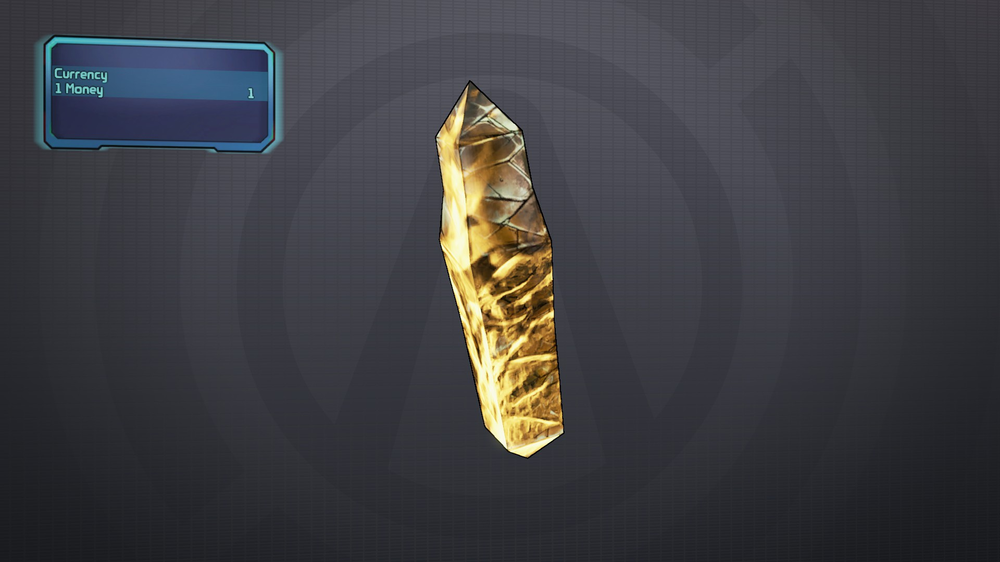

    BL2(BwAAAADAUAABDhyhAwAAwA==)

# Eridium Bar

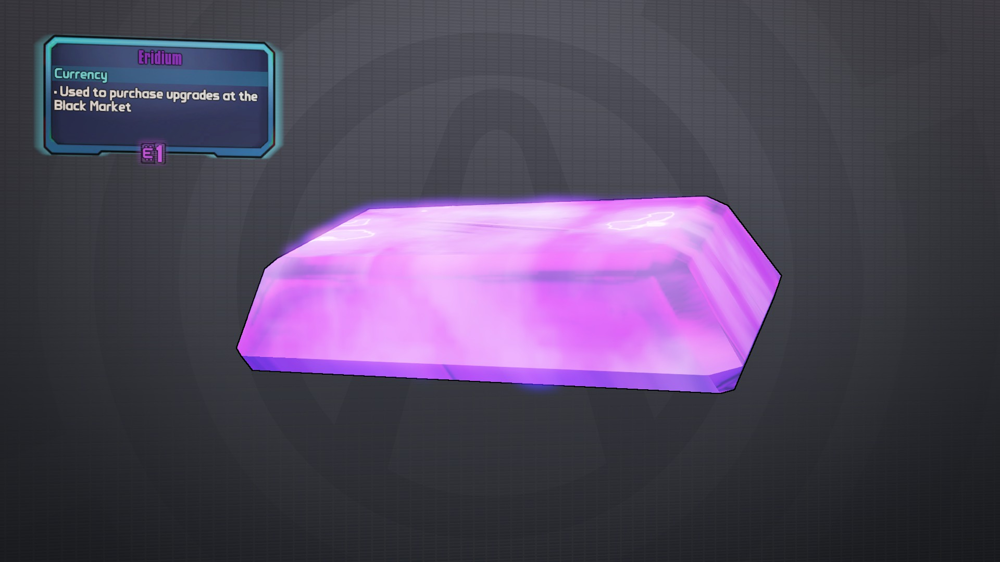
    
    BL2(BwAAAACc8gAEDhqhAwAAwA==)

# Eridium Stack

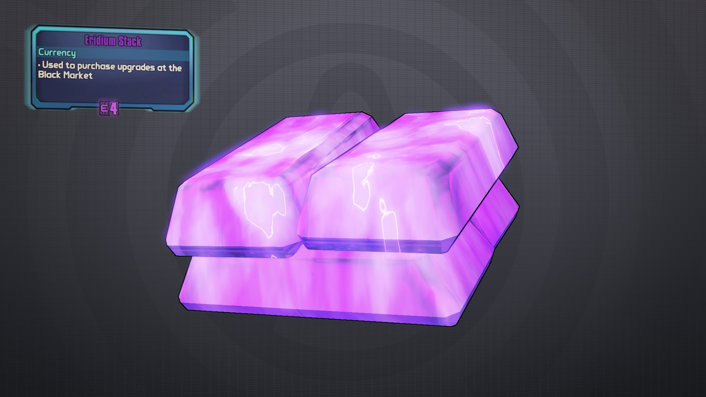

    BL2(BwAAAABNcQAADhqgAwAAwA==)

# Torgue Token

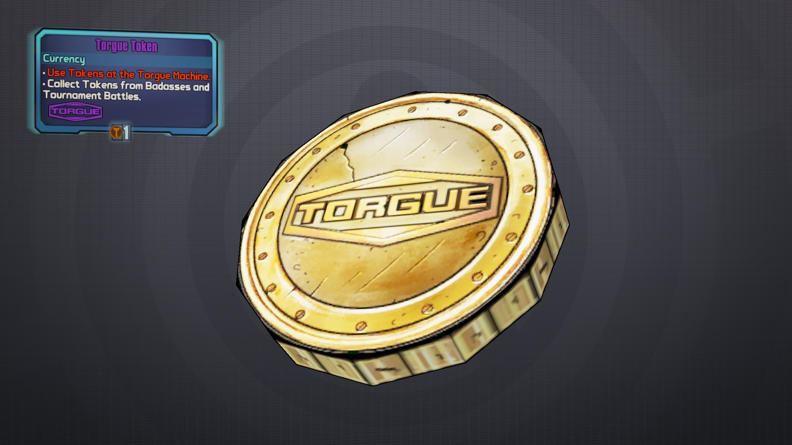

    BL2(BwAAAABOZgMACAFgkBAAwA==)

# Seraph Crystal

    Orchid: BL2(BwAAAAAB6gEAAwEYMIAAwA==)
    Iris: BL2(BwAAAAD+nQMACQOAMIAAwA==)
    Sage: BL2(BwAAAACMGgQACwFgEJAAwA==)
    Aster: BL2(BwAAAAAruQkABwE4EIAAwA==)

# Candy

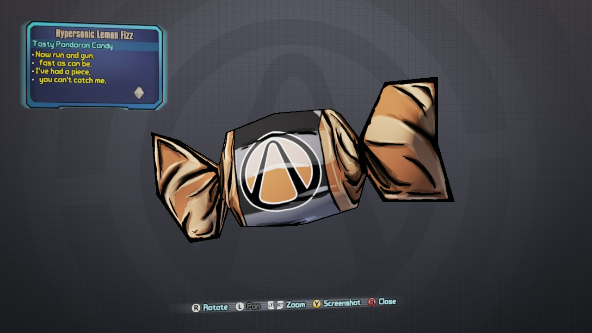
    
Requires Bloody Harvest

    BL2(BwAAAABv0AUEAAkAEBBQqAPg////////////////////fwPg) - Red/100% Damage Increase

    BL2(BwAAAADBrAUFAAsAEBBQKATg////////////////////vwTg) - Blue/Ammo Regeneration

    BL2(BwAAAAAhAQUCAAcAEBBQ6ALg////////////////////PwPg) - Green/20% Damage Reduction/Health Regeneration.

    BL2(BwAAAACTbQUDAAUAEBBQ6APg////////////////////fwTg) - Yellow/80% Movement Bonus

# Wisp Jar

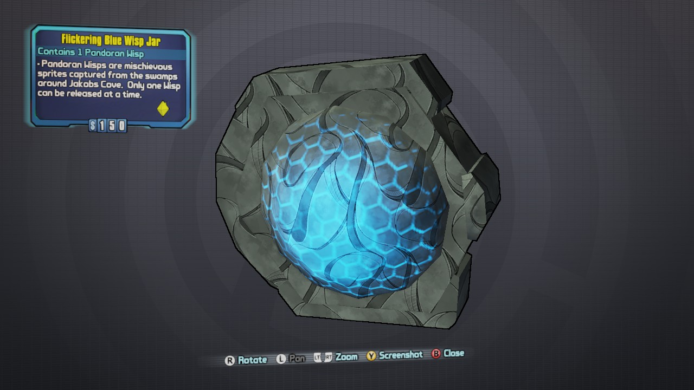

Requires Bloody Harvest

    BL2(BwAAAAAuIAUAAAEAEBBQaAHg/////////////////////wGgAOA=) - Blue/Shock

    BL2(BwAAAACpWAUAAAEAEBBQKAHg////////////////////PwKgAOA=) - Red/Fire

    BL2(BwAAAABnyQUAAAEAEBBQ6ADg////////////////////vwGgAOA=) - Yellow/Explosive

    BL2(BwAAAACQ6wUAAAEAEBBQKADg////////////////////fwCgAOA=) - Green/Corrosive

# Ammo - Assault Rifle

    BL2(BwAAAABq5QAICjihAxAAwA==)

# Ammo - Pistol

    BL2(BwAAAABOowAECjKhAxAAwA==)

# Ammo - SMG

    BL2(BwAAAAATOAAFCiyhAxAAwA==)

# Ammo - Shotgun

    BL2(BwAAAAAH6QACCi6hAxAAwA==)

# Ammo - Sniper Rifle

    BL2(BwAAAAC76gABCiqhAxAAwA==)

# Ammo - Rocket Launcher

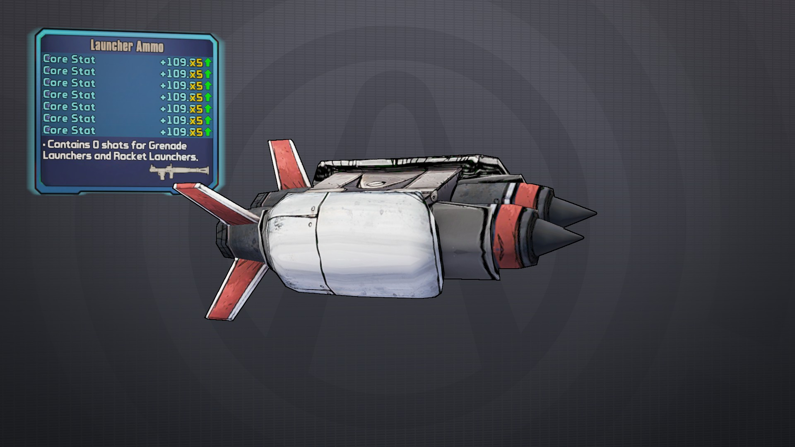

    BL2(BwAAAABacgADCjChAxAAwA==)

# Ammo - Grenade
    
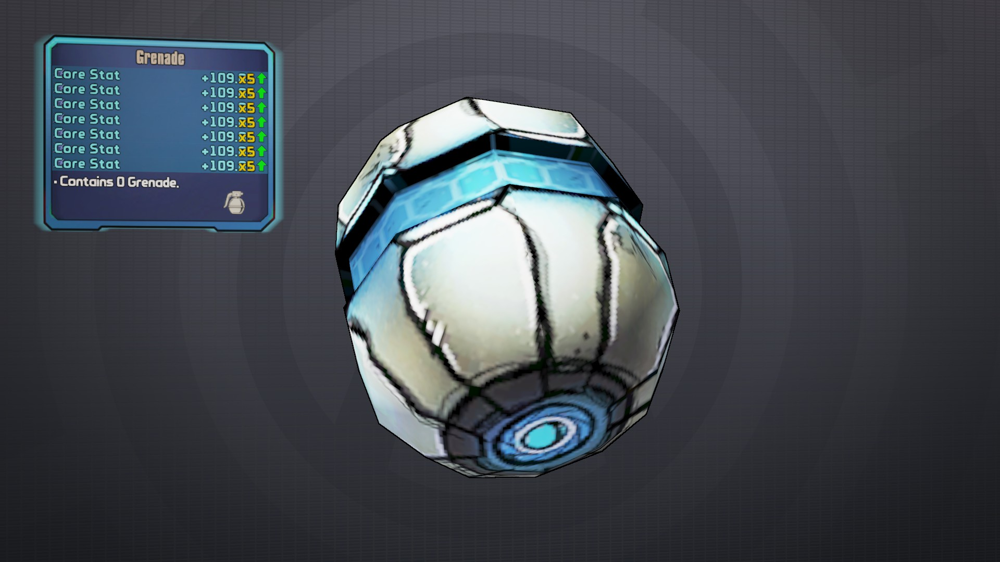

    BL2(BwAAAAC4AQAGCjShAxAAwA==)

# SDU Weapon Equip Slot

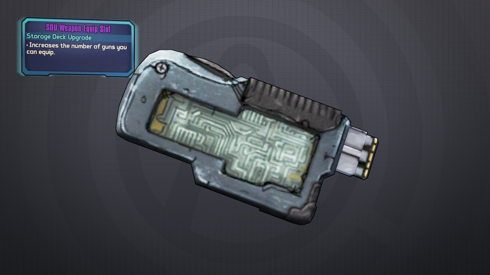
    
    BL2(BwAAAACmGgAAEgCgAxAAwA==)

# SDU Backpack Slot

    
    BL2(BwAAAACyeAACEk6gQxAAwA==)

# Helmet Data - Assassin

    BL2(BwAAAABfOgADYgaQAxEAwA==)

# Helmet Data - Commando

    BL2(BwAAAAACGgAAYgCQQxAAwA==)

# Helmet Data - Gunzerker

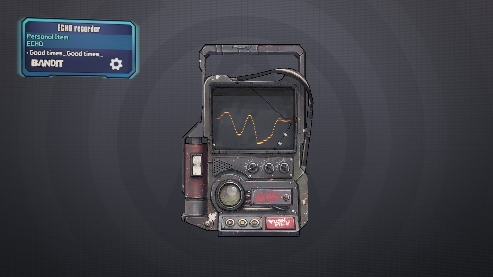

    BL2(BwAAAAD1SQACYgSQIxAAwA==)

# Helmet Data - Siren

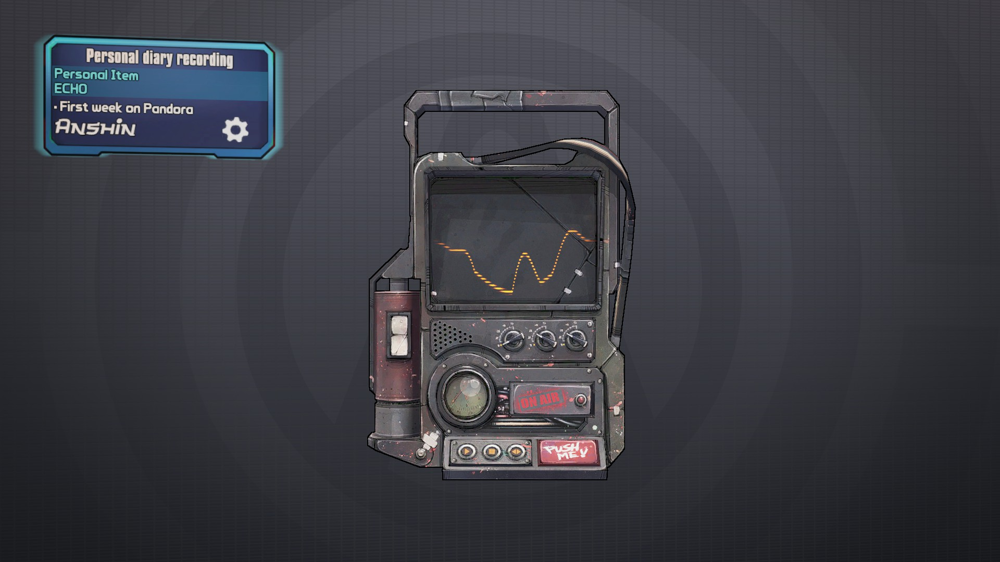

    BL2(BwAAAAD8FwABYgKQ4xEAwA==)

# Moxxi Portrait 1

    BL2(BwAAAACxoQMDEAfoEBAAwA==)

# Moxxi Portrait 2

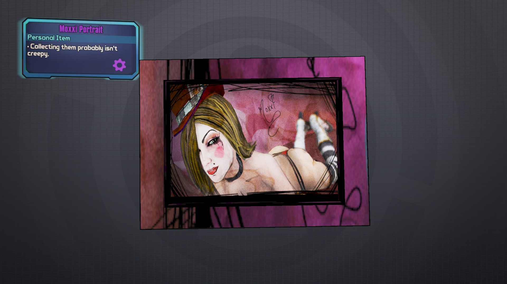
    
    BL2(BwAAAAD50gMBEAPoEBAAwA==)

# Moxxi Portrait 3

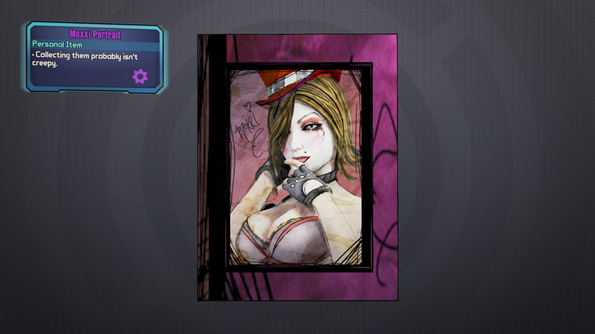

    BL2(BwAAAAD7AAMCEAXoEBAAwA==)

# Flyboy Bling - Round 1

    
    BL2(BwAAAAA6VQMAHQFQERAAwA==)

# Flyboy Bling - Round 2

    BL2(BwAAAAByJgMCHQVQERAAwA==)

# Flyboy Bling - Round 3

    BL2(BwAAAAA4hwMDHQdQERAAwA==)

# Flyboy Bling - Rematch

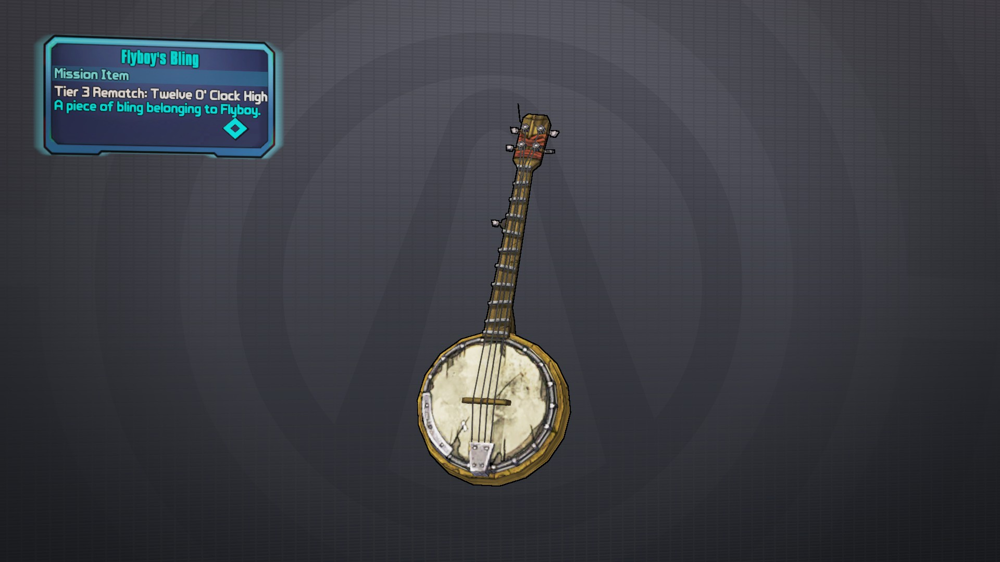

    BL2(BwAAAAD+UQMFHQ1QERAAwA==)