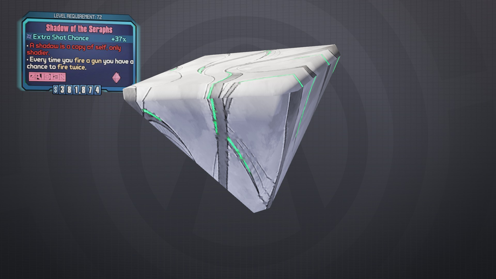
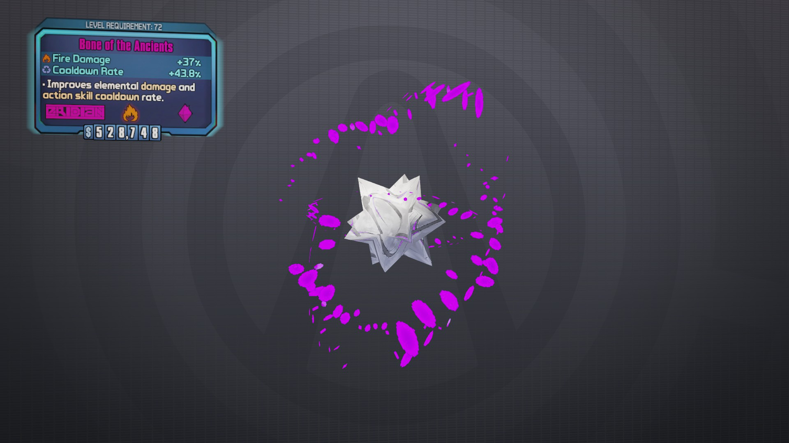
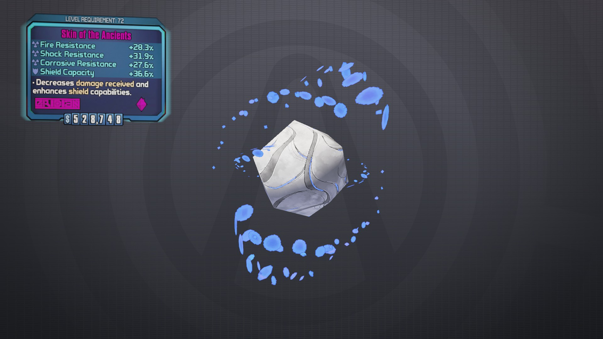
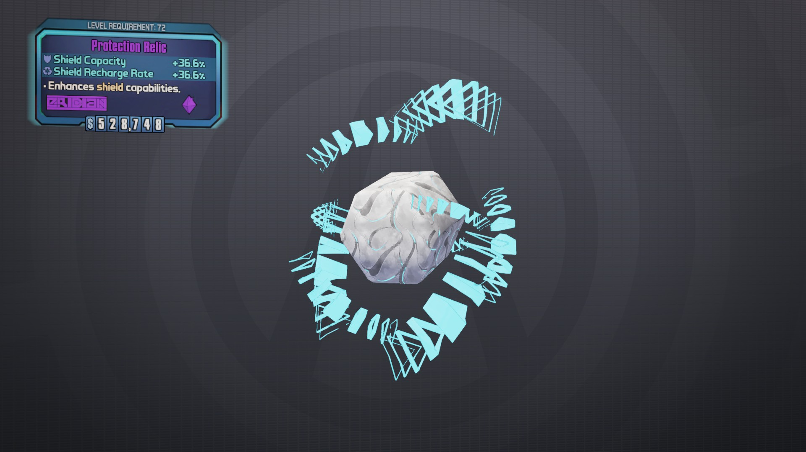
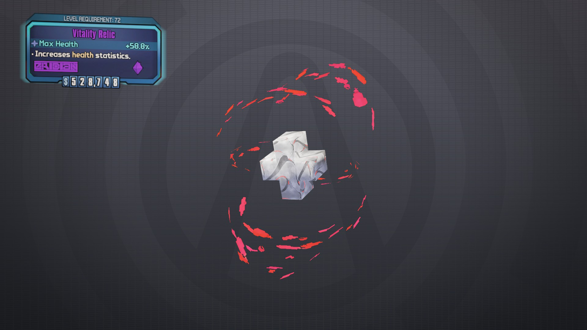
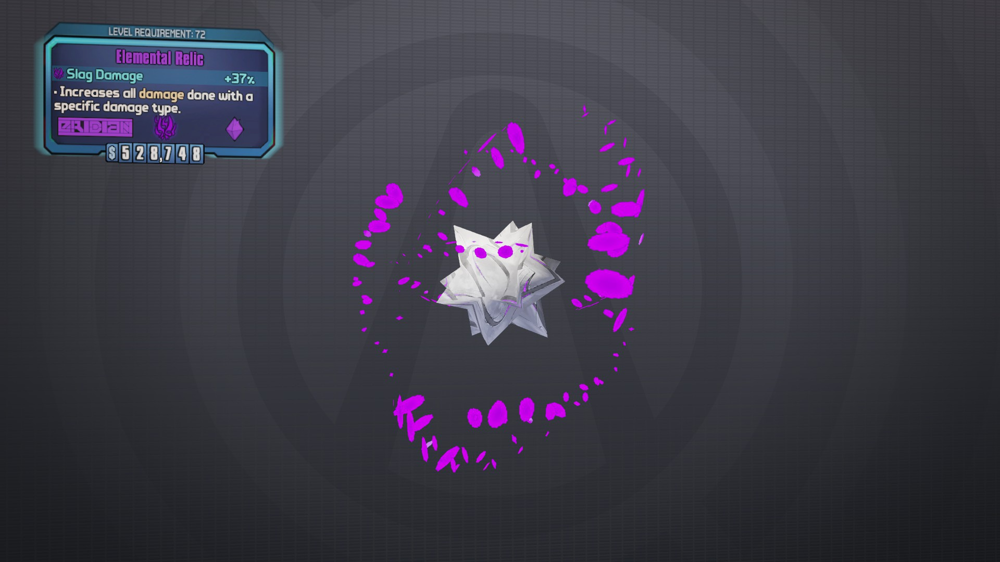
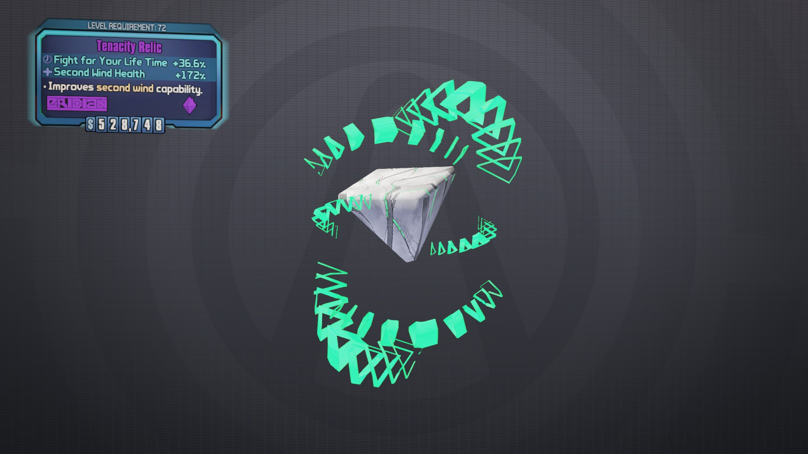

# Blood of Terramorphous

    BL2(BwAAAADOzAAZC2DYIBG9HgDA////////////fw1ABcA=)

# Shadow of the Seraphs

    BL2(BwAAAADsDwkCEwWYMBG9HgDA////////////vwAgAuA=)

# Breath of the Seraphs

    BL2(BwAAAAAxugQADgGoMBG9HgCABsD/////////PwCjAeM=)

# Blood of the Seraphs

    BL2(BwAAAAAdZQEAAQEIMBG9ngDh////////////PwBhAOE=)

# Might of the Seraphs

    BL2(BwAAAAA61wMEDQnAUBG9HgCABsD/////////vwrABeD/PwJgAuA=)

# Blood of the Ancients

    Max Health +54.4% / Assault Rifle Max Ammo +75.5% / SMG Max Ammo +75.5% 
    BL2(BwAAAAABLwgAAAEIcBG9HgCABkAIwP//////PwCgAuA=) 

    Max Health +54.4% / Assault Rifle Max Ammo +75.5% / Pistol Max Ammo +75.5%
    BL2(BwAAAAAXLwgAAAEIcBG9HgCABoAIwP//////PwCgAuA=) 

    Max Health +54.4% / Assault Rifle Max Ammo +75.5% / Shotgun Max Ammo +75.5% 
    BL2(BwAAAADmHggAAAEIcBG9HgCABgAJwP//////PwCgAuA=) 

    Max Health +54.4% / Assault Rifle Max Ammo +75.5% / Sniper Rifle Max Ammo +75.5% 
    BL2(BwAAAAAEfQgAAAEIcBG9HgCABgAKwP//////PwCgAuA=) 

    Max Health +54.4% / Assault Rifle Max Ammo +75.5% / Launcher Max Ammo +75.5% 
    BL2(BwAAAACuPwgAAAEIcBG9HgCABsAIwP//////PwCgAuA=) 

    Max Health +54.4% / SMG Max Ammo +75.5% / Pistol Max Ammo +75.5% 
    BL2(BwAAAABkxwgAAAEIcBG9HgCAB4AIwP//////PwCgAuA=) 

    Max Health +54.4% / SMG Max Ammo +75.5% / Shotgun Max Ammo +75.5% 
    BL2(BwAAAACV9ggAAAEIcBG9HgCABwAJwP//////PwCgAuA=) 

    Max Health +54.4% / SMG Max Ammo +75.5% / Sniper Rifle Max Ammo +75.5%
    BL2(BwAAAAB3lQgAAAEIcBG9HgCABwAKwP//////PwCgAuA=) 

    Max Health +54.4% / SMG Max Ammo +75.5% / Launcher Max Ammo +75.5% 
    BL2(BwAAAADd1wgAAAEIcBG9HgCAB8AIwP//////PwCgAuA=) 

    Max Health +54.4% / Pistol Max Ammo +75.5% / Shotgun Max Ammo +75.5% 
    BL2(BwAAAAByJggAAAEIcBG9HgCABQAJwP//////PwCgAuA=) 

    Max Health +54.4% / Pistol Max Ammo +75.5% / Sniper Rifle Max Ammo +75.5% 
    BL2(BwAAAACQRQgAAAEIcBG9HgCABQAKwP//////PwCgAuA=) 

    Max Health +54.4% / Pistol Max Ammo +75.5% / Launcher Max Ammo +75.5% 
    BL2(BwAAAAA6BwgAAAEIcBG9HgCABcAIwP//////PwCgAuA=) 

    Max Health +54.4% / Shotgun Max Ammo +75.5% / Sniper Rifle Max Ammo +75.5% 
    BL2(BwAAAAA9iQgAAAEIcBG9HgAABgAKwP//////PwCgAuA=) 

    Max Health +54.4% / Shotgun Max Ammo +75.5% / Launcher Max Ammo +75.5% 
    BL2(BwAAAACXywgAAAEIcBG9HgAABsAIwP//////PwCgAuA=) 

    Max Health +54.4% / Sniper Rifle Max Ammo +75.5% / Launcher Max Ammo +75.5% 
    BL2(BwAAAAB2HwgAAAEIcBG9HgDACcAIwP//////PwCgAuA=)

#  Bone of the Ancients

    Corrosive Damage +33% / Cooldown Rate +39.4%)
    BL2(BwAAAADMAwgCAAUIUBG9XgDABQAKwP//////vwSgAuA=) 

    Fire Damage +33% / Cooldown Rate +39.4%
    BL2(BwAAAABPDQgCAAUIMBG9HgCABQAKwP//////vwSgAuA=) 

    Shock Damage +33% / Cooldown Rate +39.4%
    BL2(BwAAAABUZwgCAAUIcBG9ngAABgAKwP//////vwSgAuA=)

# Skin of the Ancients

    Fire Resistance +26.3% / Corrosive +25.8% / Explosive +27.0% / Shield Recharge Rate +33.3%
    BL2(BwAAAAD6iQgBAAMIkBG9ngDACYAIwA3A////fwSgAuA=) 

    Fire Resistance +26.3% / Corrosive +25.8% / Explosive +27.0% / Shield Capacity +33.3%
    BL2(BwAAAAAbXQgBAAMIkBG9ngAABoAIwA3A////fwSgAuA=) 

    Fire Resistance +26.3% / Corrosive +25.8% / Shock +27.0% / Shield Recharge Rate +33.3%
    BL2(BwAAAABVmQgBAAMIkBG9ngDACQAIwA3A////fwSgAuA=) 

    Fire Resistance +26.3% / Corrosive +25.8% / Shock +27.0% / Shield Capacity +33.3%
    BL2(BwAAAAC0TQgBAAMIkBG9ngAABgAIwA3A////fwSgAuA=) 

    Fire Resistance +26.3% / Corrosive +25.8% / Non-Elemental +27.0% / Shield Recharge Rate +33.3%
    BL2(BwAAAABDmQgBAAMIkBG9ngDACcAIwA3A////fwSgAuA=) 

    Fire Resistance +26.3% / Corrosive +25.8% / Non-Elemental +27.0% / Shield Capacity +33.3%
    BL2(BwAAAACiTQgBAAMIkBG9ngAABsAIwA3A////fwSgAuA=) 

    Fire Resistance +26.3% / Explosive +25.8% / Non-Elemental +27.0% / Shield Recharge Rate +33.3%
    BL2(BwAAAABjTQgBAAMIkBG93gDACcAIwA3A////fwSgAuA=) 

    Fire Resistance +26.3% / Explosive +25.8% / Non-Elemental +27.0% / Shield Capacity +33.3% 
    BL2(BwAAAACCmQgBAAMIkBG93gAABsAIwA3A////fwSgAuA=) 

    Fire Resistance +26.3% / Explosive +25.8% / Shock +27.0% / Shield Recharge Rate +33.3% 
    BL2(BwAAAAB1TQgBAAMIkBG93gDACQAIwA3A////fwSgAuA=) 

    Fire Resistance +26.3% / Explosive +25.8% / Shock +27.0% / Shield Capacity +33.3% 
    BL2(BwAAAACUmQgBAAMIkBG93gAABgAIwA3A////fwSgAuA=) 

    Fire Resistance +26.3% / Shock +25.8% / Non-Elemental +27.0% / Shield Recharge Rate +33.3% 
    BL2(BwAAAAAtAggBAAMIkBG9HgHACQAIwA3A////fwSgAuA=) 

    Fire Resistance +26.3% / Shock +25.8% / Non-Elemental +27.0% / Shield Capacity +33.3% 
    BL2(BwAAAADM1ggBAAMIkBG9HgEABgAIwA3A////fwSgAuA=) 

    Corrosive Resistance +26.3% / Explosive +25.8% / Non-Elemental +27.0% / Shield Recharge Rate +33.3% 
    BL2(BwAAAAD3twgBAAMIkBG9HgHACYAIQA7A////fwSgAuA=) 

    Corrosive Resistance +26.3% / Explosive +25.8% / Non-Elemental +27.0% / Shield Capacity +33.3% 
    BL2(BwAAAAAWYwgBAAMIkBG9HgEABoAIQA7A////fwSgAuA=) 

    Corrosive Resistance +26.3% / Shock +25.8% / Non-Elemental +27.0% / Shield Recharge Rate +33.3% 
    BL2(BwAAAABYpwgBAAMIkBG9HgHACQAIQA7A////fwSgAuA=) 

    Corrosive Resistance +26.3% / Shock +25.8% / Non-Elemental +27.0% / Shield Capacity +33.3% 
    BL2(BwAAAAC5cwgBAAMIkBG9HgEABgAIQA7A////fwSgAuA=) 

    Corrosive Resistance +26.3% / Shock +25.8% / Explosive +27.0% / Shield Recharge Rate +33.3%
    BL2(BwAAAAAA6AgBAAMIkBG93gDACQAIQA7A////fwSgAuA=) 

    Corrosive Resistance +26.3% / Shock +25.8% / Explosive +27.0% / Shield Capacity +33.3% 
    BL2(BwAAAADhPAgBAAMIkBG93gAABgAIQA7A////fwSgAuA=)

# Heart of the Ancients

    Assault Rifle Damage +33% / FFYL Time +33.3% / Second Wind Health +162% 
    BL2(BwAAAACNuwgDAAcIUBG9HgCABkAIgA7A/////wSgAuA=) 

    Launcher Damage +33% / FFYL Time +33.3% / Second Wind Health +162%
    BL2(BwAAAADCvggEAAkIUBG9HgCABkAIgA7A/////wSgAuA=) 

    Pistol Damage +33% / FFYL Time +33.3% / Second Wind Health +162%
    BL2(BwAAAACIHwgFAAsIUBG9HgCABkAIgA7A/////wSgAuA=) 

    Shotgun Damage +33% / FFYL Time +33.3% / Second Wind Health +162% 
    BL2(BwAAAACKzQgGAA0IUBG9HgCABkAIgA7A/////wSgAuA=) 

    Sniper Rifle Damage +33% / FFYL Time +33.3% / Second Wind Health +162%
    BL2(BwAAAAAUxwgIABEIUBG9HgCABkAIgA7A/////wSgAuA=) 

    SMG Damage +33% / FFYL Time +33.3% / Second Wind Health +162% 
    BL2(BwAAAADAbAgHAA8IUBG9HgCABkAIgA7A/////wSgAuA=)

# Aggression Relics

    Assault Rifle Damage +33,3%
    BL2(BwAAAAClMQAJC0DYIBG9HgBAAMD/////////fwtABcA=)

    Launcher Damage +33,3%
    BL2(BwAAAADaQAAKC0LYIBG9HgBAAMD/////////fwtABcA=)

    Pistol Damage +33,3%
    BL2(BwAAAADtQgALC0TYIBG9HgBAAMD/////////fwtABcA=)

    Shotgun Damage +33,3%
    BL2(BwAAAADtQgALC0TYIBG9HgBAAMD/////////fwtABcA=)

    SMG Damage +33,3%
    BL2(BwAAAADo5gANC0jYIBG9HgBAAMD/////////fwtABcA=)

    Sniper Rifle Damage +33,3% 
    BL2(BwAAAACXlwAOC0rYIBG9HgBAAMD/////////fwtABcA=)

# Proficiency Relics

    BL2(BwAAAADb8wAICz7YIBG9HgDA////////////fwZABcA=)

# Protection Relics

    BL2(BwAAAAALxgACCzLYYBG9HgCABsD//////////wZABcA=)

# Stockpile Relics

    Assaut Rifle Max Ammo +75,5% 
    SMG Max Ammo +75,5% 
    Pistol Max Ammo +75,5%
    BL2(BwAAAABDKAABCzDYYBG9HgCABkAIwP//////fwpABcA=)

    Assault Rifle Max Ammo +75,5% 
    SMG Max Ammo +75,50% 
    Shotgun Max Ammo +75,50%
    BL2(BwAAAADsOAABCzDYYBG9HgCABsAIwP//////fwpABcA=)

    Assault Rifle Max Ammo +75,50% 
    SMG Max Ammo +75,50% 
    Sniper Rifle Max Ammo +75,50% 
    BL2(BwAAAACkGQABCzDYYBG9HgCABgAJwP//////fwpABcA=)

    Assault Rifle Max Ammo +75,50% 
    SMG Max Ammo +75,50% 
    Launcher Max Ammo +75,50%
    BL2(BwAAAABVKAABCzDYYBG9HgCABoAIwP//////fwpABcA=)

    Assault Rifle Max Ammo +75,50% 
    Pistol Max Ammo +75,50% 
    Shotgun Max Ammo +75,50%
    BL2(BwAAAACf0AABCzDYYBG9HgCAB8AIwP//////fwpABcA=)

    Assault Rifle Max Ammo +75,50% 
    Pistol Max Ammo +75,50% 
    Sniper Rifle Max Ammo +75,50%
    BL2(BwAAAADX8QABCzDYYBG9HgCABwAJwP//////fwpABcA=)

    Assault Rifle Max Ammo +75,50% 
    Pistol Max Ammo +75,50% 
    Launcher Max Ammo +75,50%
    BL2(BwAAAAAmwAABCzDYYBG9HgCAB4AIwP//////fwpABcA=)

    Assault Rifle Max Ammo +75,50% 
    Shotgun Max Ammo +75,50% 
    Sniper Rifle Max Ammo +75,50%
    BL2(BwAAAAAs2wABCzDYYBG9HgDABQAJwP//////fwpABcA=)

    Assault Rifle Max Ammo +75,50% 
    Shotgun Max Ammo +75,50% 
    Launcher Max Ammo +75,50%
    BL2(BwAAAADd6gABCzDYYBG9HgDABYAIwP//////fwpABcA=)

    SMG Max Ammo +75,50% 
    Pistol Max Ammo +75,50% 
    Shotgun Max Ammo +75,50%
    BL2(BwAAAAC/BAABCzDYYBG9XgCAB8AIwP//////fwpABcA=)

    SMG Max Ammo +75,50% 
    Pistol Max Ammo +75,50% 
    Sniper Rifle Max Ammo +75,50%
    BL2(BwAAAAD3JQABCzDYYBG9XgCABwAJwP//////fwpABcA=)

    SMG Max Ammo +75,50% 
    Pistol Max Ammo +75,50% 
    Launcher Max Ammo +75,50%
    BL2(BwAAAAAGFAABCzDYYBG9XgCAB4AIwP//////fwpABcA=)

    SMG Max Ammo +75,50% 
    Shotgun Max Ammo +75,50% 
    Sniper Rifle Max Ammo +75,50%
    BL2(BwAAAAAMDwABCzDYYBG9XgDABQAJwP//////fwpABcA=)

    SMG Max Ammo +75,50% 
    Shotgun Max Ammo +75,50% 
    Launcher Max Ammo +75,50%
    BL2(BwAAAAD9PgABCzDYYBG9XgDABYAIwP//////fwpABcA=)

    SMG Max Ammo +75,50% 
    Sniper Rifle Max Ammo +75,50% 
    Launcher Max Ammo +75,50%
    BL2(BwAAAABMCAABCzDYYBG9XgAABoAIwP//////fwpABcA=)

    Pistol Max Ammo +75,50% 
    Shotgun Max Ammo +75,50% 
    Launcher Max Ammo +75,50%
    BL2(BwAAAABBcwABCzDYYBG9ngDABYAIwP//////fwpABcA=)

    Pistol Max Ammo +75,50% 
    Shotgun Max Ammo +75,50% 
    Sniper Max Ammo +75,50%
    BL2(BwAAAACwQgABCzDYYBG9ngDABQAJwP//////fwpABcA=)

    Sniper Rifle Max Ammo +75,50% 
    Shotgun Max Ammo +75,50% 
    Launcher Max Ammo +75,50%
    BL2(BwAAAADbhQABCzDYYBG9HgfABYAIwP//////fwpABcA=)

    Assault Rifle Max Ammo +75,50% 
    SMG Max Ammo +75,50% 
    Grenade Count +4
    BL2(BwAAAABGegABCzDYYBG9HgCABgAKwP//////fwpABcA=)

    Assault Rifle Max Ammo +75,50% 
    Pistol Max Ammo +75,50% 
    Grenade Count +4
    BL2(BwAAAAA1kgABCzDYYBG9HgCABwAKwP//////fwpABcA=)

    Assault Rifle Max Ammo +75,50% 
    Shotgun Max Ammo +75,50% 
    Grenade Count +4
    BL2(BwAAAADOuAABCzDYYBG9HgDABQAKwP//////fwpABcA=)

    Assault Rifle Max Ammo +75,50% 
    Sniper Rifle Max Ammo +75,50% 
    Grenade Count +4
    BL2(BwAAAAB/jgABCzDYYBG9HgAABgAKwP//////fwpABcA=)

    SMG Max Ammo +75,50% 
    Launcher Max Ammo +75,50% 
    Grenade Count +4
    BL2(BwAAAADSQgABCzDYYBG9HgCABQAKwP//////fwpABcA=)

    SMG Max Ammo +75,50% 
    Pistol Max Ammo +75,50% 
    Grenade Count +4
    BL2(BwAAAAAVRgABCzDYYBG9XgCABwAKwP//////fwpABcA=)

    SMG Max Ammo +75,50% 
    Shotgun Max Ammo +75,50% 
    Grenade Count +4
    BL2(BwAAAADubAABCzDYYBG9XgDABQAKwP//////fwpABcA=)

    SMG Max Ammo +75,50% 
    Sniper Rifle Max Ammo +75,50% 
    Grenade Count +4
    BL2(BwAAAABfWgABCzDYYBG9XgAABgAKwP//////fwpABcA=)

    SMG Max Ammo +75,50% 
    Launcher Max Ammo +75,50% 
    Grenade Count +4
    BL2(BwAAAADylgABCzDYYBG9XgCABQAKwP//////fwpABcA=)

    Pistol Max Ammo +75,50% 
    Shotgun Max Ammo +75,50% 
    Grenade Count +4
    BL2(BwAAAABSIQABCzDYYBG9ngDABQAKwP//////fwpABcA=)

    Pistol Max Ammo +75,50% 
    Sniper Rifle Max Ammo +75,50% 
    Grenade Count +4
    BL2(BwAAAADjFwABCzDYYBG9ngAABgAKwP//////fwpABcA=)

    Pistol Max Ammo +75,50% 
    Launcher Max Ammo +75,50% 
    Grenade Count +4
    BL2(BwAAAABO2wABCzDYYBG9ngCABQAKwP//////fwpABcA=)

    Shotgun Max Ammo +75,50% 
    Sniper Rifle Max Ammo +75,50% 
    Grenade Count +4
    BL2(BwAAAACbjAABCzDYYBG9HgEABgAKwP//////fwpABcA=)

    Shotgun Max Ammo +75,50% 
    Launcher Max Ammo +75,50% 
    Grenade Count +4
    BL2(BwAAAACbjAABCzDYYBG9HgEABgAKwP//////fwpABcA=)

    Sniper Max Ammo +75,50% 
    Launcher Max Ammo +75,50% 
    Grenade Count +4
    BL2(BwAAAADULQABCzDYYBG9HgeABQAKwP//////fwpABcA=)

    Assault Rifle Max Ammo +81,5%
    BL2(BwAAAAC2YAABCzDYYBG9HgBAB8AHwP//////fwpABcA=)

    SMG Max Ammo +81,5%
    BL2(BwAAAADa7AABCzDYYBG9XgCABgAIwP//////fwpABcA=)

    Pistol Max Ammo +81,5%
    BL2(BwAAAACsWQABCzDYYBG9ngCAB0AIwP//////fwpABcA=)

    Shotgun Max Ammo +81,5%
    BL2(BwAAAACA+AABCzDYYBG9HgHABcAIwP//////fwpABcA=)

    Sniper Rifle Max Ammo +81,5%
    BL2(BwAAAACbggABCzDYYBG9HgcABgAJwP//////fwpABcA=)

    Launcher Max Ammo +81,5%
    BL2(BwAAAAB9XQABCzDYYBG93gCABYAIwP//////fwpABcA=)

    Grenade Count +5
    BL2(BwAAAAAIcgABCzDYYBG9ngnACQAKwP//////fwpABcA=)

# Sheriff's Badge

    BL2(BwAAAACzNQAaC2LYIBG9HgCAAIAGwP//CAAPwAxABcA=)

# Strength Relic

    BL2(BwAAAABYaQADCzTYYBG9HgCABsD/////////vwpABcA=)

# Allegiance Relics

    Maliwan - Damage + 33% Fire Rate + 24%
    BL2(BwAAAADJXAATC1TYoBG9HgDA/38IwP//////vwtABcA=)

    Maliwan - Damage + 33% Reload Speed + 40%
    BL2(BwAAAACVDAATC1TYgBG9HgDA////vwbA////vwtABcA=)

    Maliwan - Fire Rate + 24% Reload Speed + 40%
    BL2(BwAAAABRQAATC1TYwBG93v///38IgAbA////vwtABcA=)

    Vladof - Damage + 33,3% Recoil - 54,6%
    BL2(BwAAAAB06wAWC1rYgBG9HgDAAMD/vwbABcD/vwtABcA=)

    Vladof - Damage + 33,3% Acc. Recov - 105,5%
    BL2(BwAAAADQVwAWC1rYoBG9HgDAAEAIwP///z8JgAtABcA=)

    Vladof - Recoil - 54,6% Acc. Recov - 105,5%
    BL2(BwAAAADTeQAWC1rYwBG93v///38IgAbABQAJgAtABcA=)

    Torgue - Fire Rate + 24% Magazine Size + 75,5%
    BL2(BwAAAACQqAAVC1jYgBG9HgDA////vwbA////vwtABcA=)

    Torgue - Magazine Size + 70% Acc. Recovery + 105,5%
    BL2(BwAAAACsCAAVC1jYwBG93v///38IgAbABQAJgAtABcA=)

    Torgue - Fire Rate + 24% Acc. Recovery + 105,5%
    BL2(BwAAAADM+AAVC1jYoBG9HgDA/38IwP//////vwtABcA=)

    Jakobs - Magazine Size + 75% Acc. Recovery + 105,5%
    BL2(BwAAAACergASC1LYwBG93v///38IgAbABQAJgAtABcA=)

    Jakobs - Recoil - 54,6% Acc. Recovery + 105,5%
    BL2(BwAAAACdgAASC1LYoBG9HgDAAEAIwP///z8JgAtABcA=)

    Jakobs - Recoil - 54,6% Magazine Size + 75,5%
    BL2(BwAAAAA5PAASC1LYgBG9HgDAAMD/vwbABcD/vwtABcA=)

    Dahl - Recoil - 54,6% Magazine Size + 75,6%
    BL2(BwAAAAAb1gAQC07YgBG9HgDAAMD/vwbABcD/vwtABcA=)

    Dahl - Recoil - 54,6% Burst Delay - 54,6%
    BL2(BwAAAADctAAQC07YoBG9HgDA/38IwP//////vwtABcA=)

    Dahl - Magazine Size + 75,5% Burst Delay - 54,6%
    BL2(BwAAAAC8RAAQC07YwBG93v///38IgAbABQAJgAtABcA=)

    Bandit - Damage + 33,3% Reload Speed + 40%
    BL2(BwAAAAC9FQAPC0zYgBG9HgDA/78GwP//////vwtABcA=)

    Bandit - Damage + 33,3% Fire Rate + 24%
    BL2(BwAAAABNHwAPC0zYoBG9HgDA////fwjA////vwtABcA=)

    Bandit - Reload Speed + 40% Fire Rate + 24%
    BL2(BwAAAABY0wAPC0zYwBG93v///78GQAjA////vwtABcA=)

    Hyperion - Damage + 33,3% Reload Speed + 40%
    BL2(BwAAAAAiWwARC1DYgBG9HgDA//////+/BsD/vwtABcA=)

    Hyperion - Damage + 33,3% Max Accuracy + 54,6%
    BL2(BwAAAACBLwARC1DYoBG9HgDA/38IwP//////vwtABcA=)

    Hyperion - Reload Speed + 40% Max Accuracy + 54,6%
    BL2(BwAAAADmFwARC1DYwBG93v///38IwP+/BsD/vwtABcA=)

    Tediore - Damage + 33,3% Recoil - 54,6%
    BL2(BwAAAACB3QAUC1bYgBG9HgDA////vwbA////vwtABcA=)

    Tediore - Damage + 33,3% Magazine Size + 75,5%
    BL2(BwAAAADdjQAUC1bYoBG9HgDA/38IwP//////vwtABcA=)

    Tediore - Recoil - 54,6% Magazine Size + 75,5%
    BL2(BwAAAABFkQAUC1bYwBG93v///38IgAbA////vwtABcA=)

# Vitality Relic

    BL2(BwAAAACNqwAACy7YIBG9HgDA/////////////wpABcA=)

# Resistance Relics

    Fire Resistance
    Shock Resistance 
    Corrosive Resistance  
    Slag Resistance 
    BL2(BwAAAAArZAAECzbYgBG9HgFAB0AIAA7A////fwlABcA=)

    Fire Resistance 
    Shock Resistance 
    Explosive Resistance  
    Slag Resistance 
    BL2(BwAAAAB00QAECzbYgBG9HgCABsAIgA7A////fwlABcA=)

    Fire Resistance 
    Shock Resistance 
    Slag Resistance 
    Non-Elemental Resistance 
    BL2(BwAAAABvIwAECzbYgBG9HgCABsAIAA/A////fwlABcA=)

    Fire Resistance 
    Shock Resistance  
    Corrosive Resistance 
    Explosive Resistance 
    BL2(BwAAAADbwQAECzbYgBG9HgCABkAIgA7A////fwlABcA=)

    Fire Resistance 
    Shock Resistance 
    Corrosive Resistance 
    Non-Elemental Resistance
    BL2(BwAAAADAMwAECzbYgBG9HgCABkAIAA/A////fwlABcA=)

    Fire Resistance 
    Corrosive Resistance 
    Explosive Resistance  
    Slag Resistance 
    BL2(BwAAAAAHOQAECzbYgBG9HgCAB8AIgA7A////fwlABcA=)

    Shock Resistance 
    Corrosive Resistance
    Slag Resistance 
    Non-Elemental Resistance
    BL2(BwAAAABoJQAECzbYgBG9XgDABUAIAA/A////fwlABcA=)

    Shock Resistance 
    Explosive Resistance 
    Slag Resistance 
    Non-Elemental Resistance 
    BL2(BwAAAAB+JQAECzbYgBG9XgDABYAIAA/A////fwlABcA=)

    Shock Resistance
    Corrosive Resistance 
    Explosive Resistance 
    Slag Resistance 
    BL2(BwAAAABz1wAECzbYgBG9XgDABUAIgA7A////fwlABcA=)

    Corrosive Resistance 
    Explosive Resistance 
    Slag Resistance 
    Non-Elemental Resistance 
    BL2(BwAAAACrGgAECzbYgBG9HgGABwAJgA7A////fwlABcA=)

    Fire Resistance 
    BL2(BwAAAAC4TQAECzbYgBG9HgBAB8AHwA3A////fwlABcA=)

    Corrosive Resistance 
    BL2(BwAAAADX0QAECzbYgBG9ngCAB0AIQA7A////fwlABcA=)

    Shock Resistance 
    BL2(BwAAAAAARAAECzbYgBG9XgCABgAIAA7A////fwlABcA=)

    Slag Resistance 
    BL2(BwAAAAC5MQAECzbYgBG9HgHABcAIwA7A////fwlABcA=)

    Explosive Resistance
    BL2(BwAAAADltAAECzbYgBG93gCABYAIgA7A////fwlABcA=)

    Non-Elemental Resistance 
    BL2(BwAAAAAYmQAECzbYgBG9HgcABgAJAA/A////fwlABcA=)

# Elemental Relics

    Explosive Damage + 33%
    BL2(BwAAAADt0gAFCzjYIBG9XgDA////////////fwFABcA=)

    Shock Damage + 33%
    BL2(BwAAAAD7FgAGCzrYYBG9ngAABsD/////////fwFABcA=)

    Slag Damage + 33%
    BL2(BwAAAADNBgAFCzjYIBG9HgDA////////////fwFABcA=)

    Corrosive Damage + 33% 
    BL2(BwAAAABjcgAGCzrYQBG9XgDABcD/////////fwFABcA=)

    Fire Damage + 33%
    BL2(BwAAAADgfAAGCzrYIBG9HgCABcD/////////fwFABcA=)

# Tenacity Relics

    BL2(BwAAAABHCQAHCzzYYBG9HgCABsD/////////PwtABcA=)

# Moxxi's Endowment Relic

    BL2(BwAAAADtfgAcC2bYIBG9HgDA////////////PwxABMA=)

# Lucrative Opportunity

    BL2(BwAAAACaLAAXC1zYIBG9HgDA////////////fwxABMA=)

# Vault Hunters Relic

    BL2(BwAAAAAdYQAYC17YIBG9HgBAAMD/////////Pw2AA8A=)

# The Afterburner

    BL2(BwAAAACq5gAeC2rYIBG9HgCABsD/fwjA/////wtABMA=)

# Mysterious Amulet

    BL2(BwAAAACIIQkBEwOYMBG9HgDA////////////fwBgAuA=)

# Captain Blade's Otto Idol

    BL2(BwAAAABxFAEBAQMIMBG9HgCABsD//////////wBhBMA=)

# Deputy's Badge

    BL2(BwAAAAApSQAdC2jYIBG9HgCAAIAGwP//CAAPgAxABMA=)