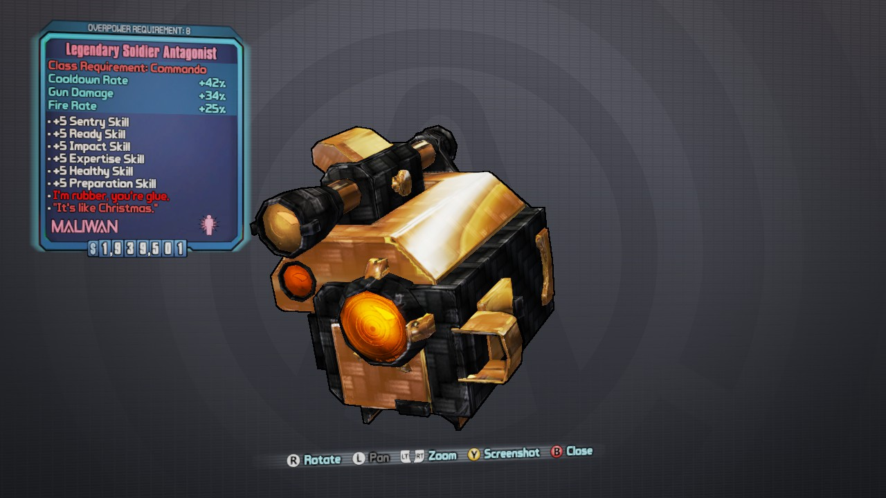

# Legendary Siren Antagonist

### Use this Class Mod with the Impaler shield, and you will end up having two spikes, 1 slag and 1 corrosive.

    BL2(BwAAAAB+9gknDQ6wEBFQKAIEBcQHRAHj//////////8AoxgBAeM=)

# Legendary Commando Antagonist

### Use this Class Mod with the Impaler shield, and you will end up having two spikes, 1 slag and 1 corrosive.

    BL2(BwAAAAB2jgklDQ6wEBFQKAIEBcQHRAHj//////////8AYxABAeM=)

# Legendary Berserker Antagonist

### Use this Class Mod with the Impaler shield, and you will end up having two spikes, 1 slag and 1 corrosive.

    BL2(BwAAAACzpAkpDQ6wEBFQKAIEBcQHRAHj//////////8A4yEBAeM=)

# Legendary Hunter Antagonist

### Use this Class Mod with the Impaler shield, and you will end up having two spikes, 1 slag and 1 corrosive.

    BL2(BwAAAAD4XwkrDQ6wEBFQKAIEBcQHRAHj//////////8AIyYBAeM=)

# The Bee

    Fastest Delay
    BL2(BwAAAADe4gAWEXyg4xBQ6P9/A4QFBFfE/////////z8jxA==)

# Alkaline The Bee

    
    Corrosive Res/Max Amp
    BL2(BwAAAAD7BgAWEXyg4xBQ6P+/BMQGBFfE/////////z8jxA==)

    Fire Res/Max Amp
    BL2(BwAAAACzJwAWEXyg4xBQ6P+/BAQHBFfE/////////z8jxA==)

    Shock Res/Max Amp
    BL2(BwAAAAAKNwAWEXyg4xBQ6P+/BEQHBFfE/////////z8jxA==)

    Explosive Res/Max Amp
    BL2(BwAAAAAcNwAWEXyg4xBQ6P+/BIQHBFfE/////////z8jxA==)

# Fire Bee

    Incendiary Fire Bee
    BL2(BwAAAAA6KwAEDzzoIBBQaBzDD8P//woDDoMOgwxDHQMSww==)

# Corrosive Pandemic

    Corrosive Pandemic Fastball
    BL2(BwAAAACA+QAEDzzoIBBQaBzDD8P/PwsDDoMOgwxDHQMSww==)

# Shock Storm

    Shock Storm Front Fastball
    BL2(BwAAAAAh2QAEDzzoIBBQaBzDD8P/fwsDDoMOgwxDHQMSww==)

These are modified, but will still pass the Sanity Check. Not as powerful as "Black" mods, but still... All weapons credited Se7enSins.